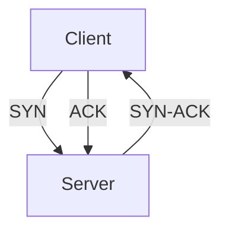
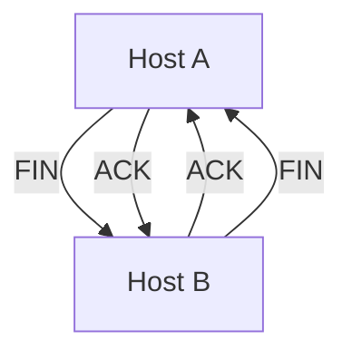

# 3.5 TCP

- TCP (Transmission Control Protocol) is a reliable, connection-oriented transport protocol.
- **Features:** Reliable, ordered, congestion and flow control, byte-stream.

---

## Connection Setup and Teardown
- **Three-way handshake:** SYN, SYN-ACK, ACK.
- **Teardown:** FIN, ACK.

---

## TCP Header Format
- **Fields:** Source port, dest port, seq number, ack number, flags, window, checksum, urgent pointer.

---

## Diagram: TCP Three-Way Handshake

---

## Summary Table
| Feature     | TCP Value |
|-------------|-----------|
| Reliable    | Yes       |
| Ordered     | Yes       |
| Flow Ctrl   | Yes       |
| Congestion  | Yes       |
| Use Case    | Web, Email|

---

## Practice Questions
1. **List three features of TCP.**
2. **Describe the three-way handshake.**
3. **Draw the TCP header format.**

---

**Exam Tips:**
- Know TCP features and header fields.
- Be able to draw handshake and header diagrams.

---

## TCP Flow Control
- **Sliding Window:** Receiver advertises window size; sender limits unacknowledged data to this size.
- **Receive Buffer:** Stores out-of-order or excess data until application reads it.
- **Zero Window:** Receiver can pause sender by advertising a window size of zero.

## TCP Timers
- **Retransmission Timer:** Triggers retransmission if ACK not received in time.
- **Persistence Timer:** Prevents deadlock when window size is zero.
- **Keepalive Timer:** Detects dead connections.
- **TIME-WAIT Timer:** Ensures late segments are discarded after connection closes.

## TCP Connection Termination
- **Four-Way Handshake:**
  1. Host A sends FIN
  2. Host B ACKs FIN, sends its own FIN
  3. Host A ACKs FIN
- **TIME_WAIT State:** Host that closes waits to ensure all packets are gone.

## Diagram: TCP Connection Termination
