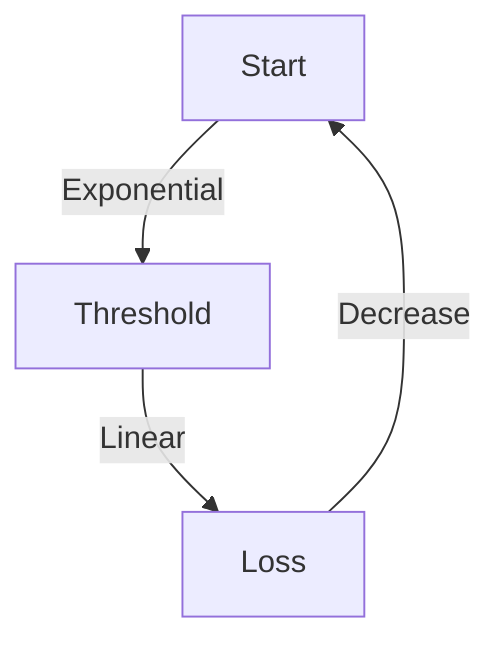

# 3.6 Congestion Control

- Congestion occurs when network resources are overloaded.
- **Effects:** Packet loss, delay, reduced throughput.
- **Control mechanisms:** TCP congestion control, router algorithms.

---

## Principles of Congestion Control

### Congestion Definition
- **Informally:** "Too many sources sending too much data too fast for network to handle"
- **Manifestations:**
  - Long delays (queueing in router buffers)
  - Packet loss (buffer overflow at routers)
- **Different from flow control!**
  - **Congestion control:** Too many senders, sending too fast
  - **Flow control:** One sender too fast for one receiver
- **A top-10 problem!**

---

## Causes/Costs of Congestion: Scenario 1

### Simplest Scenario
- **Two flows, one router, infinite buffers**
- **Input, output link capacity: R**
- **Infinite shared output link buffers**
- **No retransmissions needed**

### Analysis
- **Maximum per-connection throughput: R/2**
- **Large delays as arrival rate λin approaches capacity**
- **Q: What happens as arrival rate λin approaches R/2?**

### Results
- **Throughput: λout = λin (up to R/2)**
- **Delay increases dramatically as λin approaches R/2**

---

## Causes/Costs of Congestion: Scenario 2

### One Router, Finite Buffers
- **Host A → Host B**
- **λin: original data**
- **λ'in: original data, plus retransmitted data**
- **Finite shared output link buffers**
- **Sender retransmits lost, timed-out packet**

### Key Insight
- **Application-layer input = application-layer output: λin = λout**
- **Transport-layer input includes retransmissions: λ'in ≥ λin**

### Idealization: Perfect Knowledge
- **Sender sends only when router buffers available**
- **Throughput: λout = λin (up to R/2)**

### Realistic Scenario: Un-needed Duplicates
- **Packets can be lost, dropped at router due to full buffers – requiring retransmissions**
- **But sender times can time out prematurely, sending two copies, both of which are delivered**
- **"Wasted" capacity due to un-needed retransmissions**

### "Costs" of Congestion
- **More work (retransmission) for given receiver throughput**
- **Unneeded retransmissions: link carries multiple copies of a packet**
- **Decreasing maximum achievable throughput**

---

## Causes/Costs of Congestion: Scenario 3

### Four Senders, Multi-hop Paths
- **Timeout/retransmit**
- **Q: what happens as λin and λin' increase?**
- **A: as red λin' increases, all arriving blue pkts at upper queue are dropped, blue throughput → 0**

### Another "Cost" of Congestion
- **When packet dropped, any upstream transmission capacity and buffering used for that packet was wasted!**

---

## Causes/Costs of Congestion: Insights

### Key Insights
- **Upstream transmission capacity / buffering wasted for packets lost downstream**
- **Delay increases as capacity approached**
- **Un-needed duplicates further decreases effective throughput**
- **Loss/retransmission decreases effective throughput**
- **Throughput can never exceed capacity**

---

## Approaches Towards Congestion Control

### End-end Congestion Control
- **No explicit feedback from network**
- **Congestion inferred from observed loss, delay**
- **Approach taken by TCP**

### Network-assisted Congestion Control
- **Routers provide direct feedback to sending/receiving hosts with flows passing through congested router**
- **May indicate congestion level or explicitly set sending rate**
- **Examples:** TCP ECN, ATM, DECbit protocols

---

## Causes of Congestion
- Too many sources sending too much data.
- Insufficient bandwidth or buffer space.
- **Congestion signals:** Packet loss, increased delay, duplicate ACKs.

---

## TCP Congestion Control
- **Slow start:** Exponential increase in window size.
- **Congestion avoidance:** Linear increase, multiplicative decrease.
- **Fast retransmit/recovery:** Quick response to loss.

---

## Table: TCP Congestion Control Phases
| Phase           | Behavior                  |
|-----------------|--------------------------|
| Slow Start      | Exponential window growth |
| Cong. Avoidance | Linear window growth      |
| Fast Retransmit | Immediate loss recovery   |
| Fast Recovery   | Window reduced, grows     |

---

## Diagram: TCP Congestion Window

---

## Summary Table
| Mechanism      | Purpose                |
|---------------|------------------------|
| Slow Start     | Rapid initial growth   |
| Cong. Avoidance| Prevent overload       |
| Fast Retransmit| Quick loss recovery    |

---

## Practice Questions
1. **What causes network congestion?**
2. **Describe TCP's slow start mechanism.**
3. **Draw a diagram of the congestion window behavior.**
4. **List three congestion signals.**
5. **Explain the difference between congestion and loss.**

---

**Exam Tips:**
- Know congestion causes, signals, and TCP mechanisms.
- Be able to draw and explain congestion window diagrams.
- Distinguish between congestion and loss.

---

## More on Congestion Signals
- **Triple Duplicate ACKs:** Indicates packet loss, triggers fast retransmit.
- **Timeout:** Indicates severe congestion, triggers slow start.

## Other Congestion Control Algorithms
- **Reno:** Standard TCP, uses AIMD.
- **Cubic:** Default in Linux, uses cubic window growth for high-speed networks.
- **Vegas:** Uses delay as a signal for congestion.
- **BBR:** Google's algorithm, models bandwidth and RTT for optimal throughput. 