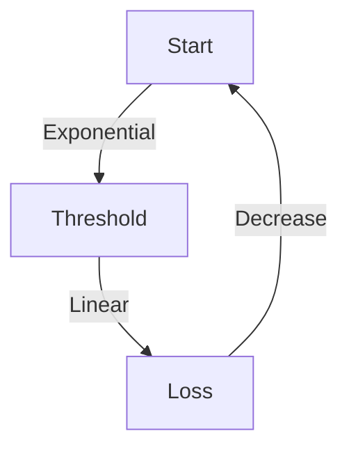

# 3.6 Congestion Control

- Congestion occurs when network resources are overloaded.
- **Effects:** Packet loss, delay, reduced throughput.
- **Control mechanisms:** TCP congestion control, router algorithms.

---

## Causes of Congestion
- Too many sources sending too much data.
- Insufficient bandwidth or buffer space.
- **Congestion signals:** Packet loss, increased delay, duplicate ACKs.

---

## TCP Congestion Control
- **Slow start:** Exponential increase in window size.
- **Congestion avoidance:** Linear increase, multiplicative decrease.
- **Fast retransmit/recovery:** Quick response to loss.

---

## Table: TCP Congestion Control Phases
| Phase           | Behavior                  |
|-----------------|--------------------------|
| Slow Start      | Exponential window growth |
| Cong. Avoidance | Linear window growth      |
| Fast Retransmit | Immediate loss recovery   |
| Fast Recovery   | Window reduced, grows     |

---

## Diagram: TCP Congestion Window

---

## Summary Table
| Mechanism      | Purpose                |
|---------------|------------------------|
| Slow Start     | Rapid initial growth   |
| Cong. Avoidance| Prevent overload       |
| Fast Retransmit| Quick loss recovery    |

---

## Practice Questions
1. **What causes network congestion?**
2. **Describe TCP's slow start mechanism.**
3. **Draw a diagram of the congestion window behavior.**
4. **List three congestion signals.**
5. **Explain the difference between congestion and loss.**

---

**Exam Tips:**
- Know congestion causes, signals, and TCP mechanisms.
- Be able to draw and explain congestion window diagrams.
- Distinguish between congestion and loss.

---

## More on Congestion Signals
- **Triple Duplicate ACKs:** Indicates packet loss, triggers fast retransmit.
- **Timeout:** Indicates severe congestion, triggers slow start.

## Other Congestion Control Algorithms
- **Reno:** Standard TCP, uses AIMD.
- **Cubic:** Default in Linux, uses cubic window growth for high-speed networks.
- **Vegas:** Uses delay as a signal for congestion.
- **BBR:** Google's algorithm, models bandwidth and RTT for optimal throughput. 