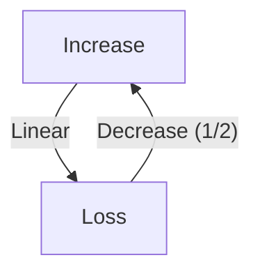
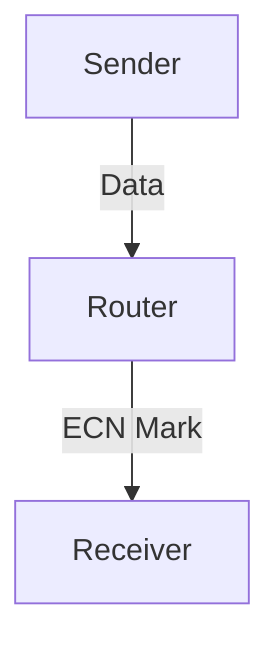

# 3.7 TCP Congestion Control

- TCP uses algorithms to avoid and control congestion.
- **AIMD:** Additive Increase, Multiplicative Decrease.
- **Fairness:** Multiple flows share bandwidth.

---

## AIMD Algorithm
- **Additive Increase:** Window grows linearly.
- **Multiplicative Decrease:** Window halves on loss.

---

## Worked Example: AIMD
- If window size is 10 and a loss occurs, it drops to 5. Then, for each RTT without loss, it increases by 1 (6, 7, 8, ...).

---

## Fairness
- TCP aims to share bandwidth fairly among flows.
- **Unfairness:** UDP flows or misbehaving TCP can disrupt fairness.

---

## Table: Congestion Control Algorithms
| Algorithm | Increase | Decrease | Fairness | Used In |
|-----------|----------|----------|----------|---------|
| AIMD      | Linear   | Halve    | Yes      | TCP     |
| Reno      | Linear   | Halve    | Yes      | TCP     |
| Cubic     | Cubic    | Halve    | Yes      | Linux   |
| Vegas     | Delay    | Linear   | Yes      | TCP     |

---

## Diagram: AIMD Behavior

---

## Summary Table
| Concept   | Description                |
|-----------|----------------------------|
| AIMD      | Linear up, halve on loss   |
| Fairness  | Equal bandwidth sharing    |

---

## Practice Questions
1. **What does AIMD stand for?**
2. **How does TCP achieve fairness?**
3. **Draw a diagram of AIMD behavior.**
4. **Give a worked example of AIMD window adjustment.**
5. **Compare AIMD with another congestion control algorithm.**

---

**Exam Tips:**
- Know AIMD, fairness, and algorithm comparisons.
- Be able to draw and explain AIMD diagrams.
- Use worked examples in answers.

---

## 3.7.1 Fairness
- **Fairness:** Multiple TCP connections share bandwidth fairly.
- **Scenario:** Two flows on same link get equal share.

---

## 3.7.2 Explicit Congestion Notification (ECN): Network-assisted Congestion Control
- **ECN:** Routers mark packets instead of dropping to signal congestion.
- **Benefit:** Reduces packet loss, improves performance.
- **Diagram:**

---

## Summary Table
| Feature | TCP Value         |
|---------|------------------|
| Fairness| Yes              |
| ECN     | Supported        |

---

**Exam Tips:**
- Know how TCP achieves fairness.
- Be able to explain ECN and draw diagrams.

---

## Modern Congestion Control: BBR and QUIC
- **BBR (Bottleneck Bandwidth and Round-trip propagation time):** Estimates available bandwidth and RTT, aims for high throughput and low latency. Used by Google and YouTube.
- **QUIC Congestion Control:** Adapts TCP algorithms (like Cubic, BBR) for use over UDP in HTTP/3. Provides fast recovery and low latency.

## More on ECN and Fairness
- **ECN (Explicit Congestion Notification):** Routers mark packets instead of dropping them, allowing endpoints to reduce sending rate before loss occurs.
- **Fairness:** Modern algorithms aim to share bandwidth fairly even with competing flows and different protocols. 