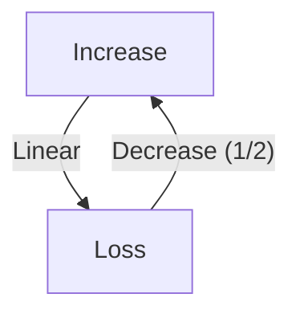
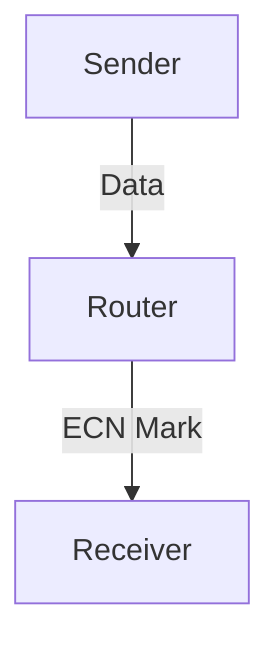

# 3.7 TCP Congestion Control

- TCP uses algorithms to avoid and control congestion.
- **AIMD:** Additive Increase, Multiplicative Decrease.
- **Fairness:** Multiple flows share bandwidth.

---

## TCP Congestion Control: AIMD

### Approach
- **Senders can increase sending rate until packet loss (congestion) occurs, then decrease sending rate on loss event**
- **AIMD sawtooth behavior: probing for bandwidth**

### Additive Increase
- **Increase sending rate by 1 maximum segment size every RTT until loss detected**

### Multiplicative Decrease
- **Cut sending rate in half at each loss event**

### Multiplicative Decrease Detail
- **Sending rate is cut in half on loss detected by triple duplicate ACK (TCP Reno)**
- **Cut to 1 MSS (maximum segment size) when loss detected by timeout (TCP Tahoe)**

### Why AIMD?
- **AIMD – a distributed, asynchronous algorithm – has been shown to:**
  - Optimize congested flow rates network wide!
  - Have desirable stability properties

---

## TCP Congestion Control: Details

### TCP Sender Limits Transmission
- **cwnd is dynamically adjusted in response to observed network congestion (implementing TCP congestion control)**
- **LastByteSent - LastByteAcked < cwnd**

### TCP Sending Behavior
- **Roughly: send cwnd bytes, wait RTT for ACKS, then send more bytes**
- **TCP rate ≈ cwnd/RTT bytes/sec**

### Sender Sequence Number Space
- **Last byte ACKed**
- **Last byte sent**
- **cwnd**
- **Available but not used**
- **Sent, but not-yet ACKed ("in-flight")**

---

## TCP Slow Start

### When Connection Begins
- **Increase rate exponentially until first loss event:**
  - Initially cwnd = 1 MSS
  - Double cwnd every RTT
  - Done by incrementing cwnd for every ACK received

### Example
- **Host A:** One segment
- **Host B:** RTT
- **Time:** Two segments, four segments
- **Summary:** Initial rate is slow, but ramps up exponentially fast

---

## TCP: From Slow Start to Congestion Avoidance

### Question
- **Q: When should the exponential increase switch to linear?**
- **A: When cwnd gets to 1/2 of its value before timeout.**

### Implementation
- **Variable ssthresh**
- **On loss event, ssthresh is set to 1/2 of cwnd just before loss event**

---

## Summary: TCP Congestion Control

### State Machine
- **Slow Start:** cwnd = cwnd + MSS, dupACKcount = 0
- **Congestion Avoidance:** cwnd = cwnd + MSS (MSS/cwnd), dupACKcount = 0
- **Fast Recovery:** cwnd = ssthresh + 3, retransmit missing segment
- **Timeout:** ssthresh = cwnd/2, cwnd = 1 MSS, dupACKcount = 0

### Events
- **New ACK:** Transmit new segment(s), as allowed
- **Duplicate ACK:** dupACKcount++, fast retransmit if dupACKcount == 3
- **Timeout:** Retransmit missing segment

---

## TCP CUBIC

### Question
- **Is there a better way than AIMD to "probe" for usable bandwidth?**

### Insight/Intuition
- **Wmax:** Sending rate at which congestion loss was detected
- **Congestion state of bottleneck link probably (?) hasn't changed much**
- **After cutting rate/window in half on loss, initially ramp to Wmax faster, but then approach Wmax more slowly**

### TCP CUBIC Algorithm
- **Increase W as a function of the cube of the distance between current time and K**
- **K:** Point in time when TCP window size will reach Wmax
- **K itself is tunable**
- **Larger increases when further away from K**
- **Smaller increases (cautious) when nearer K**

### Comparison
- **TCP CUBIC default in Linux, most popular TCP for popular Web servers**
- **TCP CUBIC - higher throughput than classic TCP**

---

## TCP and the Congested "Bottleneck Link"

### Understanding Congestion
- **TCP (classic, CUBIC) increase TCP's sending rate until packet loss occurs at some router's output: the bottleneck link**
- **Useful to focus on congested bottleneck link**

### Key Insights
- **Increasing TCP sending rate will not increase end-end throughput with congested bottleneck**
- **Increasing TCP sending rate will increase measured RTT**
- **Goal:** "Keep the end-end pipe just full, but not fuller"

---

## Delay-based TCP Congestion Control

### Approach
- **Keeping sender-to-receiver pipe "just full enough, but no fuller": keep bottleneck link busy transmitting, but avoid high delays/buffering**

### Algorithm
- **RTTmin:** Minimum observed RTT (uncongested path)
- **Uncongested throughput with congestion window cwnd is cwnd/RTTmin**
- **If measured throughput "very close" to uncongested throughput:**
  - Increase cwnd linearly (since path not congested)
- **Else if measured throughput "far below" uncongested throughput:**
  - Decrease cwnd linearly (since path is congested)

### Measured Throughput
- **Measured throughput = # bytes sent in last RTT interval / RTTmeasured**

### Benefits
- **Congestion control without inducing/forcing loss**
- **Maximizing throughput ("keeping the just pipe full…") while keeping delay low ("…but not fuller")**
- **A number of deployed TCPs take a delay-based approach**
- **BBR deployed on Google's (internal) backbone network**

---

## Explicit Congestion Notification (ECN)

### TCP Deployments
- **TCP deployments often implement network-assisted congestion control:**
- **Two bits in IP header (ToS field) marked by network router to indicate congestion**
- **Policy to determine marking chosen by network operator**
- **Congestion indication carried to destination**
- **Destination sets ECE bit on ACK segment to notify sender of congestion**
- **Involves both IP (IP header ECN bit marking) and TCP (TCP header C,E bit marking)**

### Example
- **IP datagram:** ECN=10, ECN=11
- **TCP ACK segment:** ECE=1

---

## TCP Fairness

### Fairness Goal
- **If K TCP sessions share same bottleneck link of bandwidth R, each should have average rate of R/K**

### Example: Two Competing TCP Sessions
- **Additive increase gives slope of 1, as throughput increases**
- **Multiplicative decrease decreases throughput proportionally**
- **Equal bandwidth share**

### Is TCP Fair?
- **A: Yes, under idealized assumptions:**
  - Same RTT
  - Fixed number of sessions
  - Only in congestion avoidance

### Fairness: Must All Network Apps Be "Fair"?

#### Fairness and UDP
- **Multimedia apps often do not use TCP**
- **Do not want rate throttled by congestion control**
- **Instead use UDP:**
  - Send audio/video at constant rate, tolerate packet loss
- **There is no "Internet police" policing use of congestion control**

#### Fairness, Parallel TCP Connections
- **Application can open multiple parallel connections between two hosts**
- **Web browsers do this, e.g., link of rate R with 9 existing connections:**
  - New app asks for 1 TCP, gets rate R/10
  - New app asks for 11 TCPs, gets R/2

---

## AIMD Algorithm
- **Additive Increase:** Window grows linearly.
- **Multiplicative Decrease:** Window halves on loss.

---

## Worked Example: AIMD
- If window size is 10 and a loss occurs, it drops to 5. Then, for each RTT without loss, it increases by 1 (6, 7, 8, ...).

---

## Fairness
- TCP aims to share bandwidth fairly among flows.
- **Unfairness:** UDP flows or misbehaving TCP can disrupt fairness.

---

## Table: Congestion Control Algorithms
| Algorithm | Increase | Decrease | Fairness | Used In |
|-----------|----------|----------|----------|---------|
| AIMD      | Linear   | Halve    | Yes      | TCP     |
| Reno      | Linear   | Halve    | Yes      | TCP     |
| Cubic     | Cubic    | Halve    | Yes      | Linux   |
| Vegas     | Delay    | Linear   | Yes      | TCP     |

---

## Diagram: AIMD Behavior

---

## Summary Table
| Concept   | Description                |
|-----------|----------------------------|
| AIMD      | Linear up, halve on loss   |
| Fairness  | Equal bandwidth sharing    |

---

## Practice Questions
1. **What does AIMD stand for?**
2. **How does TCP achieve fairness?**
3. **Draw a diagram of AIMD behavior.**
4. **Give a worked example of AIMD window adjustment.**
5. **Compare AIMD with another congestion control algorithm.**

---

**Exam Tips:**
- Know AIMD, fairness, and algorithm comparisons.
- Be able to draw and explain AIMD diagrams.
- Use worked examples in answers.

---

## 3.7.1 Fairness
- **Fairness:** Multiple TCP connections share bandwidth fairly.
- **Scenario:** Two flows on same link get equal share.

---

## 3.7.2 Explicit Congestion Notification (ECN): Network-assisted Congestion Control
- **ECN:** Routers mark packets instead of dropping to signal congestion.
- **Benefit:** Reduces packet loss, improves performance.
- **Diagram:**

---

## Summary Table
| Feature | TCP Value         |
|---------|------------------|
| Fairness| Yes              |
| ECN     | Supported        |

---

**Exam Tips:**
- Know how TCP achieves fairness.
- Be able to explain ECN and draw diagrams.

---

## Modern Congestion Control: BBR and QUIC
- **BBR (Bottleneck Bandwidth and Round-trip propagation time):** Estimates available bandwidth and RTT, aims for high throughput and low latency. Used by Google and YouTube.
- **QUIC Congestion Control:** Adapts TCP algorithms (like Cubic, BBR) for use over UDP in HTTP/3. Provides fast recovery and low latency.

## More on ECN and Fairness
- **ECN (Explicit Congestion Notification):** Routers mark packets instead of dropping them, allowing endpoints to reduce sending rate before loss occurs.
- **Fairness:** Modern algorithms aim to share bandwidth fairly even with competing flows and different protocols. 