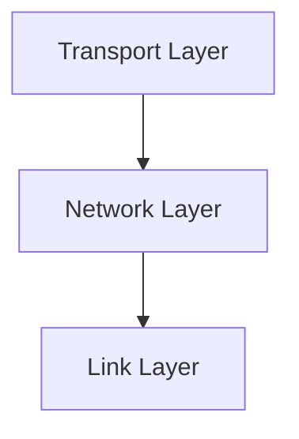

# 4.1 Overview of Network Layer

- The network layer is responsible for moving packets from source to destination across multiple networks.
- **Key functions:** Routing, forwarding, addressing.
- **Protocols:** IP (Internet Protocol), ICMP.

---

## Real-World Analogy
- The network layer is like a postal system: it finds the best route for a letter (packet) to reach its destination, possibly passing through many post offices (routers).

---

## Diagram: Network Layer in the Stack

---

## Summary Table
| Function   | Description                  |
|------------|------------------------------|
| Routing    | Path selection for packets   |
| Forwarding | Move packet to next hop      |
| Addressing | Assign unique identifiers    |

---

## Practice Questions
1. **What is the main function of the network layer?**
2. **Compare routing and forwarding.**
3. **Give a real-world analogy for the network layer.**

---

**Exam Tips:**
- Know the key functions and protocols of the network layer.
- Be able to draw and explain the network layer's role in the stack. 