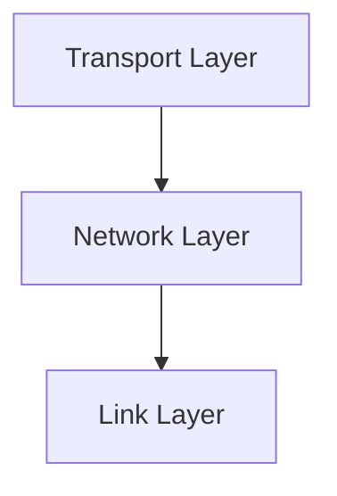

# 4.1 Overview of Network Layer

- The network layer is responsible for moving packets from source to destination across multiple networks.
- **Key functions:** Routing, forwarding, addressing.
- **Protocols:** IP (Internet Protocol), ICMP.

---

## Network Layer: Our Goals

### Understanding Principles Behind Network Layer Services
- **Network layer service models**
- **Forwarding versus routing**
- **How a router works**
- **Addressing**
- **Generalized forwarding**
- **Internet architecture**

### Instantiation, Implementation in the Internet
- **IP protocol**
- **NAT, middleboxes**

---

## Network Layer: "Data Plane" Roadmap

### Main Topics
1. **Network layer: overview**
   - Data plane
   - Control plane
2. **What's inside a router**
   - Input ports, switching, output ports
   - Buffer management, scheduling
3. **IP: the Internet Protocol**
   - Datagram format
   - Addressing
   - Network address translation
   - IPv6
4. **Generalized Forwarding, SDN**
   - Match+action
   - OpenFlow: match+action in action
5. **Middleboxes**

---

## Network-Layer Services and Protocols

### Core Functions
- **Transport segment from sending to receiving host**
- **Sender:** Encapsulates segments into datagrams, passes to link layer
- **Receiver:** Delivers segments to transport layer protocol
- **Network layer protocols in every Internet device:** Hosts, routers

### Router Functions
- **Examines header fields in all IP datagrams passing through it**
- **Moves datagrams from input ports to output ports to transfer datagrams along end-end path**

### Network Architecture
```
mobile network
enterprise network
national or global ISP
datacenter network
application
transport
network
link
physical
```

---

## Two Key Network-Layer Functions

### Forwarding
- **Move packets from a router's input link to appropriate router output link**
- **Analogy:** Taking a trip - forwarding is the process of getting through single interchange

### Routing
- **Determine route taken by packets from source to destination**
- **Analogy:** Taking a trip - routing is the process of planning trip from source to destination
- **Routing algorithms**

---

## Network Layer: Data Plane, Control Plane

### Data Plane
- **Local, per-router function**
- **Determines how datagram arriving on router input port is forwarded to router output port**

### Control Plane
- **Network-wide logic**
- **Determines how datagram is routed among routers along end-end path from source host to destination host**

### Two Control-Plane Approaches
1. **Traditional routing algorithms:** Implemented in routers
2. **Software-defined networking (SDN):** Implemented in (remote) servers

---

## Per-Router Control Plane

### Traditional Approach
- **Individual routing algorithm components in each and every router interact in the control plane**
- **Routing Algorithm**
- **Data plane**
- **Control plane**

### Operation
- **Values in arriving packet header determine forwarding**
- **Each router makes independent routing decisions**

---

## Software-Defined Networking (SDN) Control Plane

### Modern Approach
- **Remote controller computes, installs forwarding tables in routers**
- **Data plane**
- **Control plane**
- **Remote Controller**

### Advantages
- **Centralized control**
- **Programmable network behavior**
- **Rapid deployment of new protocols**

---

## Network Service Model

### Example Services for Individual Datagrams
- **Guaranteed delivery**
- **Guaranteed delivery with less than 40 msec delay**

### Example Services for a Flow of Datagrams
- **In-order datagram delivery**
- **Guaranteed minimum bandwidth to flow**
- **Restrictions on changes in inter-packet spacing**

### Key Question
- **Q: What service model for "channel" transporting datagrams from sender to receiver?**

---

## Network-Layer Service Model Comparison

### Service Model Comparison Table
| Network Architecture | Service Model | Bandwidth | Loss | Order | Timing |
|---------------------|---------------|-----------|------|-------|--------|
| Internet | best effort | none | no | no | no |
| ATM | Constant Bit Rate | Constant rate | yes | yes | yes |
| ATM | Available Bit Rate | Guaranteed min | no | yes | no |
| Internet | Intserv Guaranteed (RFC 1633) | yes | possibly | yes | yes |
| Internet | Diffserv (RFC 2475) | possible | possibly | possibly | no |

### Internet "Best Effort" Service Model
- **No guarantees on:**
  - Successful datagram delivery to destination
  - Timing or order of delivery
  - Bandwidth available to end-end flow

### Quality of Service (QoS) Guarantees?
- **Internet provides best-effort service**
- **Other architectures provide various QoS guarantees**

---

## Reflections on Best-Effort Service

### Success Factors
- **Simplicity of mechanism has allowed Internet to be widely deployed and adopted**
- **Sufficient provisioning of bandwidth allows performance of real-time applications (e.g., interactive voice, video) to be "good enough" for "most of the time"**
- **Replicated, application-layer distributed services (datacenters, content distribution networks) connecting close to clients' networks, allow services to be provided from multiple locations**
- **Congestion control of "elastic" services helps**

### Key Insight
- **It's hard to argue with success of best-effort service model**

---

## Real-World Analogy
- The network layer is like a postal system: it finds the best route for a letter (packet) to reach its destination, possibly passing through many post offices (routers).

---

## Diagram: Network Layer in the Stack


---

## Summary Table
| Function   | Description                  |
|------------|------------------------------|
| Routing    | Path selection for packets   |
| Forwarding | Move packet to next hop      |
| Addressing | Assign unique identifiers    |

---

## Practice Questions
1. **What is the main function of the network layer?**
2. **Compare routing and forwarding.**
3. **Give a real-world analogy for the network layer.**

---

**Exam Tips:**
- Know the key functions and protocols of the network layer.
- Be able to draw and explain the network layer's role in the stack.

---

## Supporting Protocols: ARP and DHCP
- **ARP (Address Resolution Protocol):** Maps IP addresses to MAC addresses on a local network. Essential for packet delivery within a LAN.
- **DHCP (Dynamic Host Configuration Protocol):** Automatically assigns IP addresses and other network configuration to devices on a network. 

---

## Case Studies & Real-World Strategies

### 1. IP Addressing and NAT at Scale
- **ISPs:** Use large-scale NAT (Carrier-Grade NAT) to conserve IPv4 addresses for millions of customers.
- **Cloud Providers (AWS, Azure, GCP):** Automate IP address management, support both IPv4 and IPv6, and provide private/public address pools for VMs and services.

### 2. IPv6 Transition Strategies
- **Google, Facebook, Comcast:** Lead global IPv6 adoption using dual-stack, tunneling (6to4, Teredo), and NAT64 for gradual migration.
- **Mobile Carriers:** Deploy IPv6-only networks with NAT64/DNS64 to support legacy IPv4 content.

### 3. Routing Optimization
- **Google B4 WAN:** Uses SDN to centrally control backbone routing, optimize bandwidth, and reroute around failures in real time.
- **Facebook:** Runs custom BGP policies and traffic engineering to balance load and ensure reliability across global data centers.
- **ISPs:** Use route reflectors, BGP communities, and traffic engineering to manage peering and transit relationships.

### 4. SDN and Programmable Networks
- **Google, Microsoft, Amazon:** Use SDN (OpenFlow, P4) in data centers and WANs for flexible, automated network management and rapid deployment of new services.
- **AT&T, Verizon:** Deploy SDN/NFV for virtualized network functions (firewalls, load balancers) and dynamic service chaining.

### 5. Buffer Management and Congestion
- **ISPs and Data Centers:** Deploy Active Queue Management (AQM) like RED and CoDel to reduce bufferbloat and improve latency for all users.
- **Netflix Open Connect:** Places edge servers in ISP networks to reduce backbone congestion and improve streaming quality. 