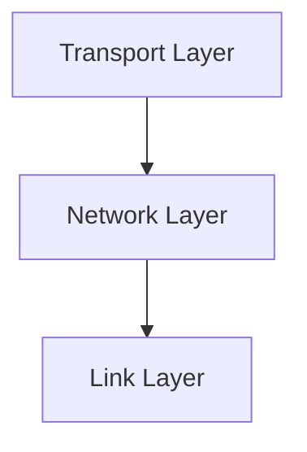

# 4.1 Overview of Network Layer

- The network layer is responsible for moving packets from source to destination across multiple networks.
- **Key functions:** Routing, forwarding, addressing.
- **Protocols:** IP (Internet Protocol), ICMP.

---

## Real-World Analogy
- The network layer is like a postal system: it finds the best route for a letter (packet) to reach its destination, possibly passing through many post offices (routers).

---

## Diagram: Network Layer in the Stack

---

## Summary Table
| Function   | Description                  |
|------------|------------------------------|
| Routing    | Path selection for packets   |
| Forwarding | Move packet to next hop      |
| Addressing | Assign unique identifiers    |

---

## Practice Questions
1. **What is the main function of the network layer?**
2. **Compare routing and forwarding.**
3. **Give a real-world analogy for the network layer.**

---

**Exam Tips:**
- Know the key functions and protocols of the network layer.
- Be able to draw and explain the network layer's role in the stack.

---

## Supporting Protocols: ARP and DHCP
- **ARP (Address Resolution Protocol):** Maps IP addresses to MAC addresses on a local network. Essential for packet delivery within a LAN.
- **DHCP (Dynamic Host Configuration Protocol):** Automatically assigns IP addresses and other network configuration to devices on a network. 

---

## Case Studies & Real-World Strategies

### 1. IP Addressing and NAT at Scale
- **ISPs:** Use large-scale NAT (Carrier-Grade NAT) to conserve IPv4 addresses for millions of customers.
- **Cloud Providers (AWS, Azure, GCP):** Automate IP address management, support both IPv4 and IPv6, and provide private/public address pools for VMs and services.

### 2. IPv6 Transition Strategies
- **Google, Facebook, Comcast:** Lead global IPv6 adoption using dual-stack, tunneling (6to4, Teredo), and NAT64 for gradual migration.
- **Mobile Carriers:** Deploy IPv6-only networks with NAT64/DNS64 to support legacy IPv4 content.

### 3. Routing Optimization
- **Google B4 WAN:** Uses SDN to centrally control backbone routing, optimize bandwidth, and reroute around failures in real time.
- **Facebook:** Runs custom BGP policies and traffic engineering to balance load and ensure reliability across global data centers.
- **ISPs:** Use route reflectors, BGP communities, and traffic engineering to manage peering and transit relationships.

### 4. SDN and Programmable Networks
- **Google, Microsoft, Amazon:** Use SDN (OpenFlow, P4) in data centers and WANs for flexible, automated network management and rapid deployment of new services.
- **AT&T, Verizon:** Deploy SDN/NFV for virtualized network functions (firewalls, load balancers) and dynamic service chaining.

### 5. Buffer Management and Congestion
- **ISPs and Data Centers:** Deploy Active Queue Management (AQM) like RED and CoDel to reduce bufferbloat and improve latency for all users.
- **Netflix Open Connect:** Places edge servers in ISP networks to reduce backbone congestion and improve streaming quality. 