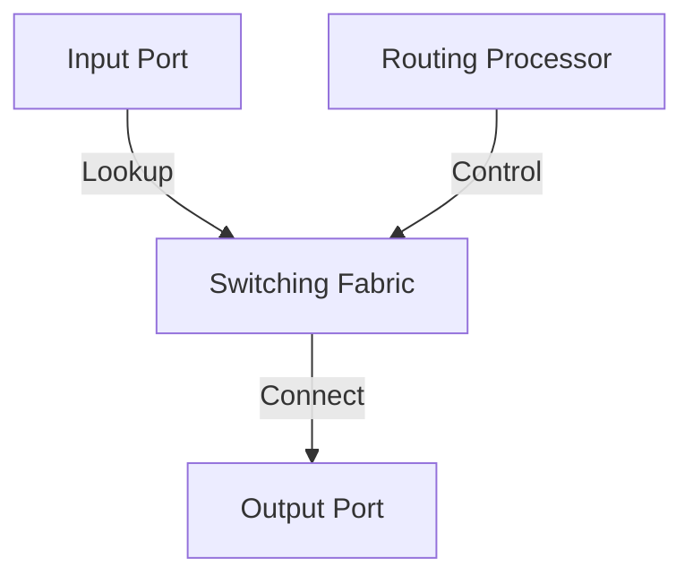

# 4.2 Inside a Router

- Routers forward packets between networks using routing tables and switching fabric.
- **Key components:** Input ports, output ports, switching fabric, routing processor.

---

## Router Architecture Overview

### High-Level View of Generic Router Architecture
- **High-speed switching fabric**
- **Routing processor**
- **Router input ports**
- **Router output ports**

### Timeframe Operations
- **Forwarding data plane (hardware):** Operates in nanosecond timeframe
- **Routing, management control plane (software):** Operates in millisecond time frame

### Analogy View
- **Roundabout:** Switching fabric
- **Station manager:** Routing processor
- **Entry stations:** Input ports
- **Exit roads:** Output ports

---

## Input Port Functions

### Physical Layer Functions
- **Bit-level reception**
- **Line termination**

### Link Layer Functions
- **Link layer protocol (receive)**
- **Link layer (e.g., Ethernet)**

### Network Layer Functions
- **Lookup, forwarding**
- **Queueing**

### Decentralized Switching
- **Using header field values, lookup output port using forwarding table in input port memory ("match plus action")**
- **Goal:** Complete input port processing at 'line speed'
- **Input port queuing:** If datagrams arrive faster than forwarding rate into switch fabric

### Frame to Datagram Processing
- **Physical layer:** Bit-level reception
- **Link layer:** Protocol processing
- **Network layer:** Lookup and forwarding

### Forwarding Types
- **Destination-based forwarding:** Forward based only on destination IP address (traditional)
- **Generalized forwarding:** Forward based on any set of header field values

---

## Destination-Based Forwarding

### Longest Prefix Matching
- **When looking for forwarding table entry for given destination address, use longest address prefix that matches destination address**

### Example Forwarding Table
| Destination Address Range | Link Interface |
|---------------------------|----------------|
| 11001000 00010111 00010*** | 0 |
| 11001000 00010111 00011000*** | 1 |
| 11001000 00010111 00011*** | 2 |
| otherwise | 3 |

### Examples
- **11001000 00010111 00011000 10101010:** Which interface?
- **11001000 00010111 00010110 10100001:** Which interface?

### Implementation
- **Longest prefix matching: often performed using ternary content addressable memories (TCAMs)**
- **Content addressable:** Present address to TCAM: retrieve address in one clock cycle, regardless of table size
- **Cisco Catalyst:** ~1M routing table entries in TCAM

---

## Switching Fabrics

### Purpose
- **Transfer packet from input link to appropriate output link**
- **High-speed switching fabric**
- **N input ports, N output ports**

### Switching Rate
- **Rate at which packets can be transfer from inputs to outputs**
- **Often measured as multiple of input/output line rate**
- **N inputs: switching rate N times line rate desirable**

### Three Major Types
1. **Bus**
2. **Memory**
3. **Interconnection network**

---

## Switching via Memory

### First Generation Routers
- **Traditional computers with switching under direct control of CPU**
- **Packet copied to system's memory**
- **Speed limited by memory bandwidth (2 bus crossings per datagram)**

### Architecture
- **Input port (e.g., Ethernet)**
- **Memory**
- **Output port (e.g., Ethernet)**
- **System bus**

---

## Switching via a Bus

### Operation
- **Datagram from input port memory to output port memory via a shared bus**
- **Bus contention: switching speed limited by bus bandwidth**
- **32 Gbps bus, Cisco 5600: sufficient speed for access routers**

---

## Switching via Interconnection Network

### Crossbar Networks
- **Crossbar, Clos networks, other interconnection nets initially developed to connect processors in multiprocessor**
- **8x8 multistage switch built from smaller-sized switches**
- **3x3 crossbar**

### Multistage Switch
- **nxn switch from multiple stages of smaller switches**
- **Exploiting parallelism:**
  - Fragment datagram into fixed length cells on entry
  - Switch cells through the fabric, reassemble datagram at exit

### Scaling with Multiple Planes
- **Speedup, scaleup via parallelism**
- **Cisco CRS router:**
  - Basic unit: 8 switching planes
  - Each plane: 3-stage interconnection network
  - Up to 100's Tbps switching capacity

---

## Input Port Queuing

### Problem
- **If switch fabric slower than input ports combined → queueing may occur at input queues**
- **Queueing delay and loss due to input buffer overflow!**

### Output Port Contention
- **Only one red datagram can be transferred. Lower red packet is blocked**
- **One packet time later: green packet experiences HOL blocking**

### Head-of-the-Line (HOL) Blocking
- **Queued datagram at front of queue prevents others in queue from moving forward**

---

## Output Port Queuing

### Buffering Requirements
- **Buffering required when datagrams arrive from fabric faster than link transmission rate**
- **Drop policy: which datagrams to drop if no free buffers?**

### Scheduling Discipline
- **Chooses among queued datagrams for transmission**
- **Datagrams can be lost due to congestion, lack of buffers**
- **Priority scheduling – who gets best performance, network neutrality**

### Buffer Management
- **Line termination**
- **Link layer protocol (send)**
- **Switch fabric (rate: NR)**
- **Datagram buffer queueing**

### Important Note
- **This is a really important slide**

---

## How Much Buffering?

### RFC 3439 Rule of Thumb
- **Average buffering equal to "typical" RTT (say 250 msec) times link capacity C**
- **Example:** C = 10 Gbps link: 2.5 Gbit buffer

### Recent Recommendation
- **With N flows, buffering equal to RTT × C / √N**
- **But too much buffering can increase delays (particularly in home routers)**
- **Long RTTs: poor performance for real-time apps, sluggish TCP response**
- **Recall delay-based congestion control: "keep bottleneck link just full enough (busy) but no fuller"**

---

## Buffer Management

### Buffer Management Functions
- **Drop: which packet to add, drop when buffers are full**
  - **Tail drop:** Drop arriving packet
  - **Priority:** Drop/remove on priority basis
- **Marking: which packets to mark to signal congestion (ECN, RED)**

### Queue Abstraction
- **Queue (waiting area)**
- **Packet arrivals**
- **Packet departures**
- **Link (server)**

---

## Packet Scheduling

### Packet Scheduling Purpose
- **Deciding which packet to send next on link**

### Scheduling Policies
1. **First come, first served (FCFS)**
2. **Priority**
3. **Round robin**
4. **Weighted fair queueing**

---

## Packet Scheduling: FCFS

### FCFS Operation
- **Packets transmitted in order of arrival to output port**
- **Also known as: First-in-first-out (FIFO)**
- **Real world examples?**

---

## Scheduling Policies: Priority

### Priority Scheduling
- **Arriving traffic classified, queued by class**
- **Any header fields can be used for classification**
- **High priority queue, low priority queue**

### Operation
- **Send packet from highest priority queue that has buffered packets**
- **FCFS within priority class**

---

## Scheduling Policies: Round Robin

### Round Robin (RR) Scheduling
- **Arriving traffic classified, queued by class**
- **Any header fields can be used for classification**
- **Server cyclically, repeatedly scans class queues, sending one complete packet from each class (if available) in turn**

---

## Scheduling Policies: Weighted Fair Queuing

### Weighted Fair Queuing (WFQ)
- **Generalized Round Robin**
- **Minimum bandwidth guarantee (per-traffic-class)**
- **Each class, i, has weight, wi, and gets weighted amount of service in each cycle: wi/Σjwj**

---

## Sidebar: Network Neutrality

### What is Network Neutrality?
- **Technical: how an ISP should share/allocation its resources**
- **Packet scheduling, buffer management are the mechanisms**
- **Social, economic principles**
- **Protecting free speech**
- **Encouraging innovation, competition**
- **Enforced legal rules and policies**
- **Different countries have different "takes" on network neutrality**

### 2015 US FCC Order
- **No blocking:** "shall not block lawful content, applications, services, or non-harmful devices, subject to reasonable network management."
- **No throttling:** "shall not impair or degrade lawful Internet traffic on the basis of Internet content, application, or service, or use of a non-harmful device, subject to reasonable network management."
- **No paid prioritization:** "shall not engage in paid prioritization"

### ISP Classification Question
- **US Telecommunication Act of 1934 and 1996:**
  - **Title II:** Imposes "common carrier duties" on telecommunications services: reasonable rates, non-discrimination and requires regulation
  - **Title I:** Applies to information services: no common carrier duties (not regulated) but grants FCC authority
- **Is an ISP a "telecommunications service" or an "information service" provider?**
- **The answer really matters from a regulatory standpoint!**

---

## Router Components
- **Input port:** Receives packets, does lookup.
- **Switching fabric:** Connects input to output ports.
- **Output port:** Queues and transmits packets.
- **Routing processor:** Runs routing protocols, manages tables.

---

## Diagram: Router Architecture

---

## Summary Table
| Component         | Function                  |
|-------------------|--------------------------|
| Input Port        | Receive, lookup          |
| Switching Fabric  | Connect input/output     |
| Output Port       | Queue, transmit          |
| Routing Processor | Protocols, table mgmt    |

---

## Practice Questions
1. **List the main components of a router.**
2. **What is the function of the switching fabric?**
3. **Draw a diagram of router architecture.**

---

**Exam Tips:**
- Know router components and their functions.
- Be able to draw and explain router diagrams.

---

## Router Buffer Management
- **Tail Drop:** Packets are dropped when the buffer is full (default behavior).
- **RED (Random Early Detection):** Proactively drops packets before the buffer is full to signal congestion.
- **Bufferbloat:** Excessive buffering causes high latency and jitter; modern routers use AQM (Active Queue Management) to mitigate.

## Switching Fabric Types
- **Memory:** Packets copied to memory, then to output port (simple, slow).
- **Bus:** Shared bus connects input/output ports (faster, can be bottlenecked).
- **Crossbar:** Matrix of interconnections, allows multiple simultaneous transfers (fastest, most expensive). 