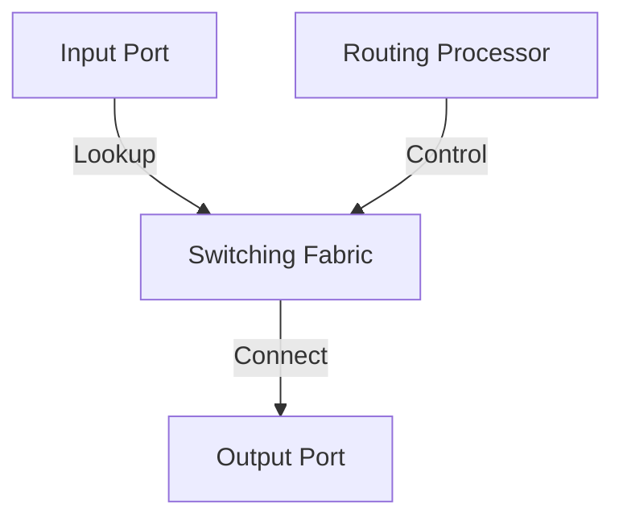

# 4.2 Inside a Router

- Routers forward packets between networks using routing tables and switching fabric.
- **Key components:** Input ports, output ports, switching fabric, routing processor.

---

## Router Components
- **Input port:** Receives packets, does lookup.
- **Switching fabric:** Connects input to output ports.
- **Output port:** Queues and transmits packets.
- **Routing processor:** Runs routing protocols, manages tables.

---

## Diagram: Router Architecture

---

## Summary Table
| Component         | Function                  |
|-------------------|--------------------------|
| Input Port        | Receive, lookup          |
| Switching Fabric  | Connect input/output     |
| Output Port       | Queue, transmit          |
| Routing Processor | Protocols, table mgmt    |

---

## Practice Questions
1. **List the main components of a router.**
2. **What is the function of the switching fabric?**
3. **Draw a diagram of router architecture.**

---

**Exam Tips:**
- Know router components and their functions.
- Be able to draw and explain router diagrams. 