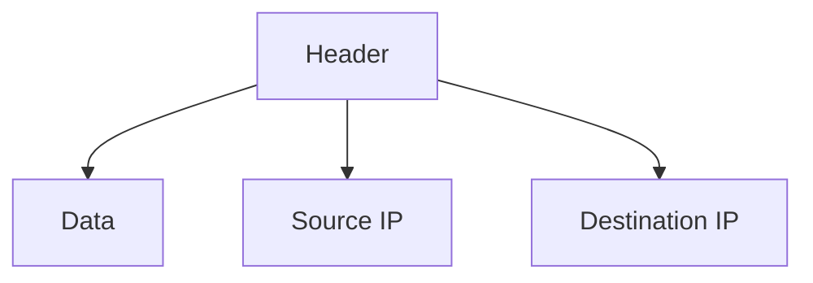

# 4.3 Internet Protocol (IP)

- IP is the principal protocol for the network layer, providing addressing and routing.
- **Versions:** IPv4 (32-bit), IPv6 (128-bit).

---

## IP Datagram Format
- **Fields:** Version, header length, type of service, total length, identification, flags, fragment offset, TTL, protocol, header checksum, source IP, destination IP, data.

---

## IPv4 vs. IPv6
- **IPv4:** 32-bit addresses, 4.3 billion possible.
- **IPv6:** 128-bit addresses, vastly more, improved features.

---

## Diagram: IP Datagram

---

## Summary Table
| Feature   | IPv4         | IPv6           |
|-----------|--------------|----------------|
| Address   | 32-bit       | 128-bit        |
| Notation  | Dotted-dec   | Hexadecimal    |
| Features  | Basic        | Improved, more |

---

## Practice Questions
1. **List three fields in the IP datagram header.**
2. **Compare IPv4 and IPv6.**
3. **Draw a diagram of the IP datagram.**

---

**Exam Tips:**
- Know IP header fields and address differences.
- Be able to draw and explain IP datagram diagrams. 