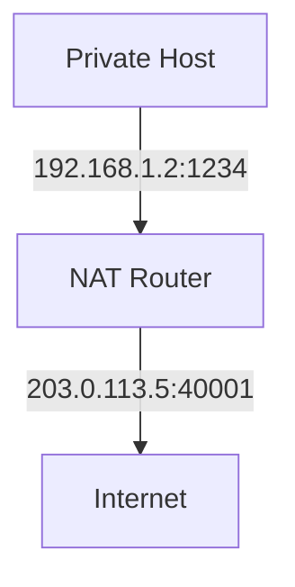
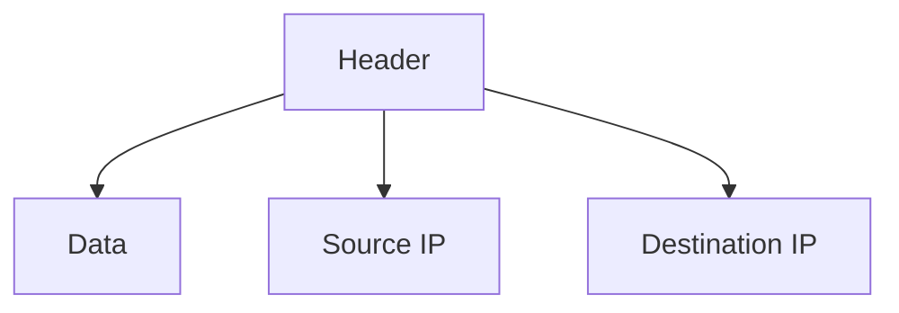

# 4.3 Internet Protocol (IP)

- IP is the principal protocol for the network layer, providing addressing and routing.
- **Versions:** IPv4 (32-bit), IPv6 (128-bit).

---

## IP Datagram Format
- **Fields:** Version, header length, type of service, total length, identification, flags, fragment offset, TTL, protocol, header checksum, source IP, destination IP, data.

---

## IPv4 vs. IPv6
- **IPv4:** 32-bit addresses, 4.3 billion possible.
- **IPv6:** 128-bit addresses, vastly more, improved features.

---

## IPv4 vs. IPv6 Header Comparison
| Field         | IPv4           | IPv6           |
|---------------|----------------|----------------|
| Address Size  | 32 bits        | 128 bits       |
| Header Length | Variable       | Fixed (40B)    |
| Checksum      | Yes            | No             |
| Fragmentation | Routers        | End hosts      |
| Options       | Yes            | Extension Hdrs |

## IPv6 Transition Mechanisms
- **Dual Stack:** Devices run both IPv4 and IPv6.
- **Tunneling:** IPv6 packets encapsulated in IPv4 for transport over IPv4 networks.
- **NAT64:** Allows IPv6-only hosts to communicate with IPv4 servers.

## Subnetting and CIDR
- **Subnetting:** Divides a network into smaller subnets. Example: 192.168.1.0/24 split into 192.168.1.0/25 and 192.168.1.128/25.
- **CIDR (Classless Inter-Domain Routing):** Uses variable-length subnet masks (e.g., 10.0.0.0/8, 192.168.1.0/24).
- **Calculation Example:**
  - /26 subnet: 64 addresses (2^(32-26)).

## NAT (Network Address Translation)
- **Purpose:** Allows multiple devices to share a single public IP address.
- **Types:**
  - **Static NAT:** One-to-one mapping.
  - **Dynamic NAT:** Many-to-many mapping.
  - **PAT (Port Address Translation):** Many-to-one, uses port numbers (most common).
- **Pros:** Conserves IPv4 addresses, adds security.
- **Cons:** Breaks end-to-end connectivity, issues with some protocols.

## Diagram: NAT Operation

## ICMP Message Types
- **Echo Request/Reply:** Used by ping.
- **Destination Unreachable:** Packet cannot be delivered.
- **Time Exceeded:** TTL expired (used by traceroute).
- **Redirect:** Suggests a better route.

---

## Diagram: IP Datagram

---

## Summary Table
| Feature   | IPv4         | IPv6           |
|-----------|--------------|----------------|
| Address   | 32-bit       | 128-bit        |
| Notation  | Dotted-dec   | Hexadecimal    |
| Features  | Basic        | Improved, more |

---

## Practice Questions
1. **List three fields in the IP datagram header.**
2. **Compare IPv4 and IPv6.**
3. **Draw a diagram of the IP datagram.**

---

**Exam Tips:**
- Know IP header fields and address differences.
- Be able to draw and explain IP datagram diagrams. 