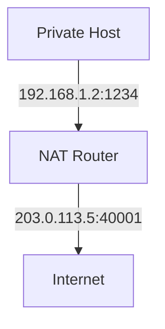
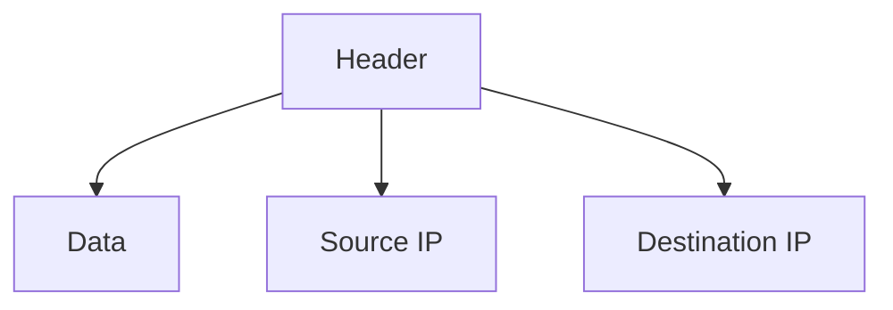

# 4.3 Internet Protocol (IP)

- IP is the principal protocol for the network layer, providing addressing and routing.
- **Versions:** IPv4 (32-bit), IPv6 (128-bit).

---

## Network Layer: Internet

### Host, Router Network Layer Functions
- **IP protocol**
- **Datagram format**
- **Addressing**
- **Packet handling conventions**
- **ICMP protocol**
  - Error reporting
  - Router "signaling"

### Protocol Stack
- **Transport layer:** TCP, UDP
- **Link layer**
- **Physical layer**
- **Network layer**
- **Forwarding table**

### Path-Selection Algorithms
- **Implemented in routing protocols (OSPF, BGP)**
- **SDN controller**

---

## IP Datagram Format

### IPv4 Header Fields
```
ver    length    32 bits
payload data (variable length, typically a TCP or UDP segment)
16-bit identifier
header checksum
time to live
source IP address
head. len
type of service
flgs
fragment offset
upper layer
destination IP address
options (if any)
```

### Header Field Details
- **IP protocol version number**
- **Header length (bytes)**
- **Upper layer protocol (e.g., TCP or UDP)**
- **Total datagram length (bytes)**
- **"Type" of service:**
  - Diffserv (0:5)
  - ECN (6:7)
- **Fragmentation/reassembly**
- **TTL: remaining max hops (decremented at each router)**
- **20 bytes of TCP + 20 bytes of IP = 40 bytes + app layer overhead for TCP+IP**
- **Overhead: e.g., timestamp, record route taken**
- **32-bit source IP address**
- **32-bit destination IP address**
- **Header checksum**
- **Maximum length: 64K bytes**
- **Typically: 1500 bytes or less**

---

## IP Addressing: Introduction

### IP Address Definition
- **IP address: 32-bit identifier associated with each host or router interface**
- **Interface: connection between host/router and physical link**
- **Router's typically have multiple interfaces**
- **Host typically has one or two interfaces (e.g., wired Ethernet, wireless 802.11)**

### Dotted-Decimal Notation
- **223.1.1.1 = 11011111 00000001 00000001 00000001**
- **223.1.1.1 = 223.1.1.1**

### Interface Connections
- **Q: How are interfaces actually connected?**
- **A: Wired Ethernet interfaces connected by Ethernet switches**
- **A: Wireless WiFi interfaces connected by WiFi base station**
- **A: We'll learn about that in chapters 6, 7**

---

## Subnets

### What's a Subnet?
- **Device interfaces that can physically reach each other without passing through an intervening router**
- **Network consisting of 3 subnets**
- **IP addresses have structure:**
  - **Subnet part: devices in same subnet have common high order bits**
  - **Host part: remaining low order bits**

### Recipe for Defining Subnets
- **Detach each interface from its host or router, creating "islands" of isolated networks**
- **Each isolated network is called a subnet**
- **Subnet mask: /24 (high-order 24 bits: subnet part of IP address)**

### Subnet Examples
- **Subnet 223.1.3.0/24**
- **Subnet 223.1.1.0/24**
- **Subnet 223.1.2.0/24**

---

## IP Addressing: CIDR

### CIDR Definition
- **CIDR: Classless InterDomain Routing (pronounced "cider")**
- **Subnet portion of address of arbitrary length**
- **Address format: a.b.c.d/x, where x is # bits in subnet portion of address**

### Example
- **11001000 00010111 00010000 00000000**
- **Subnet part, host part**
- **200.23.16.0/23**

---

## IP Addresses: How to Get One?

### Two Questions
- **Q: How does a host get IP address within its network (host part of address)?**
- **Q: How does a network get IP address for itself (network part of address)**

### How Does Host Get IP Address?
- **Hard-coded by sysadmin in config file (e.g., /etc/rc.config in UNIX)**
- **DHCP: Dynamic Host Configuration Protocol: dynamically get address from as server**
- **"Plug-and-play"**

---

## DHCP: Dynamic Host Configuration Protocol

### Goal
- **Host dynamically obtains IP address from network server when it "joins" network**
- **Can renew its lease on address in use**
- **Allows reuse of addresses (only hold address while connected/on)**
- **Support for mobile users who join/leave network**

### DHCP Overview
- **Host broadcasts DHCP discover msg [optional]**
- **DHCP server responds with DHCP offer msg [optional]**
- **Host requests IP address: DHCP request msg**
- **DHCP server sends address: DHCP ack msg**

### DHCP Client-Server Scenario
- **DHCP server: 223.1.2.5**
- **Arriving client**

### DHCP Message Exchange
1. **DHCP discover: src: 0.0.0.0, 68, dest.: 255.255.255.255, 67, yiaddr: 0.0.0.0, transaction ID: 654**
2. **DHCP offer: src: 223.1.2.5, 67, dest: 255.255.255.255, 68, yiaddr: 223.1.2.4, transaction ID: 654, lifetime: 3600 secs**
3. **DHCP request: src: 0.0.0.0, 68, dest:: 255.255.255.255, 67, yiaddr: 223.1.2.4, transaction ID: 655, lifetime: 3600 secs**
4. **DHCP ACK: src: 223.1.2.5, 67, dest: 255.255.255.255, 68, yiaddr: 223.1.2.4, transaction ID: 655, lifetime: 3600 secs**

### DHCP Additional Information
- **DHCP can return more than just allocated IP address on subnet:**
  - **Address of first-hop router for client**
  - **Name and IP address of DNS server**
  - **Network mask (indicating network versus host portion of address)**

---

## IP Addresses: How to Get One?

### How Does Network Get Subnet Part of IP Address?
- **A: Gets allocated portion of its provider ISP's address space**

### ISP Address Allocation Example
- **ISP's block: 11001000 00010111 00010000 00000000 200.23.16.0/20**
- **ISP can then allocate out its address space in 8 blocks:**
  - **Organization 0: 11001000 00010111 00010000 00000000 200.23.16.0/23**
  - **Organization 1: 11001000 00010111 00010010 00000000 200.23.18.0/23**
  - **Organization 2: 11001000 00010111 00010100 00000000 200.23.20.0/23**
  - **Organization 7: 11001000 00010111 00011110 00000000 200.23.30.0/23**

---

## Hierarchical Addressing: Route Aggregation

### Efficient Advertisement
- **Hierarchical addressing allows efficient advertisement of routing information**

### Example
- **"Send me anything with addresses beginning 200.23.16.0/20"**
- **200.23.16.0/23, 200.23.18.0/23, 200.23.30.0/23**
- **Fly-By-Night-ISP, Organization 0, Organization 7, Internet, Organization 1, ISPs-R-Us**

---

## Hierarchical Addressing: More Specific Routes

### Organization Movement
- **Organization 1 moves from Fly-By-Night-ISP to ISPs-R-Us**
- **ISPs-R-Us now advertises a more specific route to Organization 1**
- **"or 200.23.18.0/23"**

---

## IP Addressing: Last Words

### How Does ISP Get Block of Addresses?
- **A: ICANN: Internet Corporation for Assigned Names and Numbers**
- **Allocates IP addresses, through 5 regional registries (RRs) (who may then allocate to local registries)**
- **Manages DNS root zone, including delegation of individual TLD (.com, .edu, …) management**

### Are There Enough 32-bit IP Addresses?
- **ICANN allocated last chunk of IPv4 addresses to RRs in 2011**
- **NAT (next) helps IPv4 address space exhaustion**
- **IPv6 has 128-bit address space**
- **"Who the hell knew how much address space we needed?" Vint Cerf**

---

## NAT: Network Address Translation

### NAT Overview
- **Local network (e.g., home network) 10.0.0/24**
- **138.76.29.7**
- **Rest of Internet**
- **Datagrams with source or destination in this network have 10.0.0/24 address for source, destination (as usual)**
- **All datagrams leaving local network have same source NAT IP address: 138.76.29.7, but different source port numbers**
- **NAT: all devices in local network share just one IPv4 address as far as outside world is concerned**

### NAT Advantages
- **All devices in local network have 32-bit addresses in a "private" IP address space (10/8, 172.16/12, 192.168/16 prefixes) that can only be used in local network**
- **Just one IP address needed from provider ISP for all devices**
- **Can change addresses of host in local network without notifying outside world**
- **Can change ISP without changing addresses of devices in local network**
- **Security: devices inside local net not directly addressable, visible by outside world**

### NAT Implementation
- **NAT router must (transparently):**
  - **Outgoing datagrams: replace (source IP address, port #) of every outgoing datagram to (NAT IP address, new port #)**
  - **Remote clients/servers will respond using (NAT IP address, new port #) as destination address**
  - **Remember (in NAT translation table) every (source IP address, port #) to (NAT IP address, new port #) translation pair**
  - **Incoming datagrams: replace (NAT IP address, new port #) in destination fields of every incoming datagram with corresponding (source IP address, port #) stored in NAT table**

### NAT Example
- **Host 10.0.0.1 sends datagram to 128.119.40.186, 80**
- **NAT router changes datagram source address from 10.0.0.1, 3345 to 138.76.29.7, 5001, updates table**
- **Reply arrives, destination address: 138.76.29.7, 5001**
- **NAT router changes destination address to 10.0.0.1, 3345**

### NAT Controversy
- **NAT has been controversial:**
  - **Routers "should" only process up to layer 3**
  - **Address "shortage" should be solved by IPv6**
  - **Violates end-to-end argument (port # manipulation by network-layer device)**
  - **NAT traversal: what if client wants to connect to server behind NAT?**
- **But NAT is here to stay:**
  - **Extensively used in home and institutional nets, 4G/5G cellular nets**

---

## IPv6: Motivation

### Initial Motivation
- **32-bit IPv4 address space would be completely allocated**

### Additional Motivation
- **Speed processing/forwarding: 40-byte fixed length header**
- **Enable different network-layer treatment of "flows"**

---

## IPv6 Datagram Format

### IPv6 Header Fields
```
payload (data)
destination address (128 bits)
source address (128 bits)
payload len
next hdr
hop limit
flow label
pri
ver
32 bits
```

### Header Field Details
- **Priority: identify priority among datagrams in flow**
- **Flow label: identify datagrams in same "flow." (concept of "flow" not well defined)**
- **128-bit IPv6 addresses**

### What's Missing (Compared with IPv4)
- **No checksum (to speed processing at routers)**
- **No fragmentation/reassembly**
- **No options (available as upper-layer, next-header protocol at router)**

---

## Transition from IPv4 to IPv6

### Challenge
- **Not all routers can be upgraded simultaneously**
- **No "flag days"**
- **How will network operate with mixed IPv4 and IPv6 routers?**

### Solution: Tunneling
- **IPv6 datagram carried as payload in IPv4 datagram among IPv4 routers ("packet within a packet")**
- **Tunneling used extensively in other contexts (4G/5G)**

---

## Tunneling and Encapsulation

### Ethernet Connecting Two IPv6 Routers
- **Ethernet connects two IPv6 routers**
- **Link-layer frame, IPv6 datagram**
- **The usual: datagram as payload in link-layer frame**

### IPv4 Network Connecting Two IPv6 Routers
- **IPv4 network connecting two IPv6 routers**
- **IPv4 tunnel connecting IPv6 routers**
- **IPv4 datagram, IPv6 datagram**
- **Tunneling: IPv6 datagram as payload in a IPv4 datagram**

### Tunneling Example
- **Physical view: IPv4, IPv4**
- **Logical view: IPv4 tunnel connecting IPv6 routers**
- **Flow: X, Src: A, Dest: F, data**
- **A-to-B: IPv6, B-to-C: IPv6 inside IPv4, E-to-F: IPv6**

---

## IPv6: Adoption

### Current Status
- **Google: ~ 40% of clients access services via IPv6 (2023)**
- **NIST: 1/3 of all US government domains are IPv6 capable**

### Long Deployment Time
- **25 years and counting!**
- **Think of application-level changes in last 25 years: WWW, social media, streaming media, gaming, telepresence, …**
- **Why?**

---

## IP Datagram Format
- **Fields:** Version, header length, type of service, total length, identification, flags, fragment offset, TTL, protocol, header checksum, source IP, destination IP, data.

---

## IPv4 vs. IPv6
- **IPv4:** 32-bit addresses, 4.3 billion possible.
- **IPv6:** 128-bit addresses, vastly more, improved features.

---

## IPv4 vs. IPv6 Header Comparison
| Field         | IPv4           | IPv6           |
|---------------|----------------|----------------|
| Address Size  | 32 bits        | 128 bits       |
| Header Length | Variable       | Fixed (40B)    |
| Checksum      | Yes            | No             |
| Fragmentation | Routers        | End hosts      |
| Options       | Yes            | Extension Hdrs |

## IPv6 Transition Mechanisms
- **Dual Stack:** Devices run both IPv4 and IPv6.
- **Tunneling:** IPv6 packets encapsulated in IPv4 for transport over IPv4 networks.
- **NAT64:** Allows IPv6-only hosts to communicate with IPv4 servers.

## Subnetting and CIDR
- **Subnetting:** Divides a network into smaller subnets. Example: 192.168.1.0/24 split into 192.168.1.0/25 and 192.168.1.128/25.
- **CIDR (Classless Inter-Domain Routing):** Uses variable-length subnet masks (e.g., 10.0.0.0/8, 192.168.1.0/24).
- **Calculation Example:**
  - /26 subnet: 64 addresses (2^(32-26)).

## NAT (Network Address Translation)
- **Purpose:** Allows multiple devices to share a single public IP address.
- **Types:**
  - **Static NAT:** One-to-one mapping.
  - **Dynamic NAT:** Many-to-many mapping.
  - **PAT (Port Address Translation):** Many-to-one, uses port numbers (most common).
- **Pros:** Conserves IPv4 addresses, adds security.
- **Cons:** Breaks end-to-end connectivity, issues with some protocols.

## Diagram: NAT Operation


## ICMP Message Types
- **Echo Request/Reply:** Used by ping.
- **Destination Unreachable:** Packet cannot be delivered.
- **Time Exceeded:** TTL expired (used by traceroute).
- **Redirect:** Suggests a better route.

---

## Diagram: IP Datagram


---

## Summary Table
| Feature   | IPv4         | IPv6           |
|-----------|--------------|----------------|
| Address   | 32-bit       | 128-bit        |
| Notation  | Dotted-dec   | Hexadecimal    |
| Features  | Basic        | Improved, more |

---

## Practice Questions
1. **List three fields in the IP datagram header.**
2. **Compare IPv4 and IPv6.**
3. **Draw a diagram of the IP datagram.**

---

**Exam Tips:**
- Know IP header fields and address differences.
- Be able to draw and explain IP datagram diagrams. 