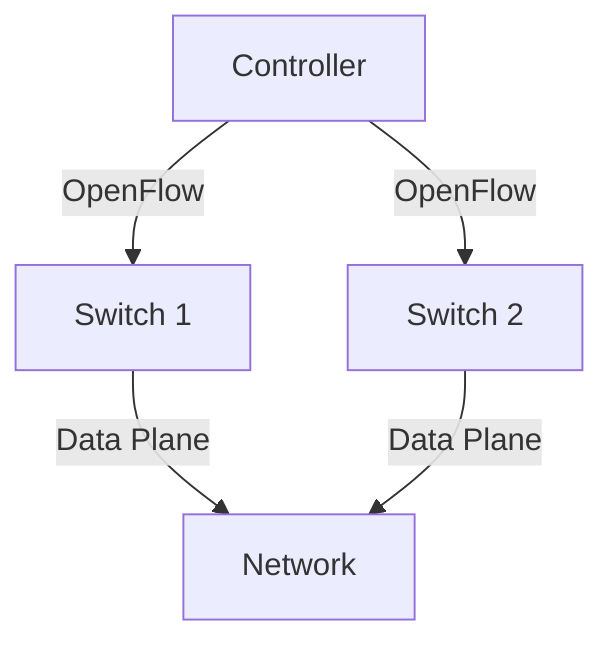

# 4.4 Generalized Forwarding and Software-Defined Networking (SDN)

- SDN separates the control plane (decision-making) from the data plane (forwarding).
- **Generalized forwarding:** Flexible, programmable packet handling.
- **OpenFlow:** Protocol for SDN switches/controllers.

---

## SDN Architecture
- **Controller:** Centralized control logic.
- **Switches:** Simple forwarding devices.
- **Southbound API:** (e.g., OpenFlow) connects controller to switches.

---

## Diagram: SDN Architecture

---

## Summary Table
| Concept      | Traditional | SDN             |
|-------------|-------------|-----------------|
| Control     | Distributed | Centralized     |
| Forwarding  | Fixed       | Programmable    |
| Flexibility | Low         | High            |

---

## Practice Questions
1. **What is SDN?**
2. **How does OpenFlow work in SDN?**
3. **Draw a diagram of SDN architecture.**

---

**Exam Tips:**
- Know SDN concepts and OpenFlow role.
- Be able to draw and explain SDN diagrams.

---

## SDN Use Cases and Benefits
- **Network Virtualization:** Easily create isolated virtual networks for tenants or applications.
- **Traffic Engineering:** Dynamically adjust paths for optimal performance.
- **Security:** Centralized control enables rapid response to threats and fine-grained policy enforcement.
- **Automation:** Simplifies network management and reduces human error. 