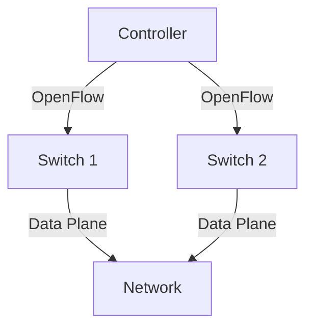

# 4.4 Generalized Forwarding and Software-Defined Networking (SDN)

- SDN separates the control plane (decision-making) from the data plane (forwarding).
- **Generalized forwarding:** Flexible, programmable packet handling.
- **OpenFlow:** Protocol for SDN switches/controllers.

---

## Generalized Forwarding: Match Plus Action

### Review: Traditional Forwarding
- **Each router contains a forwarding table**
- **"Match plus action" abstraction: match bits in arriving packet, take action**
- **Destination-based forwarding: forward based on dest. IP address**

### Generalized Forwarding
- **Many header fields can determine action**
- **Many action possible: drop/copy/modify/log packet**
- **Forwarding table (aka: flow table)**

---

## Flow Table Abstraction

### Flow Definition
- **Flow: defined by header field values (in link-, network-, transport-layer fields)**
- **Generalized forwarding: simple packet-handling rules**

### Match-Action Rules
- **Match: pattern values in packet header fields**
- **Actions: for matched packet: drop, forward, modify, matched packet or send matched packet to controller**
- **Priority: disambiguate overlapping patterns**
- **Counters: #bytes and #packets**

### Router's Flow Table
- **Router's flow table define router's match+action rules**
- **Flow table: match, action**

### Example Flow Table
| Priority | Match | Action |
|----------|-------|--------|
| 1 | src=10.1.2.3, dest=*.*.*.* | send to controller |
| 2 | src=1.2.*.*, dest=*.*.*.* | drop |
| 3 | src=*.*.*.*, dest=3.4.*.* | forward(2) |

---

## OpenFlow: Flow Table Entries

### Match Fields
- **Header fields to match:**
  - **Link layer:** Ingress Port, Src MAC, Dst MAC, Eth Type, VLAN ID, VLAN Pri
  - **Network layer:** IP ToS, IP Proto, IP Src, IP Dst
  - **Transport layer:** TCP/UDP Src Port, TCP/UDP Dst Port

### Actions
- **Forward packet to port(s)**
- **Drop packet**
- **Modify fields in header(s)**
- **Encapsulate and forward to controller**

### Stats
- **Packet + byte counters**

---

## OpenFlow: Examples

### Destination-Based Forwarding
- **IP datagrams destined to IP address 51.6.0.8 should be forwarded to router output port 6**

### Firewall Rules
- **Block (do not forward) all datagrams destined to TCP port 22 (ssh port #)**
- **Block (do not forward) all datagrams sent by host 128.119.1.1**

### Layer 2 Destination-Based Forwarding
- **Layer 2 frames with destination MAC address 22:A7:23:11:E1:02 should be forwarded to output port 3**

---

## Match+Action: Abstraction Unifies Different Kinds of Devices

### OpenFlow Abstraction
- **Router:**
  - **Match: longest destination IP prefix**
  - **Action: forward out a link**
- **Switch:**
  - **Match: destination MAC address**
  - **Action: forward or flood**
- **Firewall:**
  - **Match: IP addresses and TCP/UDP port numbers**
  - **Action: permit or deny**
- **NAT:**
  - **Match: IP address and port**
  - **Action: rewrite address and port**

---

## OpenFlow Example

### Network Topology
- **Host h1: 10.1.0.1**
- **Host h2: 10.1.0.2**
- **Host h3: 10.2.0.3**
- **Host h4: 10.2.0.4**
- **Host h5: 10.3.0.5**
- **Host h6: 10.3.0.6**
- **Switches: s1, s2, s3**
- **Controller**

### Network-Wide Behavior
- **Datagrams from hosts h5 and h6 should be sent to h3 or h4, via s1 and from there to s2**

### Flow Table Entries
- **Switch s1:**
  - **Match: ingress port = 1, IP Src = 10.3.*.*, IP Dst = 10.2.*.***
  - **Action: forward(4)**
- **Switch s2:**
  - **Match: ingress port = 2, IP Dst = 10.2.0.3**
  - **Action: forward(3)**
  - **Match: ingress port = 2, IP Dst = 10.2.0.4**
  - **Action: forward(4)**
- **Switch s3:**
  - **Match: ingress port = 1, IP Src = 10.3.*.*, IP Dst = 10.2.*.***
  - **Action: forward(4)**

---

## Generalized Forwarding: Summary

### Key Concepts
- **"Match plus action" abstraction: match bits in arriving packet header(s) in any layers, take action**
- **Matching over many fields (link-, network-, transport-layer)**
- **Local actions: drop, forward, modify, or send matched packet to controller**
- **"Program" network-wide behaviors**
- **Simple form of "network programmability"**
- **Programmable, per-packet "processing"**

### Historical Context
- **Historical roots: active networking**
- **Today: more generalized programming: P4 (see p4.org)**

---

## SDN Architecture
- **Controller:** Centralized control logic.
- **Switches:** Simple forwarding devices.
- **Southbound API:** (e.g., OpenFlow) connects controller to switches.

---

## Diagram: SDN Architecture

---

## Summary Table
| Concept      | Traditional | SDN             |
|-------------|-------------|-----------------|
| Control     | Distributed | Centralized     |
| Forwarding  | Fixed       | Programmable    |
| Flexibility | Low         | High            |

---

## Practice Questions
1. **What is SDN?**
2. **How does OpenFlow work in SDN?**
3. **Draw a diagram of SDN architecture.**

---

**Exam Tips:**
- Know SDN concepts and OpenFlow role.
- Be able to draw and explain SDN diagrams.

---

## SDN Use Cases and Benefits
- **Network Virtualization:** Easily create isolated virtual networks for tenants or applications.
- **Traffic Engineering:** Dynamically adjust paths for optimal performance.
- **Security:** Centralized control enables rapid response to threats and fine-grained policy enforcement.
- **Automation:** Simplifies network management and reduces human error. 