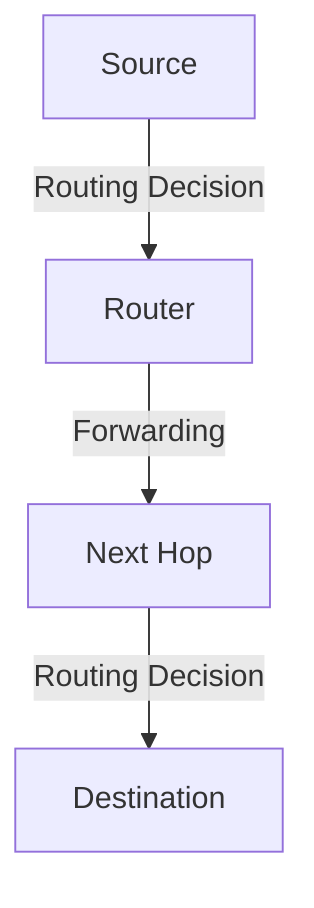

# 5.1 Introduction

- The network layer is responsible for routing packets across networks.
- **Routing:** Determines the best path for data.
- **Forwarding:** Moves packets to the next hop.
- **Protocols:** OSPF, BGP, RIP, ICMP.

---

## Real-World Analogy
- Routing is like planning a road trip: you choose the best route based on maps (routing tables) and traffic (network conditions).

---

## Diagram: Routing vs. Forwarding

---

## Summary Table
| Function   | Description                  |
|------------|------------------------------|
| Routing    | Path selection for packets   |
| Forwarding | Move packet to next hop      |
| Protocols  | OSPF, BGP, RIP, ICMP         |

---

## Practice Questions
1. **What is the difference between routing and forwarding?**
2. **Give a real-world analogy for routing.**
3. **List two network layer protocols.**

---

**Exam Tips:**
- Know the difference between routing and forwarding.
- Be able to draw and explain routing diagrams.

---

## Intra-AS vs. Inter-AS Routing
- **Intra-AS (Interior Gateway Protocols):** Routing within a single autonomous system (e.g., OSPF, RIP).
- **Inter-AS (Exterior Gateway Protocols):** Routing between autonomous systems (e.g., BGP).

## Routing Policies
- **Policies:** Influence route selection based on business, performance, or security needs (e.g., prefer certain ISPs, avoid others).

---

## Case Studies & Real-World Strategies

### 1. BGP Policy and Global Routing
- **Google, Facebook, Microsoft:** Use custom BGP policies and traffic engineering to optimize inter-data center traffic, balance load, and ensure reliability. Employ BGP communities, local preference, and AS path prepending for fine-grained control.
- **ISPs:** Use route reflectors, BGP communities, and peering agreements to manage global routing and business relationships.

### 2. OSPF and Intra-Domain Routing
- **Large Enterprises (e.g., banks, telecoms):** Use OSPF with hierarchical areas to scale large internal networks and ensure fast convergence.
- **Cloud Providers:** Automate OSPF configuration and monitoring for thousands of routers in data centers.

### 3. SDN Controllers and Centralized Routing
- **Google B4 WAN:** Uses SDN controllers to centrally compute and update backbone routes, optimizing bandwidth and rerouting around failures in real time.
- **AT&T, Verizon:** Deploy SDN/NFV for dynamic service chaining and rapid deployment of new network services.

### 4. DDoS Mitigation and Route Security
- **Cloudflare, Akamai:** Use BGP blackholing and remote triggered black hole (RTBH) filtering to mitigate DDoS attacks at the routing layer.
- **MANRS Initiative:** Major networks participate in Mutually Agreed Norms for Routing Security (MANRS) to prevent route leaks and hijacks.

### 5. Network Management and Monitoring
- **ISPs and Cloud Providers:** Use SNMP, NetFlow, and custom telemetry for real-time monitoring, anomaly detection, and automated troubleshooting of routing issues. 