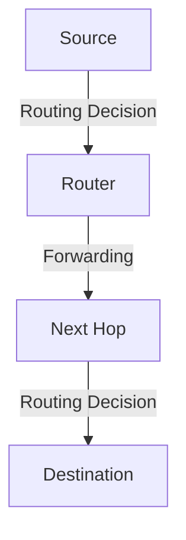

# 5.1 Introduction

- The network layer is responsible for routing packets across networks.
- **Routing:** Determines the best path for data.
- **Forwarding:** Moves packets to the next hop.
- **Protocols:** OSPF, BGP, RIP, ICMP.

---

## Network Layer Control Plane: Our Goals

### Understanding Principles Behind Network Control Plane
- **Traditional routing algorithms**
- **SDN controllers**
- **Network management, configuration**

### Instantiation, Implementation in the Internet
- **OSPF, BGP**
- **OpenFlow, ODL and ONOS controllers**
- **Internet Control Message Protocol: ICMP**
- **SNMP, YANG/NETCONF**

---

## Network Layer: "Control Plane" Roadmap

### Main Topics
1. **Introduction**
2. **Routing protocols**
   - Link state
   - Distance vector
3. **Intra-ISP routing: OSPF**
4. **Routing among ISPs: BGP**
5. **SDN control plane**
6. **Internet Control Message Protocol**
7. **Network management, configuration**
   - SNMP
   - NETCONF/YANG

---

## Two Approaches to Structuring Network Control Plane

### Per-Router Control (Traditional)
- **Individual routing algorithm components in each and every router interact in the control plane**
- **Routing Algorithm**
- **Data plane**
- **Control plane**

### Logically Centralized Control (Software Defined Networking)
- **Remote controller computes, installs forwarding tables in routers**
- **Data plane**
- **Control plane**
- **Remote Controller**

---

## Per-Router Control Plane

### Traditional Approach
- **Individual routing algorithm components in each and every router interact in the control plane**
- **Forwarding: move packets from router's input to appropriate router output**
- **Routing: determine route taken by packets from source to destination**

### Operation
- **Values in arriving packet header determine forwarding**
- **Each router makes independent routing decisions**

---

## Software-Defined Networking (SDN) Control Plane

### Modern Approach
- **Remote controller computes, installs forwarding tables in routers**
- **Centralized control logic**
- **Programmable network behavior**

### Advantages
- **Easier network management**
- **Greater flexibility of traffic flows**
- **Open (non-proprietary) implementation**
- **Foster innovation**

---

## Routing Protocol Goal

### Primary Objective
- **Determine "good" paths (equivalently, routes), from sending hosts to receiving host, through network of routers**
- **Path: sequence of routers packets traverse from given initial source host to final destination host**
- **"Good": least "cost", "fastest", "least congested"**
- **Routing: a "top-10" networking challenge!**

### Network Architecture
```
mobile network
enterprise network
national or global ISP
datacenter network
application
transport
network
link
physical
```

---

## Graph Abstraction: Link Costs

### Network Representation
- **Graph: G = (N,E)**
- **N: set of routers = { u, v, w, x, y, z }**
- **E: set of links = { (u,v), (u,x), (v,x), (v,w), (x,w), (x,y), (w,y), (w,z), (y,z) }**
- **ca,b: cost of direct link connecting a and b**
- **Example: cw,z = 5, cu,z = ∞**

### Cost Definition
- **Cost defined by network operator:**
  - **Could always be 1, or inversely related to bandwidth, or inversely related to congestion**

---

## Routing Algorithm Classification

### Global or Decentralized Information?
- **Global: all routers have complete topology, link cost info**
  - **"Link state" algorithms**
- **Decentralized: iterative process of computation, exchange of info with neighbors**
  - **Routers initially only know link costs to attached neighbors**
  - **"Distance vector" algorithms**

### How Fast Do Routes Change?
- **Dynamic: routes change more quickly**
  - **Periodic updates or in response to link cost changes**
- **Static: routes change slowly over time**

---

## Real-World Analogy
- Routing is like planning a road trip: you choose the best route based on maps (routing tables) and traffic (network conditions).

---

## Diagram: Routing vs. Forwarding


---

## Summary Table
| Function   | Description                  |
|------------|------------------------------|
| Routing    | Path selection for packets   |
| Forwarding | Move packet to next hop      |
| Protocols  | OSPF, BGP, RIP, ICMP         |

---

## Practice Questions
1. **What is the difference between routing and forwarding?**
2. **Give a real-world analogy for routing.**
3. **List two network layer protocols.**

---

**Exam Tips:**
- Know the difference between routing and forwarding.
- Be able to draw and explain routing diagrams.

---

## Intra-AS vs. Inter-AS Routing
- **Intra-AS (Interior Gateway Protocols):** Routing within a single autonomous system (e.g., OSPF, RIP).
- **Inter-AS (Exterior Gateway Protocols):** Routing between autonomous systems (e.g., BGP).

## Routing Policies
- **Policies:** Influence route selection based on business, performance, or security needs (e.g., prefer certain ISPs, avoid others).

---

## Case Studies & Real-World Strategies

### 1. BGP Policy and Global Routing
- **Google, Facebook, Microsoft:** Use custom BGP policies and traffic engineering to optimize inter-data center traffic, balance load, and ensure reliability. Employ BGP communities, local preference, and AS path prepending for fine-grained control.
- **ISPs:** Use route reflectors, BGP communities, and peering agreements to manage global routing and business relationships.

### 2. OSPF and Intra-Domain Routing
- **Large Enterprises (e.g., banks, telecoms):** Use OSPF with hierarchical areas to scale large internal networks and ensure fast convergence.
- **Cloud Providers:** Automate OSPF configuration and monitoring for thousands of routers in data centers.

### 3. SDN Controllers and Centralized Routing
- **Google B4 WAN:** Uses SDN controllers to centrally compute and update backbone routes, optimizing bandwidth and rerouting around failures in real time.
- **AT&T, Verizon:** Deploy SDN/NFV for dynamic service chaining and rapid deployment of new network services.

### 4. DDoS Mitigation and Route Security
- **Cloudflare, Akamai:** Use BGP blackholing and remote triggered black hole (RTBH) filtering to mitigate DDoS attacks at the routing layer.
- **MANRS Initiative:** Major networks participate in Mutually Agreed Norms for Routing Security (MANRS) to prevent route leaks and hijacks.

### 5. Network Management and Monitoring
- **ISPs and Cloud Providers:** Use SNMP, NetFlow, and custom telemetry for real-time monitoring, anomaly detection, and automated troubleshooting of routing issues. 