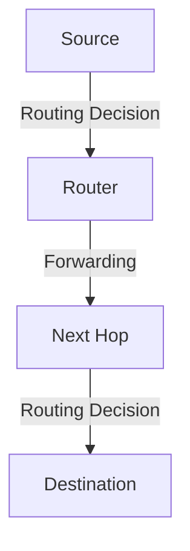

# 5.1 Introduction

- The network layer is responsible for routing packets across networks.
- **Routing:** Determines the best path for data.
- **Forwarding:** Moves packets to the next hop.
- **Protocols:** OSPF, BGP, RIP, ICMP.

---

## Real-World Analogy
- Routing is like planning a road trip: you choose the best route based on maps (routing tables) and traffic (network conditions).

---

## Diagram: Routing vs. Forwarding

---

## Summary Table
| Function   | Description                  |
|------------|------------------------------|
| Routing    | Path selection for packets   |
| Forwarding | Move packet to next hop      |
| Protocols  | OSPF, BGP, RIP, ICMP         |

---

## Practice Questions
1. **What is the difference between routing and forwarding?**
2. **Give a real-world analogy for routing.**
3. **List two network layer protocols.**

---

**Exam Tips:**
- Know the difference between routing and forwarding.
- Be able to draw and explain routing diagrams. 