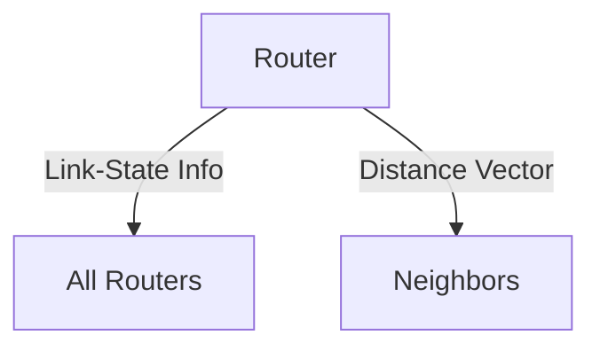

# 5.2 Routing Algorithms

- Routing algorithms determine the best path for packets.
- **Types:** Link-state (Dijkstra), distance-vector (Bellman-Ford), hierarchical.

---

## Link-State Routing (Dijkstra)
- Each router knows the full network topology.
- Computes shortest path using Dijkstra's algorithm.

---

## Distance-Vector Routing (Bellman-Ford)
- Routers know only their neighbors.
- Exchange distance vectors to compute shortest paths.

---

## Hierarchical Routing
- Divides network into regions for scalability.

---

## Diagram: Dijkstra vs. Bellman-Ford

---

## Summary Table
| Algorithm      | Info Used      | Example Protocol |
|---------------|---------------|------------------|
| Link-State    | Full topology  | OSPF             |
| Distance-Vector| Neighbors     | RIP              |
| Hierarchical  | Regions        | BGP              |

---

## Practice Questions
1. **Compare link-state and distance-vector routing.**
2. **What is hierarchical routing?**
3. **Draw a diagram of routing information exchange.**

---

**Exam Tips:**
- Know Dijkstra and Bellman-Ford basics.
- Be able to draw and explain routing algorithm diagrams. 