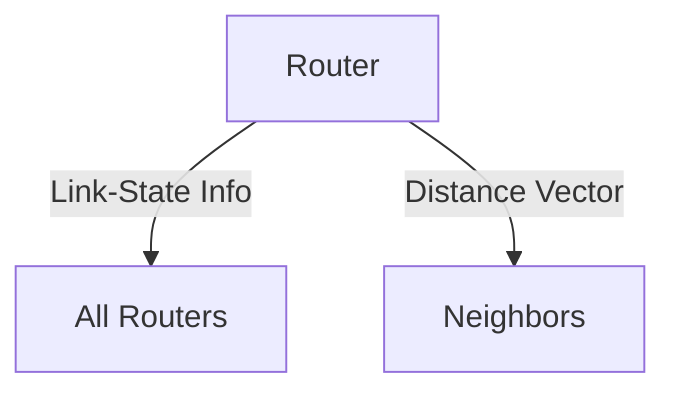

# 5.2 Routing Algorithms

- Routing algorithms determine the best path for packets.
- **Types:** Link-state (Dijkstra), distance-vector (Bellman-Ford), hierarchical.

---

## Link-State Routing (Dijkstra)
- Each router knows the full network topology.
- Computes shortest path using Dijkstra's algorithm.

---

## Distance-Vector Routing (Bellman-Ford)
- Routers know only their neighbors.
- Exchange distance vectors to compute shortest paths.

---

## Distance Vector vs. Link State: Detailed Comparison
| Feature           | Distance Vector      | Link State         |
|-------------------|---------------------|--------------------|
| Info Used         | Neighbors           | Full topology      |
| Algorithm         | Bellman-Ford        | Dijkstra           |
| Convergence       | Slower, loops       | Faster, fewer loops|
| Example Protocol  | RIP                 | OSPF               |

## Count-to-Infinity Problem
- **Issue:** Distance vector protocols can take a long time to converge after a failure, causing routing loops.
- **Solution:** Split horizon, poison reverse, hold-down timers.

## Hierarchical Routing
- **Autonomous Systems (AS):** Large networks under a single admin.
- **Area Border Routers:** Connect different areas or ASes.
- **Scalability:** Reduces routing table size and update overhead.

## RIP (Routing Information Protocol)
- **Type:** Distance vector protocol.
- **Metric:** Hop count (max 15, 16 = unreachable).
- **Updates:** Periodic, sent to all neighbors.
- **Limitations:** Slow convergence, count-to-infinity, not scalable for large networks.

---

## Diagram: Dijkstra vs. Bellman-Ford

---

## Summary Table
| Algorithm      | Info Used      | Example Protocol |
|---------------|---------------|------------------|
| Link-State    | Full topology  | OSPF             |
| Distance-Vector| Neighbors     | RIP              |
| Hierarchical  | Regions        | BGP              |

---

## Practice Questions
1. **Compare link-state and distance-vector routing.**
2. **What is hierarchical routing?**
3. **Draw a diagram of routing information exchange.**

---

**Exam Tips:**
- Know Dijkstra and Bellman-Ford basics.
- Be able to draw and explain routing algorithm diagrams. 