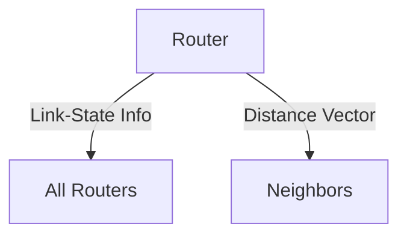

# 5.2 Routing Algorithms

- Routing algorithms determine the best path for packets.
- **Types:** Link-state (Dijkstra), distance-vector (Bellman-Ford), hierarchical.

---

## Dijkstra's Link-State Routing Algorithm

### Centralized Approach
- **Centralized: network topology, link costs known to all nodes**
- **Accomplished via "link state broadcast"**
- **All nodes have same info**
- **Computes least cost paths from one node ("source") to all other nodes**
- **Gives forwarding table for that node**
- **Iterative: after k iterations, know least cost path to k destinations**

### Notation
- **cx,y: direct link cost from node x to y; = ∞ if not direct neighbors**
- **D(v): current estimate of cost of least-cost-path from source to destination v**
- **p(v): predecessor node along path from source to v**
- **N': set of nodes whose least-cost-path definitively known**

### Algorithm Steps
1. **Initialization:**
   - **N' = {u} /* compute least cost path from u to all other nodes */**
   - **For all nodes v:**
     - **If v adjacent to u /* u initially knows direct-path-cost only to direct neighbors */**
     - **Then D(v) = cu,v /* but may not be minimum cost! */**
     - **Else D(v) = ∞**

2. **Loop:**
   - **Find w not in N' such that D(w) is a minimum**
   - **Add w to N'**
   - **Update D(v) for all v adjacent to w and not in N':**
     - **D(v) = min ( D(v), D(w) + cw,v )**
     - **/* new least-path-cost to v is either old least-cost-path to v or known least-cost-path to w plus direct-cost from w to v */**

---

## Dijkstra's Algorithm: An Example

### Network Topology
- **Nodes: u, v, w, x, y, z**
- **Links with costs: (u,v)=2, (u,x)=1, (v,x)=2, (v,w)=3, (x,w)=3, (x,y)=1, (w,y)=1, (w,z)=5, (y,z)=2**

### Step-by-Step Execution
| Step | N' | D(v),p(v) | D(w),p(w) | D(x),p(x) | D(y),p(y) | D(z),p(z) |
|------|----|-----------|-----------|-----------|-----------|-----------|
| 0 | u | 2,u | 5,u | 1,u | ∞ | ∞ |
| 1 | ux | 2,u | 4,x | 1,u | 2,x | ∞ |
| 2 | uxy | 2,u | 3,y | 1,u | 2,x | 4,y |
| 3 | uxyv | 2,u | 3,y | 1,u | 2,x | 4,y |
| 4 | uxyvw | 2,u | 3,y | 1,u | 2,x | 4,y |
| 5 | uxyvwz | 2,u | 3,y | 1,u | 2,x | 4,y |

### Resulting Forwarding Table
- **v: (u,v) - route from u to v directly**
- **x: (u,x) - route from u to x directly**
- **y: (u,x) - route from u to y via x**
- **w: (u,x) - route from u to w via x**
- **z: (u,x) - route from u to z via x**

---

## Dijkstra's Algorithm: Discussion

### Algorithm Complexity
- **n nodes**
- **Each of n iteration: need to check all nodes, w, not in N**
- **n(n+1)/2 comparisons: O(n2) complexity**
- **More efficient implementations possible: O(nlogn)**

### Message Complexity
- **Each router must broadcast its link state information to other n routers**
- **Efficient (and interesting!) broadcast algorithms: O(n) link crossings to disseminate a broadcast message from one source**
- **Each router's message crosses O(n) links: overall message complexity: O(n2)**

### Oscillations Possible
- **When link costs depend on traffic volume, route oscillations possible**
- **Example scenario: routing to destination a, traffic entering at d, c, e with rates 1, e (<1), 1**
- **Link costs are directional, and volume-dependent**

---

## Distance Vector Algorithm

### Based on Bellman-Ford (BF) Equation
- **Let Dx(y): cost of least-cost path from x to y.**
- **Then: Dx(y) = minv { cx,v + Dv(y) }**
- **Bellman-Ford equation**
- **min taken over all neighbors v of x**

### Key Idea
- **From time-to-time, each node sends its own distance vector estimate to neighbors**
- **Under minor, natural conditions, the estimate Dx(y) converge to the actual least cost dx(y)**
- **Dx(y) ← minv{cx,v + Dv(y)} for each node y ∊ N**
- **When x receives new DV estimate from any neighbor, it updates its own DV using B-F equation:**

### Algorithm Characteristics
- **Iterative, asynchronous: each local iteration caused by:**
  - **Local link cost change**
  - **DV update message from neighbor**
- **Distributed, self-stopping: each node notifies neighbors only when its DV changes**
- **Neighbors then notify their neighbors – only if necessary**
- **No notification received, no actions taken!**

---

## Bellman-Ford Example

### Network Topology
- **Nodes: u, v, w, x, y, z**
- **Links with costs: (u,v)=2, (u,x)=1, (v,x)=2, (v,w)=3, (x,w)=3, (x,y)=1, (w,y)=1, (w,z)=5, (y,z)=2**

### Bellman-Ford Equation Application
- **Suppose that u's neighboring nodes, x,v,w, know that for destination z:**
  - **Dv(z) = 5**
  - **Dw(z) = 3**
  - **Dx(z) = 3**
- **Du(z) = min { cu,v + Dv(z), cu,x + Dx(z), cu,w + Dw(z) }**
- **= min {2 + 5, 1 + 3, 5 + 3} = 4**
- **Node achieving minimum (x) is next hop on estimated least-cost path to destination (z)**

---

## Distance Vector: Example

### Initial State (t=0)
- **All nodes have distance estimates to nearest neighbors (only)**
- **A few asymmetries: missing link, larger cost**
- **All nodes send their local distance vector to their neighbors**

### Iteration Process
- **All nodes:**
  - **Receive distance vectors from neighbors**
  - **Compute their new local distance vector**
  - **Send their new local distance vector to neighbors**

### State Information Diffusion
- **t=0: c's state at t=0 is at c only**
- **t=1: c's state at t=0 has propagated to b, and may influence distance vector computations up to 1 hop away**
- **t=2: c's state at t=0 may now influence distance vector computations up to 2 hops away**
- **t=3: c's state at t=0 may influence distance vector computations up to 3 hops away**
- **t=4: c's state at t=0 may influence distance vector computations up to 4 hops away**

---

## Distance Vector: Link Cost Changes

### "Good News Travels Fast"
- **t0: y detects link-cost change, updates its DV, informs its neighbors**
- **t1: z receives update from y, updates its DV, computes new least cost to x, sends its neighbors its DV**
- **t2: y receives z's update, updates its DV. y's least costs do not change, so y does not send a message to z**

### "Bad News Travels Slow" – Count-to-Infinity Problem
- **y sees direct link to x has new cost 60, but z has said it has a path at cost of 5**
- **y computes "my new cost to x will be 6, via z"; notifies z of new cost of 6 to x**
- **z learns that path to x via y has new cost 6, so z computes "my new cost to x will be 7 via y", notifies y of new cost of 7 to x**
- **y learns that path to x via z has new cost 7, so y computes "my new cost to x will be 8 via y", notifies z of new cost of 8 to x**
- **z learns that path to x via y has new cost 8, so z computes "my new cost to x will be 9 via y", notifies y of new cost of 9 to x**
- **... continues indefinitely**

---

## Comparison of LS and DV Algorithms

### Message Complexity
- **LS: n routers, O(n2) messages sent**
- **DV: exchange between neighbors; convergence time varies**

### Speed of Convergence
- **LS: O(n2) algorithm, O(n2) messages**
- **May have oscillations**
- **DV: convergence time varies**
- **May have routing loops**
- **Count-to-infinity problem**

### Robustness: What Happens If Router Malfunctions, or Is Compromised?
- **LS:**
  - **Router can advertise incorrect link cost**
  - **Each router computes only its own table**
- **DV:**
  - **DV router can advertise incorrect path cost ("I have a really low-cost path to everywhere"): black-holing**
  - **Each router's DV is used by others: error propagate thru network**

---

## Link-State Routing (Dijkstra)
- Each router knows the full network topology.
- Computes shortest path using Dijkstra's algorithm.

---

## Distance-Vector Routing (Bellman-Ford)
- Routers know only their neighbors.
- Exchange distance vectors to compute shortest paths.

---

## Distance Vector vs. Link State: Detailed Comparison
| Feature           | Distance Vector      | Link State         |
|-------------------|---------------------|--------------------|
| Info Used         | Neighbors           | Full topology      |
| Algorithm         | Bellman-Ford        | Dijkstra           |
| Convergence       | Slower, loops       | Faster, fewer loops|
| Example Protocol  | RIP                 | OSPF               |

## Count-to-Infinity Problem
- **Issue:** Distance vector protocols can take a long time to converge after a failure, causing routing loops.
- **Solution:** Split horizon, poison reverse, hold-down timers.

## Hierarchical Routing
- **Autonomous Systems (AS):** Large networks under a single admin.
- **Area Border Routers:** Connect different areas or ASes.
- **Scalability:** Reduces routing table size and update overhead.

## RIP (Routing Information Protocol)
- **Type:** Distance vector protocol.
- **Metric:** Hop count (max 15, 16 = unreachable).
- **Updates:** Periodic, sent to all neighbors.
- **Limitations:** Slow convergence, count-to-infinity, not scalable for large networks.

---

## Diagram: Dijkstra vs. Bellman-Ford

---

## Summary Table
| Algorithm      | Info Used      | Example Protocol |
|---------------|---------------|------------------|
| Link-State    | Full topology  | OSPF             |
| Distance-Vector| Neighbors     | RIP              |
| Hierarchical  | Regions        | BGP              |

---

## Practice Questions
1. **Compare link-state and distance-vector routing.**
2. **What is hierarchical routing?**
3. **Draw a diagram of routing information exchange.**

---

**Exam Tips:**
- Know Dijkstra and Bellman-Ford basics.
- Be able to draw and explain routing algorithm diagrams. 