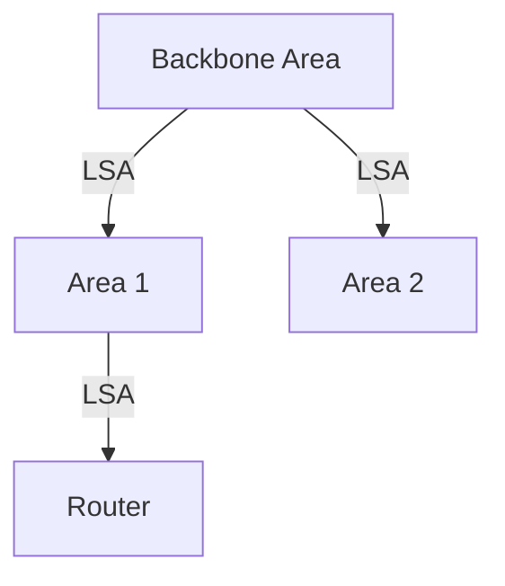

# 5.3 Intra-AS Routing: OSPF

- OSPF (Open Shortest Path First) is a link-state routing protocol for intra-domain routing.
- **Features:** Hierarchical, fast convergence, authentication, supports multiple paths.

---

## OSPF Operation
- Routers flood link-state advertisements (LSAs).
- Each router computes shortest path tree using Dijkstra's algorithm.
- Supports areas for scalability.

---

## Diagram: OSPF Areas

---

## Summary Table
| Feature        | OSPF Value         |
|---------------|--------------------|
| Type          | Link-state         |
| Convergence   | Fast               |
| Hierarchical  | Yes (areas)        |
| Auth          | Yes                |

---

## Practice Questions
1. **What type of routing protocol is OSPF?**
2. **How does OSPF achieve scalability?**
3. **Draw a diagram of OSPF areas.**

---

**Exam Tips:**
- Know OSPF features and area structure.
- Be able to draw and explain OSPF diagrams. 