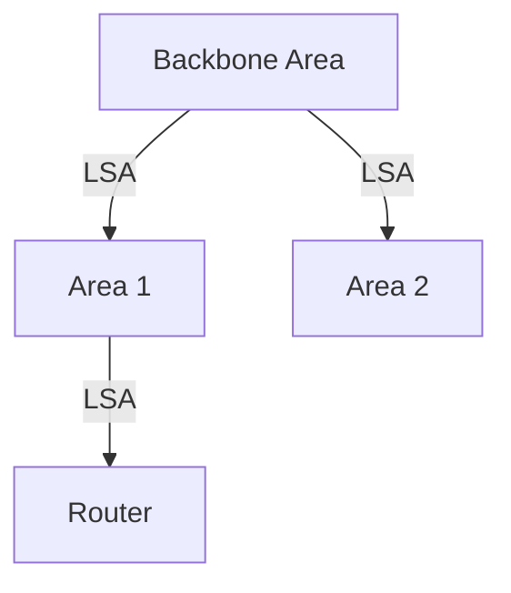

# 5.3 Intra-AS Routing: OSPF

- OSPF (Open Shortest Path First) is a link-state routing protocol for intra-domain routing.
- **Features:** Hierarchical, fast convergence, authentication, supports multiple paths.

---

## Making Routing Scalable

### Our Routing Study Thus Far - Idealized
- **All routers identical**
- **Network "flat"**
- **... not true in practice**

### Scale Challenges
- **Billions of destinations:**
  - **Can't store all destinations in routing tables!**
  - **Routing table exchange would swamp links!**
- **Administrative autonomy:**
  - **Internet: a network of networks**
  - **Each network admin may want to control routing in its own network**

### Internet Approach to Scalable Routing
- **Aggregate routers into regions known as "autonomous systems" (AS) (a.k.a. "domains")**

---

## Interconnected ASes

### Intra-AS vs Inter-AS Routing
- **Intra-AS (aka "intra-domain"): routing among routers within same AS ("network")**
  - **All routers in AS must run same intra-domain protocol**
  - **Routers in different AS can run different intra-domain routing protocols**
  - **Gateway router: at "edge" of its own AS, has link(s) to router(s) in other AS'es**
- **Inter-AS (aka "inter-domain"): routing among AS'es**
  - **Gateways perform inter-domain routing (as well as intra-domain routing)**

### Network Topology Example
- **AS1, AS2, AS3**
- **Intra-AS routing within each AS**
- **Inter-AS routing between ASes**
- **Forwarding table configured by intra- and inter-AS routing algorithms**

### Routing Table Population
- **Intra-AS routing determine entries for destinations within AS**
- **Inter-AS & intra-AS determine entries for external destinations**

---

## Inter-AS Routing: A Role in Intradomain Forwarding

### Example Scenario
- **Suppose router in AS1 receives datagram destined outside of AS1:**
- **AS1 inter-domain routing must:**
  - **Learn which destinations reachable through AS2, which through AS3**
  - **Propagate this reachability info to all routers in AS1**
  - **Router should forward packet to gateway router in AS1, but which one?**

---

## Intra-AS Routing: Routing Within an AS

### Most Common Intra-AS Routing Protocols
- **RIP: Routing Information Protocol [RFC 1723]**
  - **Classic DV: DVs exchanged every 30 secs**
  - **No longer widely used**
- **EIGRP: Enhanced Interior Gateway Routing Protocol**
  - **DV based**
  - **Formerly Cisco-proprietary for decades (became open in 2013 [RFC 7868])**
- **OSPF: Open Shortest Path First [RFC 2328]**
  - **Link-state routing**
  - **IS-IS protocol (ISO standard, not RFC standard) essentially same as OSPF**

---

## OSPF (Open Shortest Path First) Routing

### Key Characteristics
- **"Open": publicly available**
- **Classic link-state**
- **Each router floods OSPF link-state advertisements (directly over IP rather than using TCP/UDP) to all other routers in entire AS**
- **Multiple link costs metrics possible: bandwidth, delay**
- **Each router has full topology, uses Dijkstra's algorithm to compute forwarding table**
- **Security: all OSPF messages authenticated (to prevent malicious intrusion)**

---

## Hierarchical OSPF

### Two-Level Hierarchy
- **Local area, backbone**
- **Link-state advertisements flooded only in area, or backbone**
- **Each node has detailed area topology; only knows direction to reach other destinations**

### Router Types
- **Area border routers: "summarize" distances to destinations in own area, advertise in backbone**
- **Backbone router: runs OSPF limited to backbone**
- **Boundary router: connects to other ASes**
- **Local routers:**
  - **Flood LS in area only**
  - **Compute routing within area**
  - **Forward packets to outside via area border router**

### Area Structure
- **Area 1, Area 2, Area 3**
- **Backbone area connecting all areas**
- **Internal routers within each area**
- **Area border routers connecting areas to backbone**

---

## OSPF Operation
- Routers flood link-state advertisements (LSAs).
- Each router computes shortest path tree using Dijkstra's algorithm.
- Supports areas for scalability.

---

## Diagram: OSPF Areas

---

## Summary Table
| Feature        | OSPF Value         |
|---------------|--------------------|
| Type          | Link-state         |
| Convergence   | Fast               |
| Hierarchical  | Yes (areas)        |
| Auth          | Yes                |

---

## Practice Questions
1. **What type of routing protocol is OSPF?**
2. **How does OSPF achieve scalability?**
3. **Draw a diagram of OSPF areas.**

---

**Exam Tips:**
- Know OSPF features and area structure.
- Be able to draw and explain OSPF diagrams.

---

## More OSPF Features
- **Authentication:** Supports cryptographic authentication of routing updates.
- **Multiple Paths:** Can use equal-cost multipath (ECMP) for load balancing.
- **Link Types:** Supports point-to-point, broadcast, and non-broadcast links.

## Hierarchical OSPF
- **Backbone Area (Area 0):** Central area connecting all other areas.
- **Area Border Routers (ABR):** Connect backbone to other areas.
- **Benefits:** Scalability, reduced routing table size, faster convergence. 