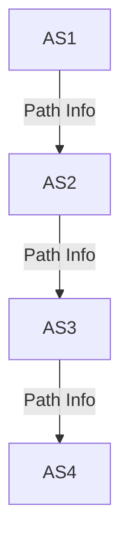

# 5.4 Routing Among ISPs: BGP

- BGP (Border Gateway Protocol) is the standard for inter-domain (inter-AS) routing.
- **Type:** Path vector protocol.
- **Features:** Policy-based, scalable, loop prevention.

---

## BGP Operation
- Routers exchange path vectors (AS paths).
- Routing decisions based on policy, not just shortest path.

---

## Diagram: BGP AS Path

---

## Summary Table
| Feature      | BGP Value         |
|-------------|-------------------|
| Type        | Path vector       |
| Policy      | Yes               |
| Scalability | High              |
| Loop Prev.  | AS path           |

---

## Practice Questions
1. **What type of protocol is BGP?**
2. **How does BGP prevent routing loops?**
3. **Draw a diagram of BGP AS path.**

---

**Exam Tips:**
- Know BGP features and AS path concept.
- Be able to draw and explain BGP diagrams. 