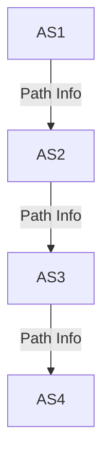
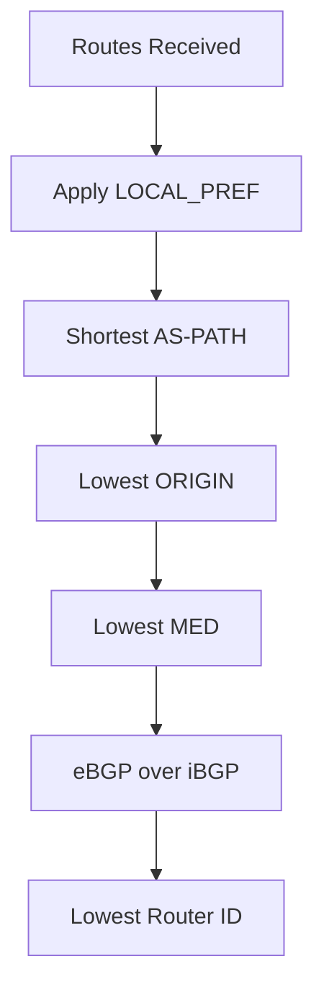

# 5.4 Routing Among ISPs: BGP

- BGP (Border Gateway Protocol) is the standard for inter-domain (inter-AS) routing.
- **Type:** Path vector protocol.
- **Features:** Policy-based, scalable, loop prevention.

---

## Interconnected ASes

### Intra-AS vs Inter-AS Routing
- **Intra-AS (aka "intra-domain"): routing among routers within same AS ("network")**
- **Inter-AS (aka "inter-domain"): routing among AS'es**

---

## BGP (Border Gateway Protocol): The De Facto Inter-Domain Routing Protocol

### Key Characteristics
- **"Glue that holds the Internet together"**
- **Allows subnet to advertise its existence, and the destinations it can reach, to rest of Internet: "I am here, here is who I can reach, and how"**

### BGP Provides Each AS a Means to:
- **Obtain destination network reachability info from neighboring ASes (eBGP)**
- **Determine routes to other networks based on reachability information and policy**
- **Propagate reachability information to all AS-internal routers (iBGP)**
- **Advertise (to neighboring networks) destination reachability info**

---

## eBGP, iBGP Connections

### Network Topology
- **AS 1, AS 2, AS 3**
- **eBGP connectivity between ASes**
- **Logical iBGP connectivity within each AS**
- **Gateway routers run both eBGP and iBGP protocols**

### Connection Types
- **eBGP: External BGP between different ASes**
- **iBGP: Internal BGP within the same AS**

---

## BGP Basics

### Path Advertisement
- **When AS3 gateway 3a advertises path AS3,X to AS2 gateway 2c:**
  - **AS3 promises to AS2 it will forward datagrams towards X**

### BGP Session
- **Two BGP routers ("peers") exchange BGP messages over semi-permanent TCP connection:**
  - **Advertising paths to different destination network prefixes (BGP is a "path vector" protocol)**

### Network Example
- **AS1, AS2, AS3 with destination X**
- **BGP advertisement: AS3, X**

---

## BGP Protocol Messages

### BGP Messages Exchanged Between Peers Over TCP Connection
- **BGP messages [RFC 4371]:**
  - **OPEN: opens TCP connection to remote BGP peer and authenticates sending BGP peer**
  - **UPDATE: advertises new path (or withdraws old)**
  - **KEEPALIVE: keeps connection alive in absence of UPDATES; also ACKs OPEN request**
  - **NOTIFICATION: reports errors in previous msg; also used to close connection**

---

## Path Attributes and BGP Routes

### BGP Advertised Route
- **Prefix + attributes**
- **Prefix: destination being advertised**

### Two Important Attributes
- **AS-PATH: list of ASes through which prefix advertisement has passed**
- **NEXT-HOP: indicates specific internal-AS router to next-hop AS**

### Policy-Based Routing
- **Gateway receiving route advertisement uses import policy to accept/decline path (e.g., never route through AS Y)**
- **AS policy also determines whether to advertise path to other neighboring ASes**

---

## BGP Path Advertisement

### Example Scenario
- **AS2 router 2c receives path advertisement AS3,X (via eBGP) from AS3 router 3a**
- **Based on AS2 policy, AS2 router 2c accepts path AS3,X, propagates (via iBGP) to all AS2 routers**
- **AS2,AS3,X**
- **Based on AS2 policy, AS2 router 2a advertises (via eBGP) path AS2, AS3, X to AS1 router 1c**

---

## BGP Path Advertisement: Multiple Paths

### Multiple Path Learning
- **AS1 gateway router 1c learns path AS2,AS3,X from 2a**
- **Gateway router may learn about multiple paths to destination:**
  - **AS3,X**
  - **AS1 gateway router 1c learns path AS3,X from 3a**
- **Based on policy, AS1 gateway router 1c chooses path AS3,X and advertises path within AS1 via iBGP**

---

## BGP: Populating Forwarding Tables

### Example: Router 1d
- **Recall: 1a, 1b, 1d learn via iBGP from 1c: "path to X goes through 1c"**
- **At 1d: OSPF intra-domain routing: to get to 1c, use interface 1**
- **At 1d: to get to X, use interface 1**

### Example: Router 1a
- **At 1a: OSPF intra-domain routing: to get to 1c, use interface 2**
- **At 1a: to get to X, use interface 2**

---

## Hot Potato Routing

### Definition
- **2d learns (via iBGP) it can route to X via 2a or 2c**
- **Hot potato routing: choose local gateway that has least intra-domain cost (e.g., 2d chooses 2a, even though more AS hops to X): don't worry about inter-domain cost!**

### OSPF Link Weights
- **201, 112, 263**

---

## BGP: Achieving Policy via Advertisements

### Example Scenario
- **A advertises path Aw to B and to C**
- **B chooses not to advertise BAw to C!**
- **B gets no "revenue" for routing CBAw, since none of C, A, w are B's customers**
- **C does not learn about CBAw path**
- **C will route CAw (not using B) to get to w**

### Policy Principle
- **ISP only wants to route traffic to/from its customer networks (does not want to carry transit traffic between other ISPs – a typical "real world" policy)**

---

## BGP: Achieving Policy via Advertisements (More)

### Network Types
- **A,B,C are provider networks**
- **x,w,y are customer (of provider networks)**
- **x is dual-homed: attached to two networks**

### Policy Enforcement
- **Policy to enforce: x does not want to route from B to C via x**
- **.. so x will not advertise to B a route to C**

---

## BGP Route Selection

### Router Decision Process
- **Router may learn about more than one route to destination AS, selects route based on:**
  - **Local preference value attribute: policy decision**
  - **Shortest AS-PATH**
  - **Closest NEXT-HOP router: hot potato routing**
  - **Additional criteria**

---

## Why Different Intra-, Inter-AS Routing?

### Policy
- **Inter-AS: admin wants control over how its traffic routed, who routes through its network**
- **Intra-AS: single admin, so policy less of an issue**

### Scale
- **Hierarchical routing saves table size, reduced update traffic**

### Performance
- **Intra-AS: can focus on performance**
- **Inter-AS: policy dominates over performance**

---

## BGP Operation
- Routers exchange path vectors (AS paths).
- Routing decisions based on policy, not just shortest path.

---

## Diagram: BGP AS Path

---

## Summary Table
| Feature      | BGP Value         |
|-------------|-------------------|
| Type        | Path vector       |
| Policy      | Yes               |
| Scalability | High              |
| Loop Prev.  | AS path           |

---

## Practice Questions
1. **What type of protocol is BGP?**
2. **How does BGP prevent routing loops?**
3. **Draw a diagram of BGP AS path.**

---

**Exam Tips:**
- Know BGP features and AS path concept.
- Be able to draw and explain BGP diagrams.

---

## BGP Path Attributes
- **AS-PATH:** List of ASes a route has traversed (used for loop prevention).
- **NEXT-HOP:** IP address of the next hop router.
- **LOCAL_PREF:** Preference for exit points within an AS.
- **MED (Multi-Exit Discriminator):** Suggests preferred entry point into an AS.

## BGP Policy and Decision Process
- **Policy:** Routing decisions based on business agreements, not just shortest path.
- **Decision Steps:** LOCAL_PREF > AS-PATH length > ORIGIN > MED > eBGP over iBGP > lowest router ID.

## Diagram: BGP Decision Process
