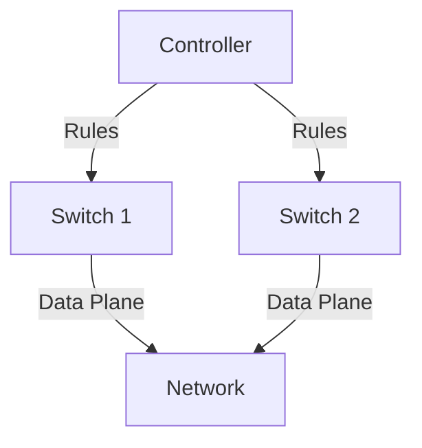

# 5.5 SDN Control Plane

- SDN (Software-Defined Networking) separates control and data planes.
- **Control plane:** Centralized logic, manages routing and forwarding.
- **Data plane:** Forwards packets based on rules.

---

## Centralized Routing
- Controller computes routes for the entire network.
- Pushes forwarding rules to switches.

---

## Diagram: SDN Control Plane

---

## Summary Table
| Plane      | Function         | Example      |
|------------|------------------|-------------|
| Control    | Routing, mgmt    | Controller  |
| Data       | Forwarding       | Switch      |

---

## Practice Questions
1. **What is the role of the SDN control plane?**
2. **How does centralized routing work in SDN?**
3. **Draw a diagram of SDN control plane.**

---

**Exam Tips:**
- Know SDN control/data plane separation.
- Be able to draw and explain SDN control diagrams.

---

## SDN Controllers and OpenFlow
- **SDN Controller:** Centralized software that manages network devices, computes routes, and installs forwarding rules.
- **OpenFlow Protocol:** Standard protocol for communication between controller and switches. Allows controller to add, update, or delete flow entries in switch tables.
- **Controller-Switch Interaction:** Controller monitors network state, reacts to events, and updates switch rules dynamically. 