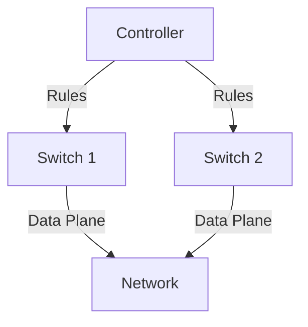

# 5.5 SDN Control Plane

- SDN (Software-Defined Networking) separates control and data planes.
- **Control plane:** Centralized logic, manages routing and forwarding.
- **Data plane:** Forwards packets based on rules.

---

## Internet Network Layer: Historical Implementation

### Traditional Approach
- **Historically implemented via distributed, per-router control approach:**
- **Monolithic router contains switching hardware, runs proprietary implementation of Internet standard protocols (IP, RIP, IS-IS, OSPF, BGP) in proprietary router OS (e.g., Cisco IOS)**
- **Different "middleboxes" for different network layer functions: firewalls, load balancers, NAT boxes, ..**

### Renewed Interest
- **~2005: renewed interest in rethinking network control plane**

---

## Software Defined Networking (SDN)

### Per-Router Control Plane
- **Individual routing algorithm components in each and every router interact in the control plane to compute forwarding tables**
- **Routing Algorithm**
- **Data plane**
- **Control plane**

### SDN Control Plane
- **Remote controller computes, installs forwarding tables in routers**
- **Data plane**
- **Control plane**
- **Remote Controller**

---

## Why a Logically Centralized Control Plane?

### Advantages
- **Easier network management: avoid router misconfigurations, greater flexibility of traffic flows**
- **Table-based forwarding (recall OpenFlow API) allows "programming" routers**
- **Centralized "programming" easier: compute tables centrally and distribute**
- **Distributed "programming" more difficult: compute tables as result of distributed algorithm (protocol) implemented in each-and-every router**
- **Open (non-proprietary) implementation of control plane**
- **Foster innovation: let 1000 flowers bloom**

---

## SDN Analogy: Mainframe to PC Revolution

### Vertically Integrated (Old)
- **Closed, proprietary**
- **Slow innovation**
- **Small industry**
- **Specialized Operating System**
- **Specialized Hardware**
- **Specialized Applications**

### Horizontal (New)
- **Open interfaces**
- **Rapid innovation**
- **Huge industry**
- **Microprocessor**
- **Open Interface**
- **Windows, Linux, MAC OS**

---

## Traffic Engineering: Difficult with Traditional Routing

### Problem 1: Specific Path Routing
- **Q: what if network operator wants u-to-z traffic to flow along uvwz, rather than uxyz?**
- **A: need to re-define link weights so traffic routing algorithm computes routes accordingly (or need a new routing algorithm)!**
- **Link weights are only control "knobs": not much control!**

### Problem 2: Load Balancing
- **Q: what if network operator wants to split u-to-z traffic along uvwz and uxyz (load balancing)?**
- **A: can't do it (or need a new routing algorithm)**

### Problem 3: Different Traffic Types
- **Q: what if w wants to route blue and red traffic differently from w to z?**
- **A: can't do it (with destination-based forwarding, and LS, DV routing)**

### Solution
- **We learned in Chapter 4 that generalized forwarding and SDN can be used to achieve any routing desired**

---

## Software Defined Networking (SDN)

### Key Components
1. **Generalized "flow-based" forwarding (e.g., OpenFlow)**
2. **Control, data plane separation**
3. **Control plane functions external to data-plane switches**
4. **Programmable control applications**

### Applications
- **Routing**
- **Access control**
- **Load balance**

---

## Data-Plane Switches

### Characteristics
- **Fast, simple, commodity switches implementing generalized data-plane forwarding (Section 4.4) in hardware**
- **Flow (forwarding) table computed, installed under controller supervision**
- **API for table-based switch control (e.g., OpenFlow)**
  - **Defines what is controllable, what is not**
- **Protocol for communicating with controller (e.g., OpenFlow)**

### Architecture
- **Data plane**
- **Control plane**
- **SDN Controller (network operating system)**
- **Southbound API**
- **Northbound API**
- **SDN-controlled switches**
- **Network-control applications**

---

## SDN Controller (Network OS)

### Functions
- **Maintain network state information**
- **Interacts with network control applications "above" via northbound API**
- **Interacts with network switches "below" via southbound API**
- **Implemented as distributed system for performance, scalability, fault-tolerance, robustness**

### Applications
- **Routing**
- **Access control**
- **Load balance**

---

## Network-Control Apps

### Characteristics
- **"Brains" of control: implement control functions using lower-level services, API provided by SDN controller**
- **Unbundled: can be provided by 3rd party: distinct from routing vendor, or SDN controller**

---

## Components of SDN Controller

### Network-Wide Distributed, Robust State Management
- **Link-state info**
- **Switch info**
- **Host info**
- **Statistics**
- **Flow tables**

### Communication to/from Controlled Devices
- **OpenFlow**
- **SNMP**
- **Network graph**
- **Intent**
- **RESTful API**

### Interface, Abstractions for Network Control Apps
- **Routing**
- **Access control**
- **Load balance**

---

## OpenFlow Protocol

### Operation
- **Operates between controller, switch**
- **TCP used to exchange messages**
- **Optional encryption**
- **Three classes of OpenFlow messages:**
  - **Controller-to-switch**
  - **Asynchronous (switch to controller)**
  - **Symmetric (misc.)**
- **Distinct from OpenFlow API**
- **API used to specify generalized forwarding actions**

---

## OpenFlow: Controller-to-Switch Messages

### Key Controller-to-Switch Messages
- **Features: controller queries switch features, switch replies**
- **Configure: controller queries/sets switch configuration parameters**
- **Modify-state: add, delete, modify flow entries in the OpenFlow tables**
- **Packet-out: controller can send this packet out of specific switch port**

---

## OpenFlow: Switch-to-Controller Messages

### Key Switch-to-Controller Messages
- **Packet-in: transfer packet (and its control) to controller. See packet-out message from controller**
- **Flow-removed: flow table entry deleted at switch**
- **Port status: inform controller of a change on a port**

### Note
- **Fortunately, network operators don't "program" switches by creating/sending OpenFlow messages directly. Instead use higher-level abstraction at controller**

---

## SDN: Control/Data Plane Interaction Example

### Step 1: Link Failure Detection
- **S1, experiencing link failure uses OpenFlow port status message to notify controller**

### Step 2: Controller Update
- **SDN controller receives OpenFlow message, updates link status info**

### Step 3: Algorithm Trigger
- **Dijkstra's routing algorithm application has previously registered to be called when ever link status changes. It is called.**

### Step 4: Route Computation
- **Dijkstra's routing algorithm access network graph info, link state info in controller, computes new routes**

### Step 5: Flow Table Computation
- **Link state routing app interacts with flow-table-computation component in SDN controller, which computes new flow tables needed**

### Step 6: Table Installation
- **Controller uses OpenFlow to install new tables in switches that need updating**

---

## Google ORION SDN Control Plane

### ORION Overview
- **ORION: Google's SDN control plane (NSDI'21): control plane for Google's datacenter (Jupiter) and wide area (B4) networks**

### Orion SDN Architecture and Core Apps
- **Routing (intradomain, iBGP), traffic engineering: implemented in applications on top of ORION core**
- **Edge-edge flow-based controls (e.g., CoFlow scheduling) to meet contract SLAs**
- **Management: pub-sub distributed microservices in Orion core, OpenFlow for switch signaling/monitoring**

### Note
- **ORION provides intradomain services within Google's network**

---

## OpenDaylight (ODL) Controller

### Architecture
- **Network Orchestrations and Applications**
- **Southbound API**
- **Service Abstraction Layer (SAL)**
- **Config. and operational data store**
- **REST/RESTCONF/NETCONF APIs**
- **Messaging**
- **OpenFlow, NETCONF, SNMP, OVSDB, ...**
- **Northbound API**

### Applications
- **Traffic Engineering**
- **Firewalling**
- **Load Balancing**
- **Basic Network Functions**
- **Enhanced Services**

### Components
- **Forwarding rules mgr.**
- **AAA**
- **Host Tracker**
- **Stats mgr.**
- **Switch mgr.**
- **Topology processing**

### Service Abstraction Layer
- **Interconnects internal, external applications and services**

---

## ONOS Controller

### Architecture
- **Network Applications**
- **Southbound API**
- **Northbound API**
- **Traffic Engineering**
- **Firewalling**
- **Load Balancing**

### Southbound Abstractions, Protocols
- **OpenFlow**
- **Netconf**
- **OVSDB**
- **Device, link, host, flow, packet**

### Northbound Abstractions, Protocols
- **REST API**
- **Intent**

### ONOS Distributed Core
- **Statistics**
- **Devices**
- **Hosts**
- **Links**
- **Paths**
- **Flow rules**
- **Topology**

### Key Features
- **Control apps separate from controller**
- **Intent framework: high-level specification of service: what rather than how**
- **Considerable emphasis on distributed core: service reliability, replication performance scaling**
- **Hardening the control plane: dependable, reliable, performance-scalable, secure distributed system**
- **Robustness to failures: leverage strong theory of reliable distributed system for control plane**
- **Dependability, security: "baked in" from day one?**
- **Networks, protocols meeting mission-specific requirements**
- **e.g., real-time, ultra-reliable, ultra-secure**
- **Internet-scaling: beyond a single AS**
- **SDN critical in 5G cellular networks**

---

## SDN: Selected Challenges

### SDN-Computed Versus Router-Computed Forwarding Tables
- **Just one example of logically-centralized-computed versus protocol computed**
- **One could imagine SDN-computed congestion control:**
  - **Controller sets sender rates based on router-reported (to controller) congestion levels**

---

## SDN and the Future of Traditional Network Protocols

### Evolution Question
- **How will implementation of network functionality (SDN versus protocols) evolve?**

---

## Centralized Routing
- Controller computes routes for the entire network.
- Pushes forwarding rules to switches.

---

## Diagram: SDN Control Plane

---

## Summary Table
| Plane      | Function         | Example      |
|------------|------------------|-------------|
| Control    | Routing, mgmt    | Controller  |
| Data       | Forwarding       | Switch      |

---

## Practice Questions
1. **What is the role of the SDN control plane?**
2. **How does centralized routing work in SDN?**
3. **Draw a diagram of SDN control plane.**

---

**Exam Tips:**
- Know SDN control/data plane separation.
- Be able to draw and explain SDN control diagrams.

---

## SDN Controllers and OpenFlow
- **SDN Controller:** Centralized software that manages network devices, computes routes, and installs forwarding rules.
- **OpenFlow Protocol:** Standard protocol for communication between controller and switches. Allows controller to add, update, or delete flow entries in switch tables.
- **Controller-Switch Interaction:** Controller monitors network state, reacts to events, and updates switch rules dynamically. 