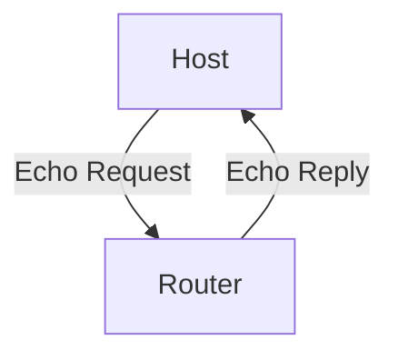
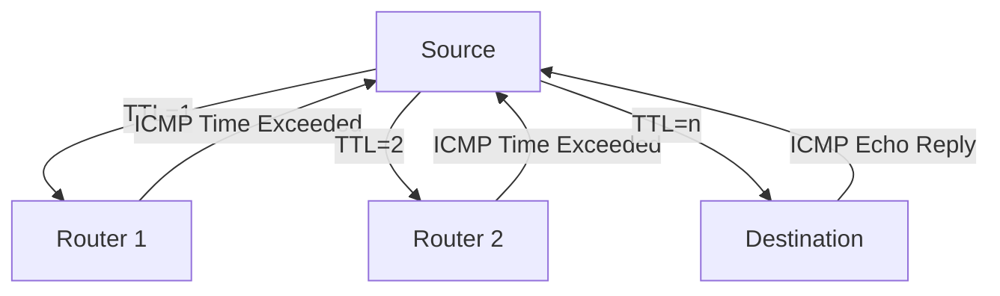

# 5.6 ICMP

- ICMP (Internet Control Message Protocol) is used for error reporting and diagnostics in IP networks.
- **Features:** Sends error messages (unreachable, time exceeded), echo requests (ping).

---

## ICMP: Internet Control Message Protocol

### Purpose
- **Used by hosts and routers to communicate network-level information**
- **Error reporting: unreachable host, network, port, protocol**
- **Echo request/reply (used by ping)**
- **Network-layer "above" IP:**
  - **ICMP messages carried in IP datagrams**
- **ICMP message: type, code plus first 8 bytes of IP datagram causing error**

### ICMP Message Types
| Type | Code | Description |
|------|------|-------------|
| 0 | 0 | echo reply (ping) |
| 3 | 0 | dest. network unreachable |
| 3 | 1 | dest host unreachable |
| 3 | 2 | dest protocol unreachable |
| 3 | 3 | dest port unreachable |
| 3 | 6 | dest network unknown |
| 3 | 7 | dest host unknown |
| 4 | 0 | source quench (congestion control - not used) |
| 8 | 0 | echo request (ping) |
| 9 | 0 | route advertisement |
| 10 | 0 | router discovery |
| 11 | 0 | TTL expired |
| 12 | 0 | bad IP header |

---

## Traceroute and ICMP

### Traceroute Operation
- **Source sends sets of UDP segments to destination**
- **1st set has TTL =1, 2nd set has TTL=2, etc.**
- **Datagram in nth set arrives to nth router:**
  - **Router discards datagram and sends source ICMP message (type 11, code 0)**
  - **ICMP message possibly includes name of router & IP address**

### Stopping Criteria
- **UDP segment eventually arrives at destination host**
- **Destination returns ICMP "port unreachable" message (type 3, code 3)**
- **Source stops**

### Recording Results
- **When ICMP message arrives at source: record RTTs**
- **3 probes sent for each TTL value**

---

## ICMP Message Types
- **Echo request/reply:** Used by ping.
- **Destination unreachable:** Packet cannot be delivered.
- **Time exceeded:** TTL expired.

---

## Diagram: ICMP Echo

---

## Summary Table
| Message Type         | Use Case         |
|---------------------|------------------|
| Echo request/reply  | Ping             |
| Dest unreachable    | Error reporting  |
| Time exceeded       | TTL expired      |

---

## Practice Questions
1. **What is the purpose of ICMP?**
2. **List two ICMP message types.**
3. **Draw a diagram of ICMP echo.**

---

**Exam Tips:**
- Know ICMP message types and uses.
- Be able to draw and explain ICMP diagrams.

---

## ICMP Traceroute and Ping
- **Ping:** Uses ICMP echo request/reply to test reachability and measure round-trip time.
- **Traceroute:** Sends packets with increasing TTL; each router returns ICMP time exceeded, revealing the path.

## Diagram: ICMP Traceroute
