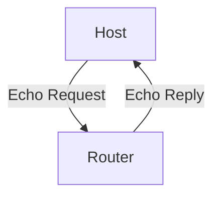

# 5.6 ICMP

- ICMP (Internet Control Message Protocol) is used for error reporting and diagnostics in IP networks.
- **Features:** Sends error messages (unreachable, time exceeded), echo requests (ping).

---

## ICMP Message Types
- **Echo request/reply:** Used by ping.
- **Destination unreachable:** Packet cannot be delivered.
- **Time exceeded:** TTL expired.

---

## Diagram: ICMP Echo

---

## Summary Table
| Message Type         | Use Case         |
|---------------------|------------------|
| Echo request/reply  | Ping             |
| Dest unreachable    | Error reporting  |
| Time exceeded       | TTL expired      |

---

## Practice Questions
1. **What is the purpose of ICMP?**
2. **List two ICMP message types.**
3. **Draw a diagram of ICMP echo.**

---

**Exam Tips:**
- Know ICMP message types and uses.
- Be able to draw and explain ICMP diagrams. 