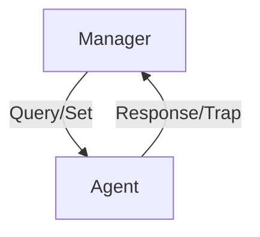

# 5.7 Network Management: SNMP

- SNMP (Simple Network Management Protocol) is used to monitor and manage network devices.
- **Features:** Collects device info, sets parameters, detects faults.

---

## What Is Network Management?

### Definition
- **"Network management includes the deployment, integration and coordination of the hardware, software, and human elements to monitor, test, poll, configure, analyze, evaluate, and control the network and element resources to meet the real-time, operational performance, and Quality of Service requirements at a reasonable cost."**

### Autonomous Systems
- **Autonomous systems (aka "network"): 1000s of interacting hardware/software components**
- **Other complex systems requiring monitoring, configuration, control:**
  - **Jet airplane, nuclear power plant, others?**

---

## Components of Network Management

### Managed Device
- **Equipment with manageable, configurable hardware, software components**
- **Agent: software component on managed device**
- **Data: device "state" configuration data, operational data, device statistics**

### Managing Server/Controller
- **Application, typically with network managers (humans) in the loop**
- **Data: management information**

### Network Management Protocol
- **Used by managing server to query, configure, manage device**
- **Used by devices to inform managing server of data, events**

---

## Network Operator Approaches to Management

### CLI (Command Line Interface)
- **Operator issues (types, scripts) direct to individual devices (e.g., vis ssh)**

### SNMP/MIB
- **Operator queries/sets devices data (MIB) using Simple Network Management Protocol (SNMP)**

### NETCONF/YANG
- **More abstract, network-wide, holistic**
- **Emphasis on multi-device configuration management**
- **YANG: data modeling language**
- **NETCONF: communicate YANG-compatible actions/data to/from/among remote devices**

---

## SNMP Protocol

### Two Ways to Convey MIB Info, Commands

#### Request/Response Mode
- **Manager sends request to agent**
- **Agent responds with data**

#### Trap Mode
- **Agent sends unsolicited information to manager**
- **Used for alerts and notifications**

---

## SNMP Protocol: Message Types

### Manager-to-Agent Messages
- **GetRequest: get me data (data instance, next data in list, block of data)**
- **GetNextRequest: get next data in sequence**
- **GetBulkRequest: get block of data**
- **SetRequest: set MIB value**

### Agent-to-Manager Messages
- **Response: value, response to Request**
- **Trap: inform manager of exceptional event**

---

## SNMP Protocol: Message Formats

### Get/Set Header Format
- **PDU type (0-3)**
- **Request ID**
- **Error Status (0-5)**
- **Error Index**
- **Name, Value pairs for variables to get/set**

### Trap Header Format
- **PDU type 4**
- **Enterprise**
- **Agent Addr**
- **Trap Type (0-7)**
- **Specific code**
- **Time stamp**
- **Name, Value pairs for trap info**

---

## SNMP: Management Information Base (MIB)

### MIB Overview
- **Managed device's operational (and some configuration) data gathered into device MIB module**
- **400 MIB modules defined in RFC's; many more vendor-specific MIBs**
- **Structure of Management Information (SMI): data definition language**

### Example MIB Variables for UDP Protocol
| Object ID | Name | Type | Comments |
|-----------|------|------|----------|
| 1.3.6.1.2.1.7.1 | UDPInDatagrams | 32-bit counter | total # datagrams delivered |
| 1.3.6.1.2.1.7.2 | UDPNoPorts | 32-bit counter | # undeliverable datagrams (no application at port) |
| 1.3.6.1.2.1.7.3 | UDInErrors | 32-bit counter | # undeliverable datagrams (all other reasons) |
| 1.3.6.1.2.1.7.4 | UDPOutDatagrams | 32-bit counter | total # datagrams sent |
| 1.3.6.1.2.1.7.5 | udpTable | SEQUENCE | one entry for each port currently in use |

---

## NETCONF Overview

### Goal
- **Actively manage/configure devices network-wide**
- **Operates between managing server and managed network devices**

### Actions
- **Retrieve, set, modify, activate configurations**
- **Atomic-commit actions over multiple devices**
- **Query operational data and statistics**
- **Subscribe to notifications from devices**

### Characteristics
- **Remote procedure call (RPC) paradigm**
- **NETCONF protocol messages encoded in XML**
- **Exchanged over secure, reliable transport (e.g., TLS) protocol**

---

## NETCONF Initialization, Exchange, Close

### Session Flow
1. **Session initiation, capabilities exchange: <hello>**
2. **RPC exchanges: <rpc>, <rpc-reply>**
3. **Optional notifications: <notification>**
4. **Session close: <close-session>**

### Message Flow
- **Managing server/controller data**
- **Agent data**
- **Bidirectional communication**

---

## Selected NETCONF Operations

### Core Operations
| NETCONF Operation | Description |
|------------------|-------------|
| <get-config> | Retrieve all or part of a given configuration. A device may have multiple configurations. |
| <get> | Retrieve all or part of both configuration state and operational state data. |
| <edit-config> | Change specified (possibly running) configuration at managed device. Managed device <rpc-reply> contains <ok> or <rpcerror> with rollback. |
| <lock>, <unlock> | Lock (unlock) configuration datastore at managed device (to lock out NETCONF, SNMP, or CLIs commands from other sources). |
| <create-subscription>, <notification> | Enable event notification subscription from managed device |

---

## Sample NETCONF RPC Message

### Example Configuration Change
- **Note message id**
- **Change the running configuration**
- **Change MTU of Ethernet 0/0 interface to 1500**
- **Change a configuration**

---

## YANG

### Purpose
- **Data modeling language used to specify structure, syntax, semantics of NETCONF network management data**
- **Built-in data types, like SMI**
- **XML document describing device, capabilities can be generated from YANG description**

### Features
- **Can express constraints among data that must be satisfied by a valid NETCONF configuration**
- **Ensure NETCONF configurations satisfy correctness, consistency constraints**

### Usage
- **Agent data**
- **Managing server/controller data**
- **NETCONF RPC message: <edit-config>**
- **YANG-generated XML**
- **YANG generated**

---

## SNMP Operation
- **Manager:** Central system that queries/controls devices.
- **Agent:** Software on devices that responds to manager.
- **MIB (Management Information Base):** Database of device parameters.

---

## Diagram: SNMP Operation

---

## Summary Table
| Component | Role                |
|-----------|---------------------|
| Manager   | Controls/monitors   |
| Agent     | Responds, reports   |
| MIB       | Stores parameters   |

---

## Practice Questions
1. **What is SNMP used for?**
2. **List the main components of SNMP.**
3. **Draw a diagram of SNMP operation.**

---

**Exam Tips:**
- Know SNMP components and operation.
- Be able to draw and explain SNMP diagrams.

## 5.7.2 The Simple Network Management Protocol (SNMP) 