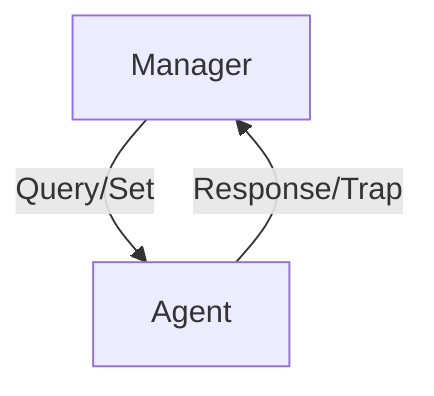

# 5.7 Network Management: SNMP

- SNMP (Simple Network Management Protocol) is used to monitor and manage network devices.
- **Features:** Collects device info, sets parameters, detects faults.

---

## SNMP Operation
- **Manager:** Central system that queries/controls devices.
- **Agent:** Software on devices that responds to manager.
- **MIB (Management Information Base):** Database of device parameters.

---

## Diagram: SNMP Operation

---

## Summary Table
| Component | Role                |
|-----------|---------------------|
| Manager   | Controls/monitors   |
| Agent     | Responds, reports   |
| MIB       | Stores parameters   |

---

## Practice Questions
1. **What is SNMP used for?**
2. **List the main components of SNMP.**
3. **Draw a diagram of SNMP operation.**

---

**Exam Tips:**
- Know SNMP components and operation.
- Be able to draw and explain SNMP diagrams.

## 5.7.2 The Simple Network Management Protocol (SNMP) 