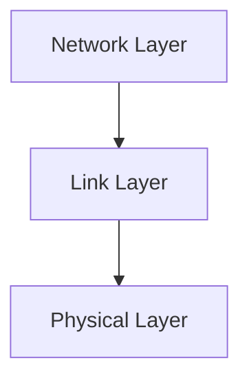

# 6.1 Introduction to the Link Layer

- The link layer is responsible for data transfer between directly connected nodes.
- **Key functions:** Framing, error detection, medium access control (MAC), addressing.
- **Protocols:** Ethernet, WiFi, PPP, ARP.

---

## Real-World Analogy
- The link layer is like a local delivery truck: it picks up and drops off packages (frames) within a neighborhood (local network).

---

## Diagram: Link Layer in the Stack

---

## Summary Table
| Function   | Description                  |
|------------|------------------------------|
| Framing    | Encapsulate data in frames   |
| Error Det. | Detect/correct errors        |
| MAC        | Control access to medium     |
| Addressing | Identify devices (MAC addr)  |

---

## Practice Questions
1. **What is the main function of the link layer?**
2. **Give a real-world analogy for the link layer.**
3. **List two link layer protocols.**

---

**Exam Tips:**
- Know the key functions and protocols of the link layer.
- Be able to draw and explain the link layer's role in the stack. 