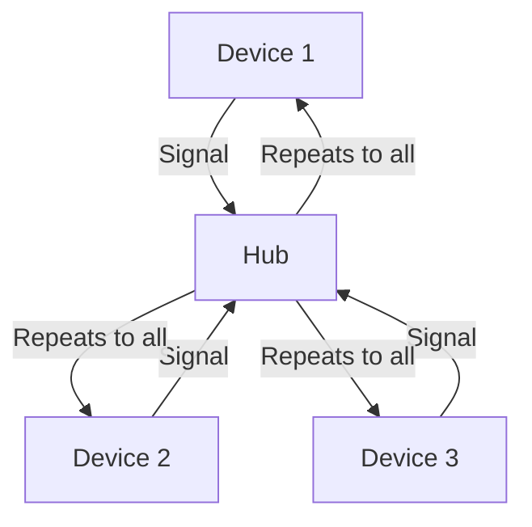

# 6.1 Introduction to the Link Layer

- The link layer is responsible for data transfer between directly connected nodes.
- **Key functions:** Framing, error detection, medium access control (MAC), addressing.
- **Protocols:** Ethernet, WiFi, PPP, ARP.

---

## Real-World Analogy
- The link layer is like a local delivery truck: it picks up and drops off packages (frames) within a neighborhood (local network).

---

## Diagram: Link Layer in the Stack

---

## Summary Table
| Function   | Description                  |
|------------|------------------------------|
| Framing    | Encapsulate data in frames   |
| Error Det. | Detect/correct errors        |
| MAC        | Control access to medium     |
| Addressing | Identify devices (MAC addr)  |

---

## Practice Questions
1. **What is the main function of the link layer?**
2. **Give a real-world analogy for the link layer.**
3. **List two link layer protocols.**

---

**Exam Tips:**
- Know the key functions and protocols of the link layer.
- Be able to draw and explain the link layer's role in the stack.

---

## Network Interface Cards (NICs)

### What is a NIC?
- **Definition:** Hardware component that connects a computer to a network.
- **Functions:**
  - Converts digital data to analog signals for transmission
  - Converts received analog signals to digital data
  - Provides physical connection to network media
  - Implements MAC address and link layer protocols

### NIC Components
- **Transceiver:** Converts electrical signals to/from network media
- **MAC Controller:** Implements MAC protocol (CSMA/CD for Ethernet)
- **Buffer Memory:** Temporary storage for incoming/outgoing frames
- **Bus Interface:** Connects to computer's expansion bus (PCI, PCIe)
- **ROM:** Contains firmware and MAC address

### MAC Address
- **Structure:** 48-bit (6-byte) unique identifier
- **Format:** XX:XX:XX:XX:XX:XX (hexadecimal)
- **Organizationally Unique Identifier (OUI):** First 3 bytes identify manufacturer
- **Network Interface Controller (NIC) Specific:** Last 3 bytes unique to device
- **Example:** 00:1B:44:11:3A:B7

### NIC Types
- **Ethernet NICs:**
  - **10/100 Mbps:** Fast Ethernet
  - **1 Gbps:** Gigabit Ethernet
  - **10 Gbps:** 10 Gigabit Ethernet
- **Wireless NICs:**
  - **802.11a/b/g/n/ac/ax:** WiFi standards
  - **Bluetooth:** Short-range wireless
- **Fiber NICs:** For fiber optic connections

### NIC Drivers
- **Purpose:** Software interface between OS and NIC hardware
- **Functions:**
  - Initialize NIC hardware
  - Handle interrupts from NIC
  - Manage transmit/receive buffers
  - Implement network protocols
- **Examples:** Windows NDIS drivers, Linux kernel modules

---

## Hubs (Multiport Repeaters)

### What is a Hub?
- **Definition:** Physical layer device that repeats signals to all ports.
- **Function:** Acts as a multiport repeater, amplifying and regenerating signals.
- **Operation:** Receives signal on one port, repeats it to all other ports.

### Hub Characteristics
- **OSI Layer:** Physical layer (Layer 1)
- **Intelligence:** None - operates at bit level
- **Collision Domain:** Single collision domain for all connected devices
- **Bandwidth:** Shared among all ports
- **Security:** No security features

### Hub Operation

### Hub Types
- **Passive Hub:** Simply connects cables, no signal regeneration
- **Active Hub:** Amplifies and regenerates signals
- **Intelligent Hub:** Includes basic management features

### Hub Limitations
- **Single Collision Domain:** All devices share bandwidth
- **No Traffic Isolation:** All traffic visible to all devices
- **No Security:** No filtering or access control
- **Performance:** Bandwidth divided among all ports
- **Troubleshooting:** Difficult to isolate problems

### Why Hubs Were Replaced by Switches
- **Performance:** Switches provide dedicated bandwidth per port
- **Security:** Switches can isolate traffic using VLANs
- **Collision Domains:** Switches create separate collision domains
- **Intelligence:** Switches can make forwarding decisions based on MAC addresses

### Real-World Example
- **Legacy Networks:** Older office networks used hubs
- **Modern Use:** Rarely used, replaced by switches
- **Educational:** Still used in networking labs to demonstrate collision domains

---

## Classic LAN Topologies
- **Star:** All devices connect to a central switch/hub. Easy to manage, but central point of failure.
- **Bus:** All devices share a single communication line. Simple, but collisions and troubleshooting issues.
- **Ring:** Devices form a closed loop. Predictable, but break in ring affects all.

| Topology | Pros | Cons |
|----------|------|------|
| Star     | Easy to manage, scalable | Hub/switch failure = network down |
| Bus      | Cheap, simple            | Collisions, hard to troubleshoot |
| Ring     | Predictable, orderly     | Break = all down |

---

## Ethernet Evolution
- **10Base-T:** 10 Mbps, twisted pair.
- **100Base-TX:** 100 Mbps, twisted pair.
- **Gigabit Ethernet:** 1 Gbps, twisted pair/fiber.
- **10G/40G/100G Ethernet:** High-speed, data centers/backbones.

---

## Case Studies & Real-World Strategies

### 1. Ethernet Evolution and High-Speed LANs
- **Google, Facebook, Microsoft:** Deploy 10G/40G/100G Ethernet in data centers for high bandwidth and low latency. Use fiber and copper based on distance and cost.
- **Financial Firms:** Use low-latency Ethernet and cut-through switching for high-frequency trading.

### 2. Switching and VLANs
- **Large Enterprises:** Use VLANs to segment networks for security, performance, and compliance. Employ Spanning Tree Protocol (STP) and Rapid STP to prevent loops and enable fast failover.
- **Cloud Providers:** Automate VLAN provisioning and use VXLAN for scalable virtual networks across data centers.

### 3. WiFi and Wireless LANs
- **Universities, Airports, Stadiums:** Deploy dense WiFi networks with multiple access points, seamless roaming, and load balancing. Use WPA2/WPA3 Enterprise for secure authentication.
- **Google and Amazon:** Use WiFi 6/6E in offices and warehouses for high device density and IoT support.

### 4. Data Center Networking
- **Amazon, Google, Microsoft:** Use fat-tree and spine-leaf topologies for scalable, redundant, and high-performance data center networks. Employ SDN for automated traffic engineering and rapid scaling.
- **Netflix Open Connect:** Deploys custom switches and high-capacity links in ISP data centers to optimize video delivery.

### 5. Link Virtualization and MPLS
- **ISPs:** Use MPLS for traffic engineering, VPNs, and fast reroute in WANs. Enterprises use PPP and HDLC for secure point-to-point links in legacy WANs.
