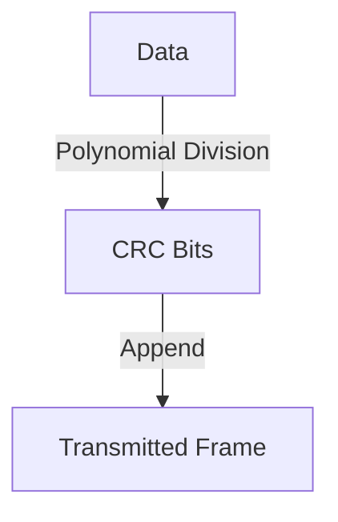

# 6.2 Error Detection and Correction

- Error detection/correction ensures data integrity over unreliable links.
- **Methods:** Parity, checksums, CRC, Hamming code.

---

## Parity
- **Single-bit parity:** Adds a bit to make total 1s even/odd.
- **Detects single-bit errors.**

---

## Checksums
- **Sum of data segments.**
- **Used in IP, TCP, UDP.**

---

## Cyclic Redundancy Check (CRC)
- **Polynomial division of data.**
- **Detects burst errors.**

---

## Hamming Code
- **Error correction:** Can correct single-bit errors.

---

## Diagram: CRC Process

---

## Summary Table
| Method   | Detects | Corrects | Used In   |
|----------|---------|----------|-----------|
| Parity   | 1-bit   | No       | Simple HW |
| Checksum | Many    | No       | IP, TCP   |
| CRC      | Burst   | No       | Ethernet  |
| Hamming  | 1-bit   | 1-bit    | Memory    |

---

## Practice Questions
1. **What is the purpose of CRC?**
2. **How does parity detect errors?**
3. **Which method can correct errors?**

---

**Exam Tips:**
- Know error detection/correction methods and their uses.
- Be able to draw and explain CRC diagrams. 