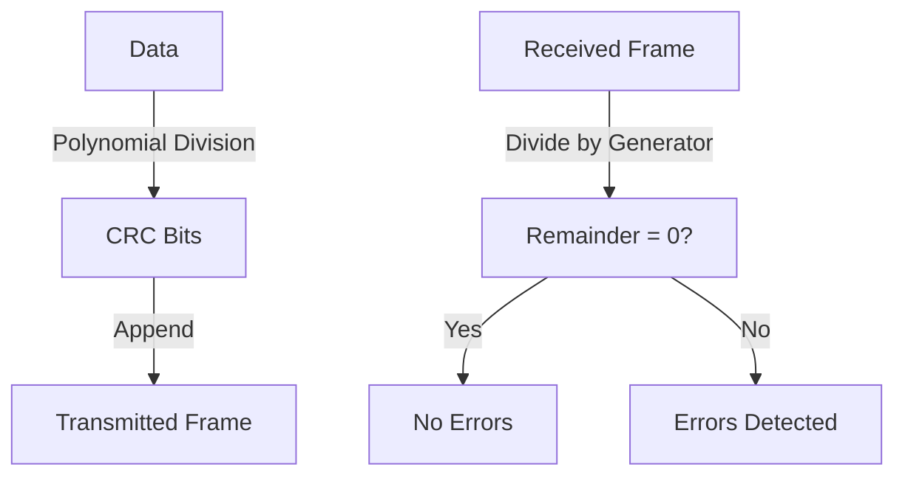

# 6.2 Error Detection and Correction

- Error detection/correction ensures data integrity over unreliable links.
- **Methods:** Parity, checksums, CRC, Hamming code.

---

## Error Detection

### EDC (Error Detection and Correction)
- **EDC = Error Detection and Correction bits (redundancy)**
- **D = Data protected by error checking, may include header fields**
- **Error detection not 100% reliable!**
  - **Protocol may miss some errors, but rarely**
  - **Larger EDC field yields better detection and correction**

### Goal
- **Detect "errors" (e.g., flipped bits) in transmitted packet**
- **Note: used at transport layer only**

---

## Parity Checking

### Single Bit Parity
- **Detect single bit errors**
- **Adds a bit to make total 1s even/odd**

### Two-Dimensional Bit Parity
- **Detect and correct single bit errors**
- **Uses both row and column parity bits**

### Example
```
Data: 1011
Parity (even): 10110 (add 0 to make total 1s even)
```

---

## Internet Checksum (Review)

### Sender Process
- **Treat segment contents as sequence of 16-bit integers**
- **Checksum: addition (1's complement sum) of segment contents**
- **Sender puts checksum value into UDP checksum field**

### Receiver Process
- **Compute checksum of received segment**
- **Check if computed checksum equals checksum field value:**
  - **NO - error detected**
  - **YES - no error detected. But maybe errors nonetheless?**

### Goal
- **Detect "errors" (e.g., flipped bits) in transmitted packet**
- **Note: used at transport layer only**

---

## Cyclic Redundancy Check (CRC)

### Overview
- **More powerful error-detection coding**
- **View data bits, D, as a binary number**
- **Choose r+1 bit pattern (generator), G**
- **Goal: choose r CRC bits, R, such that <D,R> exactly divisible by G (modulo 2)**
- **Receiver knows G, divides <D,R> by G. If non-zero remainder: error detected!**
- **Can detect all burst errors less than r+1 bits**
- **Widely used in practice (Ethernet, 802.11 WiFi, ATM)**

### Mathematical Foundation
- **Want: D.2r XOR R = nG**
- **Equivalently: D.2r = nG XOR R**
- **Equivalently: if we divide D.2r by G, want remainder R to satisfy:**
  - **R = remainder[D.2r/G]**

### CRC Example
- **Data D = 101110**
- **Generator G = 1001 (r = 3)**
- **D.2r = 101110000**
- **Divide 101110000 by 1001**
- **Remainder R = 011**
- **Transmitted frame: 101110011**

---

## CRC Process

### Step-by-Step Process
1. **Append r zeros to data D**
2. **Divide D.2r by generator G using modulo-2 arithmetic**
3. **Remainder R becomes CRC bits**
4. **Append R to D to form transmitted frame**

### Modulo-2 Arithmetic
- **Addition = XOR (no carry)**
- **Subtraction = XOR (no borrow)**
- **Division = long division with XOR**

### Verification
- **Receiver divides received frame by G**
- **If remainder = 0: no errors detected**
- **If remainder ≠ 0: errors detected**

---

## Diagram: CRC Process


---

## Error Detection Methods Comparison

### Parity Checking
- **Single bit parity: detects single bit errors**
- **Two-dimensional parity: detects and corrects single bit errors**
- **Simple to implement**
- **Limited error detection capability**

### Internet Checksum
- **Used in IP, TCP, UDP headers**
- **Simple addition-based algorithm**
- **Detects many types of errors**
- **Cannot correct errors**

### Cyclic Redundancy Check (CRC)
- **Most powerful error detection**
- **Detects all burst errors less than r+1 bits**
- **Used in Ethernet, WiFi, ATM**
- **Cannot correct errors**
- **More complex computation**

### Hamming Code
- **Error correction: can correct single-bit errors**
- **Used in memory systems**
- **More overhead than error detection only**

---

## Summary Table
| Method   | Detects | Corrects | Used In   | Complexity |
|----------|---------|----------|-----------|------------|
| Parity   | 1-bit   | No       | Simple HW | Low        |
| Checksum | Many    | No       | IP, TCP   | Low        |
| CRC      | Burst   | No       | Ethernet  | Medium     |
| Hamming  | 1-bit   | 1-bit    | Memory    | High       |

---

## Real-World Applications

### Ethernet CRC-32
- **32-bit CRC polynomial**
- **Detects all burst errors up to 32 bits**
- **Standard polynomial: 0x04C11DB7**

### WiFi (802.11) CRC
- **32-bit CRC for data frames**
- **16-bit CRC for control frames**
- **Critical for wireless error detection**

### ATM CRC
- **8-bit CRC for header**
- **32-bit CRC for payload**
- **Fast hardware implementation**

---

## Practice Questions
1. **What is the purpose of CRC?**
2. **How does parity detect errors?**
3. **Which method can correct errors?**
4. **Explain the CRC division process.**
5. **Why is error detection not 100% reliable?**

---

**Exam Tips:**
- Know error detection/correction methods and their uses.
- Be able to draw and explain CRC diagrams.
- Understand the mathematical foundation of CRC.
- Know which methods are used in which protocols. 