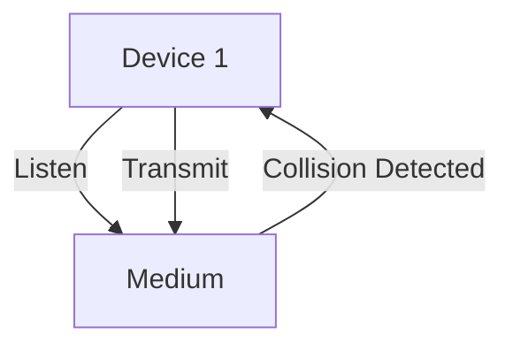

# 6.3 Multiple Access Protocols

- Multiple access protocols coordinate how devices share a communication medium.
- **Types:** Channel partitioning, random access, taking turns.

---

## Channel Partitioning
- **TDMA:** Time slots.
- **FDMA:** Frequency bands.
- **CDMA:** Codes.

---

## Random Access
- **ALOHA:** Transmit anytime, risk collision.
- **CSMA/CD (Ethernet):** Listen before transmit, detect collisions.
- **CSMA/CA (WiFi):** Avoid collisions with backoff.

---

## Taking Turns
- **Polling:** Central controller invites devices.
- **Token passing:** Token circulates, only holder transmits.

---

## Diagram: CSMA/CD

---

## Summary Table
| Protocol   | Medium      | Collision Handling |
|------------|------------|-------------------|
| TDMA       | Wired/Wireless | No collisions   |
| CSMA/CD    | Wired (Eth) | Detect/correct    |
| CSMA/CA    | Wireless    | Avoid/backoff     |
| Token Ring | Wired       | No collisions     |

---

## Practice Questions
1. **What is CSMA/CD?**
2. **How does TDMA avoid collisions?**
3. **List two random access protocols.**

---

**Exam Tips:**
- Know multiple access types and examples.
- Be able to draw and explain CSMA/CD diagrams.

---

## Classic LANs and Multiple Access
- **Token Ring:** Uses a token-passing protocol in a ring topology. No collisions, but token loss can halt network.
- **Bus LANs:** Use CSMA/CD or ALOHA for access control.
- **Star LANs:** Use a central hub/switch for coordination.

## Hidden and Exposed Terminal Problems (Wireless)
- **Hidden Terminal:** Two devices can't sense each other but collide at a common receiver.
- **Exposed Terminal:** A device refrains from transmitting because it senses the medium is busy, but its transmission wouldn't cause a collision. 