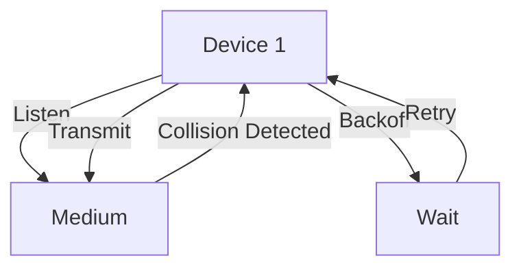

# 6.3 Multiple Access Protocols

- Multiple access protocols coordinate how devices share a communication medium.
- **Types:** Channel partitioning, random access, taking turns.

---

## Multiple Access Links, Protocols

### Two Types of "Links"

#### Point-to-Point
- **PPP for dial-up access**
- **Point-to-point link between Ethernet switch, host**

#### Broadcast (Shared Wire or Medium)
- **Old-fashioned Ethernet**
- **Upstream HFC**
- **802.11 wireless LAN**
- **Shared wire (e.g., cabled Ethernet)**
- **Shared RF (e.g., 802.11 WiFi)**
- **Shared RF (satellite)**
- **Humans at a cocktail party (shared air, acoustical)**

---

## Multiple Access Protocols

### Single Shared Broadcast Channel
- **Two or more simultaneous transmissions by nodes: interference**
- **Collision if node receives two or more signals at the same time**

### Multiple Access Protocol
- **Distributed algorithm that determines how nodes share channel, i.e., determine when node can transmit**
- **Communication about channel sharing must use channel itself!**
- **No out-of-band channel for coordination**

---

## An Ideal Multiple Access Protocol

### Given: Broadcast Channel of Rate R bps

### Desiderata
1. **When one node wants to transmit, it can send at rate R**
2. **When M nodes want to transmit, each can send at average rate R/M**
3. **Fully decentralized:**
   - **No special node to coordinate transmissions**
   - **No synchronization of clocks, slots**
4. **Simple**

---

## MAC Protocols: Taxonomy

### Three Broad Classes

#### Channel Partitioning
- **Divide channel into smaller "pieces" (time slots, frequency, code)**
- **Allocate piece to node for exclusive use**

#### Random Access
- **Channel not divided, allow collisions**
- **"Recover" from collisions**

#### "Taking Turns"
- **Nodes take turns, but nodes with more to send can take longer turns**

---

## Channel Partitioning MAC Protocols: TDMA

### TDMA: Time Division Multiple Access
- **Access to channel in "rounds"**
- **Each station gets fixed length slot (length = packet transmission time) in each round**
- **Unused slots go idle**

### Example
- **6-station LAN, 1,3,4 have packets to send, slots 2,5,6 idle**
- **6-slot frame repeated**

### Characteristics
- **No collisions**
- **Fair allocation**
- **Inefficient at low load**
- **Clock synchronization required**

---

## Channel Partitioning MAC Protocols: FDMA

### FDMA: Frequency Division Multiple Access
- **Channel spectrum divided into frequency bands**
- **Each station assigned fixed frequency band**
- **Unused transmission time in frequency bands go idle**

### Example
- **6-station LAN, 1,3,4 have packet to send, frequency bands 2,5,6 idle**

### Characteristics
- **No collisions**
- **Fixed bandwidth allocation**
- **Inefficient at low load**
- **Complex hardware requirements**

---

## Random Access Protocols

### When Node Has Packet to Send
- **Transmit at full channel data rate R**
- **No a priori coordination among nodes**
- **Two or more transmitting nodes ➜ "collision"**

### Random Access MAC Protocol Specifies
- **How to detect collisions**
- **How to recover from collisions (e.g., via delayed retransmissions)**

### Examples of Random Access MAC Protocols
- **Slotted ALOHA**
- **ALOHA**
- **CSMA, CSMA/CD, CSMA/CA**

---

## Slotted ALOHA

### Assumptions
- **All frames same size**
- **Time divided into equal size slots (time to transmit 1 frame)**
- **Nodes start to transmit only slot beginning**
- **Nodes are synchronized**
- **If 2 or more nodes transmit in slot, all nodes detect collision**

### Operation
- **When node obtains fresh frame, transmits in next slot**
- **If no collision: node can send new frame in next slot**
- **If collision: node retransmits frame in each subsequent slot with prob. p until success**

### Pros
- **Single active node can continuously transmit at full rate of channel**
- **Highly decentralized: only slots in nodes need to be in sync**
- **Simple**

### Cons
- **Collisions, wasting slots**
- **Idle slots**
- **Nodes may be able to detect collision in less than time to transmit packet**
- **Clock synchronization**

---

## Slotted ALOHA: Efficiency

### Efficiency Calculation
- **Suppose: N nodes with many frames to send, each transmits in slot with probability p**
- **Prob that given node has success in a slot = p(1-p)N-1**
- **Prob that any node has a success = Np(1-p)N-1**
- **Max efficiency: find p* that maximizes Np(1-p)N-1**
- **For many nodes, take limit of Np*(1-p*)N-1 as N goes to infinity, gives:**
  - **Max efficiency = 1/e = .37**

### Result
- **At best: channel used for useful transmissions 37% of time!**

---

## Pure (Unslotted) ALOHA

### Operation
- **Unslotted Aloha: simpler, no synchronization**
- **When frame first arrives: transmit immediately**
- **Collision probability increases:**
  - **Frame sent at t0 collides with other frames sent in [t0-1,t0+1]**

### Pure ALOHA Efficiency
- **P(success by given node) = P(node transmits) × P(no other node transmits in [t0-1,t0]) × P(no other node transmits in [t0-1,t0])**
- **= p × (1-p)N-1 × (1-p)N-1**
- **= p × (1-p)2(N-1)**
- **Choosing optimum p and then letting n → ∞**
- **= 1/(2e) = .18**

### Result
- **Even worse than slotted Aloha!**

---

## CSMA (Carrier Sense Multiple Access)

### CSMA: Listen Before Transmit
- **If channel sensed idle: transmit entire frame**
- **If channel sensed busy, defer transmission**

### Human Analogy
- **Don't interrupt others!**

### CSMA Collisions
- **Collisions can still occur: propagation delay means two nodes may not hear each other's transmission**
- **Collision: entire packet transmission time wasted**
- **Distance & propagation delay play role in determining collision probability**
- **Spatial layout of nodes**

---

## CSMA/CD (Collision Detection)

### CSMA/CD: Carrier Sensing, Deferral as in CSMA
- **Collisions detected within short time**
- **Colliding transmissions aborted, reducing channel wastage**

### Collision Detection
- **Easy in wired LANs: measure signal strengths, compare transmitted, received signals**
- **Difficult in wireless LANs: received signal strength overwhelmed by local transmission strength**

### Human Analogy
- **The polite conversationalist**

---

## Ethernet CSMA/CD Algorithm

### Step-by-Step Process
1. **NIC receives datagram from network layer, creates frame**
2. **If NIC senses channel idle, starts frame transmission. If NIC senses channel busy, waits until channel idle, then transmits**
3. **If NIC transmits entire frame without detecting another transmission, NIC is done with frame!**
4. **If NIC detects another transmission while transmitting, aborts and sends jam signal**
5. **After aborting, NIC enters binary (exponential) backoff:**
   - **After mth collision, NIC chooses K at random from {0,1,2, …, 2m-1}**
   - **NIC waits K×512 bit times, returns to Step 2**
   - **Longer backoff interval with more collisions**

---

## CSMA/CD Efficiency

### Efficiency Formula
- **Tprop = max prop delay between 2 nodes in LAN**
- **ttrans = time to transmit max-size frame**
- **Efficiency goes to 1 as tprop goes to 0**
- **Efficiency goes to 1 as ttrans goes to infinity**

### Performance
- **Better performance than ALOHA: and simple, cheap, decentralized!**

---

## "Taking Turns" MAC Protocols

### Channel Partitioning MAC Protocols
- **Share channel efficiently and fairly at high load**
- **Inefficient at low load: delay in channel access, 1/N bandwidth allocated even if only 1 active node!**

### Random Access MAC Protocols
- **Efficient at low load: single node can fully utilize channel**
- **High load: collision overhead**

### "Taking Turns" Protocols
- **Look for best of both worlds!**

---

## Polling

### Operation
- **Master node "invites" slave nodes to transmit in turn**
- **Typically used with "dumb" slave devices**

### Concerns
- **Polling overhead**
- **Latency**
- **Single point of failure (master)**

### Flow
- **Master → Poll → Slave → Data → Master**

---

## Token Passing

### Operation
- **Control token passed from one node to next sequentially**
- **Token message**

### Concerns
- **Token overhead**
- **Latency**
- **Single point of failure (token)**

### Flow
- **Token → Data → Token → (nothing to send) → Token**

---

## Cable Access Network

### Architecture
- **Cable headend**
- **CMTS (Cable Modem Termination System)**
- **ISP**
- **Cable modem**
- **Splitter**

### Characteristics
- **Multiple 40Mbps downstream (broadcast) channels**
- **Single CMTS transmits into channels**
- **Multiple 30 Mbps upstream channels**
- **Multiple access: all users contend for certain upstream channel time slots (others assigned)**

### Operation
- **Internet frames, TV channels, control transmitted downstream at different frequencies**
- **Upstream Internet frames, TV control, transmitted upstream at different frequencies in time slots**

---

## DOCSIS: Data Over Cable Service Interface Spec

### FDM Over Upstream, Downstream Frequency Channels
- **TDM upstream: some slots assigned, some have contention**
- **Downstream MAP frame: assigns upstream slots**
- **Request for upstream slots (and data) transmitted random access (binary backoff) in selected slots**

### Frame Structure
- **MAP frame for Interval [t1, t2]**
- **Residences with cable modems**
- **Downstream channel i**
- **Upstream channel j**
- **Assigned minislots containing cable modem upstream data frames**
- **Minislots containing minislots request frames**

---

## Summary of MAC Protocols

### Channel Partitioning, by Time, Frequency or Code
- **Time Division, Frequency Division**

### Random Access (Dynamic)
- **ALOHA, S-ALOHA, CSMA, CSMA/CD**
- **Carrier sensing: easy in some technologies (wire), hard in others (wireless)**
- **CSMA/CD used in Ethernet**
- **CSMA/CA used in 802.11**

### Taking Turns
- **Polling from central site, token passing**
- **Bluetooth, FDDI, token ring**

---

## Diagram: CSMA/CD

---

## Summary Table
| Protocol   | Medium      | Collision Handling | Efficiency | Complexity |
|------------|------------|-------------------|------------|------------|
| TDMA       | Wired/Wireless | No collisions   | Low load: poor | Medium     |
| FDMA       | Wired/Wireless | No collisions   | Low load: poor | High       |
| ALOHA      | Any         | Detect/retry     | 18%        | Low        |
| S-ALOHA    | Any         | Detect/retry     | 37%        | Low        |
| CSMA/CD    | Wired (Eth) | Detect/correct   | High       | Medium     |
| CSMA/CA    | Wireless    | Avoid/backoff    | High       | Medium     |
| Token Ring | Wired       | No collisions    | High       | Medium     |
| Polling    | Any         | No collisions    | High       | High       |

---

## Practice Questions
1. **What is CSMA/CD?**
2. **How does TDMA avoid collisions?**
3. **List two random access protocols.**
4. **What is the efficiency of slotted ALOHA?**
5. **Explain the difference between CSMA and CSMA/CD.**

---

**Exam Tips:**
- Know multiple access types and examples.
- Be able to draw and explain CSMA/CD diagrams.
- Understand efficiency calculations for ALOHA protocols.
- Know which protocols are used in which technologies.

---

## Classic LANs and Multiple Access
- **Token Ring:** Uses a token-passing protocol in a ring topology. No collisions, but token loss can halt network.
- **Bus LANs:** Use CSMA/CD or ALOHA for access control.
- **Star LANs:** Use a central hub/switch for coordination.

## Hidden and Exposed Terminal Problems (Wireless)
- **Hidden Terminal:** Two devices can't sense each other but collide at a common receiver.
- **Exposed Terminal:** A device refrains from transmitting because it senses the medium is busy, but its transmission wouldn't cause a collision. 