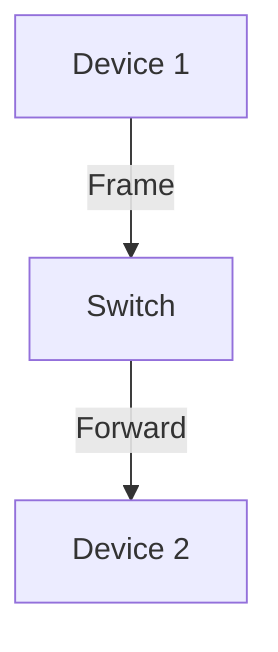

# 6.4 Switched LANs

- Switched LANs use switches to connect multiple devices in a local network.
- **Ethernet:** Most common LAN technology.
- **Switches:** Forward frames based on MAC addresses.
- **VLANs:** Virtual LANs segment networks logically.

---

## Ethernet
- **Frame format:** Preamble, dest MAC, src MAC, type, data, CRC.
- **MAC address:** Unique 48-bit identifier.

---

## Switch Operation
- **Learning:** Builds MAC address table.
- **Forwarding:** Sends frames to correct port.

---

## VLANs
- **Segment network:** Isolate traffic, improve security.

---

## Diagram: Switch Operation


---

## Summary Table
| Feature   | Ethernet Switch | Hub        |
|-----------|----------------|------------|
| Intelligence | High (Layer 2) | None (Layer 1) |
| Collision Domain | Per port | Single domain |
| Performance | Dedicated bandwidth | Shared bandwidth |
| Security | MAC filtering, VLANs | No security |

---

## Practice Questions
1. **How does a switch differ from a hub?**
2. **What is the purpose of VLANs?**
3. **Explain switch learning and forwarding.**

---

**Exam Tips:**
- Know switch vs. hub differences.
- Understand VLAN benefits.
- Be able to explain switch operation.

---

## 6.4.1 Ethernet Frame Structure
- **Preamble:** 7 bytes for synchronization.
- **Start Frame Delimiter:** 1 byte marking frame start.
- **Destination MAC:** 6 bytes, recipient address.
- **Source MAC:** 6 bytes, sender address.
- **Type/Length:** 2 bytes, protocol or length.
- **Data:** 46-1500 bytes, actual payload.
- **CRC:** 4 bytes, error detection.

---

## 6.4.2 Switch Learning Process
- **Source MAC Learning:** Switch records source MAC with port.
- **MAC Address Table:** Database of MAC addresses and ports.
- **Aging:** Remove old entries after timeout.

---

## 6.4.3 Switch Forwarding Process
- **Unicast:** Forward to specific port if MAC known.
- **Broadcast:** Forward to all ports except source.
- **Unknown Unicast:** Flood to all ports except source.

---

## 6.4.4 VLANs (Virtual LANs)
- **Logical Segmentation:** Separate broadcast domains.
- **Port-based VLANs:** Assign ports to VLANs.
- **Tagged VLANs:** 802.1Q standard, VLAN ID in frame.
- **Benefits:** Security, performance, management.

---

## 6.4.5 Switch Types
- **Unmanaged:** Basic switching, no configuration.
- **Managed:** Advanced features, VLANs, QoS.
- **Layer 3:** Routing capabilities, IP forwarding.

---

## Practice Questions
1. **Draw and label an Ethernet frame.**
2. **Explain the switch learning process.**
3. **What are the benefits of VLANs?**

---

**Exam Tips:**
- Know Ethernet frame structure.
- Understand switch learning/forwarding.
- Be able to explain VLAN concepts.

---

## More on Ethernet Switching
- **Store-and-Forward:** Receive entire frame before forwarding.
- **Cut-Through:** Forward as soon as destination is known.
- **Fragment-Free:** Check first 64 bytes before forwarding.

---

## Spanning Tree Protocol (STP)
- **Purpose:** Prevent switching loops.
- **Root Bridge:** Central reference point.
- **Port States:** Blocking, listening, learning, forwarding.
- **Rapid STP:** Faster convergence than original STP.

---

## Switch Security Features
- **Port Security:** Limit MAC addresses per port.
- **DHCP Snooping:** Prevent rogue DHCP servers.
- **Dynamic ARP Inspection:** Validate ARP messages.
- **Storm Control:** Limit broadcast/multicast traffic.

---

## Case Studies & Real-World Strategies

### 1. Enterprise Switching
- **Cisco Catalyst:** Industry standard for enterprise networks.
- **VLAN Design:** Separate traffic by department, security level.
- **High Availability:** Redundant switches, rapid failover.

### 2. Data Center Switching
- **Spine-Leaf Topology:** High bandwidth, low latency.
- **VXLAN:** Virtual extensible LAN for large-scale networks.
- **Network Virtualization:** Overlay networks for flexibility.

### 3. Campus Networks
- **Access Layer:** End device connections.
- **Distribution Layer:** VLAN routing, policy enforcement.
- **Core Layer:** High-speed backbone.

---

## Hierarchical Network Design

### What is Hierarchical Design?
- **Definition:** Network architecture organized in layers with specific functions
- **Benefits:** Scalability, manageability, performance, fault isolation
- **Principles:** Modular design, clear boundaries, standardized interfaces

### Three-Layer Hierarchical Model

#### Access Layer (Layer 1)
- **Purpose:** Provide network access to end devices
- **Devices:** Switches, wireless access points
- **Functions:**
  - Connect end devices (computers, phones, printers)
  - Provide port security and access control
  - Implement VLANs for traffic segmentation
  - Handle basic traffic filtering
- **Characteristics:**
  - High port density
  - Cost-effective
  - Simple configuration
  - Redundant uplinks to distribution layer

#### Distribution Layer (Layer 2)
- **Purpose:** Aggregate access layer traffic and provide policy enforcement
- **Devices:** Layer 3 switches, routers
- **Functions:**
  - Route between VLANs
  - Implement security policies (ACLs, firewalls)
  - Provide load balancing
  - Handle traffic filtering and QoS
  - Connect to core layer
- **Characteristics:**
  - High performance
  - Advanced features
  - Redundant connections
  - Policy enforcement capabilities

#### Core Layer (Layer 3)
- **Purpose:** Provide high-speed backbone connectivity
- **Devices:** High-performance switches, routers
- **Functions:**
  - Fast packet switching
  - Connect distribution layers
  - Provide redundancy and fault tolerance
  - Handle high-bandwidth traffic
- **Characteristics:**
  - Maximum performance
  - High availability
  - Minimal latency
  - Redundant paths

### Hierarchical Design Benefits

#### Scalability
- **Modular Growth:** Add new modules without affecting existing ones
- **Predictable Performance:** Each layer has defined capacity
- **Easier Planning:** Clear capacity requirements for each layer
- **Technology Evolution:** Upgrade layers independently

#### Manageability
- **Clear Boundaries:** Each layer has specific functions
- **Easier Troubleshooting:** Problems can be isolated to specific layers
- **Standardized Configurations:** Consistent setup across similar devices
- **Reduced Complexity:** Simpler to understand and manage

#### Performance
- **Optimized Traffic Flow:** Traffic follows efficient paths
- **Reduced Congestion:** Proper traffic distribution
- **Low Latency:** Direct paths between layers
- **High Bandwidth:** Adequate capacity at each layer

#### Fault Isolation
- **Localized Failures:** Problems don't affect entire network
- **Redundant Paths:** Multiple connections between layers
- **Fast Recovery:** Quick failover to backup paths
- **Predictable Behavior:** Known failure patterns

### Hierarchical Design Principles

#### Modularity
- **Self-Contained Modules:** Each layer functions independently
- **Standard Interfaces:** Consistent connections between layers
- **Replaceable Components:** Easy to upgrade or replace modules
- **Clear Dependencies:** Well-defined relationships between layers

#### Redundancy
- **Multiple Paths:** Redundant connections between layers
- **Load Sharing:** Distribute traffic across multiple paths
- **Failover:** Automatic switching to backup paths
- **High Availability:** Continuous operation during failures

#### Security
- **Layered Defense:** Security at multiple levels
- **Access Control:** Restrict access at access layer
- **Traffic Filtering:** Filter traffic at distribution layer
- **Monitoring:** Monitor traffic at all layers

### Real-World Hierarchical Examples

#### Enterprise Campus Network
```
Core Layer: High-speed backbone switches
    ↓
Distribution Layer: Department switches with routing
    ↓
Access Layer: Workgroup switches for end devices
```

#### Data Center Network
```
Core Layer: Spine switches for high-speed interconnect
    ↓
Distribution Layer: Leaf switches for server connectivity
    ↓
Access Layer: Top-of-rack switches for server connections
```

#### Small Business Network
```
Core Layer: Internet router/firewall
    ↓
Distribution Layer: Main switch with VLANs
    ↓
Access Layer: Workgroup switches and WiFi
```

### Hierarchical Design Best Practices

#### Layer-Specific Guidelines

##### Access Layer Best Practices
- **Port Security:** Limit MAC addresses per port
- **VLAN Assignment:** Group devices logically
- **PoE Support:** Power over Ethernet for phones, cameras
- **Redundant Uplinks:** Multiple connections to distribution
- **Storm Control:** Limit broadcast/multicast traffic

##### Distribution Layer Best Practices
- **Routing:** Route between VLANs and subnets
- **Security Policies:** Implement ACLs and firewalls
- **Load Balancing:** Distribute traffic across multiple paths
- **QoS:** Prioritize important traffic
- **Redundancy:** Multiple connections to core

##### Core Layer Best Practices
- **High Performance:** Maximum bandwidth and low latency
- **Redundancy:** Multiple paths between all points
- **Simplicity:** Minimal processing, fast switching
- **Monitoring:** Comprehensive traffic monitoring
- **Scalability:** Easy to expand capacity

#### Design Considerations

##### Traffic Patterns
- **Client-Server:** Most traffic goes to servers
- **Peer-to-Peer:** Traffic between similar devices
- **Internet Access:** Traffic to external networks
- **Backup/Storage:** High-bandwidth internal traffic

##### Growth Planning
- **Capacity Planning:** Plan for future growth
- **Technology Evolution:** Consider new technologies
- **Modular Expansion:** Add capacity incrementally
- **Performance Monitoring:** Track usage patterns

##### Security Integration
- **Network Segmentation:** Separate traffic by security level
- **Access Control:** Restrict access at multiple points
- **Monitoring:** Monitor traffic at all layers
- **Incident Response:** Plan for security incidents

### Hierarchical vs. Flat Networks

#### Flat Network Problems
- **Limited Scalability:** Difficult to grow beyond certain size
- **Poor Performance:** All devices share same broadcast domain
- **Security Issues:** Difficult to isolate and secure traffic
- **Management Complexity:** Hard to manage large flat networks
- **Fault Isolation:** Problems affect entire network

#### Hierarchical Network Advantages
- **Scalable:** Easy to add new modules and capacity
- **Performant:** Optimized traffic flow and reduced congestion
- **Secure:** Multiple layers of security and traffic isolation
- **Manageable:** Clear structure and modular design
- **Reliable:** Fault isolation and redundant paths

### Implementation Examples

#### Small Office (Single Switch)
- **Access Layer:** End devices connect to switch
- **Distribution Layer:** Switch provides VLANs and routing
- **Core Layer:** Switch connects to Internet router

#### Medium Business (Multiple Switches)
- **Access Layer:** Workgroup switches for end devices
- **Distribution Layer:** Core switch with VLANs and routing
- **Core Layer:** Internet router and firewall

#### Large Enterprise (Multiple Sites)
- **Access Layer:** Site-specific switches and WiFi
- **Distribution Layer:** Site routers with routing and security
- **Core Layer:** WAN connections between sites

---

## Broadcast Containment

### What are Broadcasts?
- **Definition:** Network messages sent to all devices on a network
- **Purpose:** Discovery, announcements, network management
- **Characteristics:** Consume bandwidth, processed by all devices
- **Examples:** ARP requests, DHCP discovery, network announcements

### Broadcast Domain
- **Definition:** Area where broadcast messages can travel
- **Boundaries:** Routers and Layer 3 devices block broadcasts
- **Size:** Should be limited for performance and security
- **Management:** Controlled through network design

### Why Contain Broadcasts?

#### Performance Impact
- **Bandwidth Consumption:** Broadcasts consume network bandwidth
- **CPU Overhead:** All devices must process broadcast messages
- **Network Congestion:** Excessive broadcasts can slow network
- **Resource Waste:** Unnecessary processing on devices

#### Security Concerns
- **Information Disclosure:** Broadcasts may reveal network information
- **Attack Vector:** Broadcast storms can be used in attacks
- **Privacy Issues:** Sensitive information in broadcasts
- **Network Reconnaissance:** Attackers can learn network structure

#### Network Stability
- **Broadcast Storms:** Malicious or accidental broadcast loops
- **Device Overload:** Too many broadcasts can overwhelm devices
- **Service Disruption:** Critical services affected by broadcast issues
- **Troubleshooting Difficulty:** Hard to isolate broadcast problems

### Broadcast Containment Methods

#### VLANs (Virtual LANs)
- **Purpose:** Create separate broadcast domains
- **Implementation:** Configure switches to isolate traffic
- **Benefits:** Logical separation, security, performance
- **Examples:**
  - **Department VLANs:** Separate traffic by department
  - **Security VLANs:** Isolate sensitive systems
  - **Guest VLANs:** Separate guest network access

#### Subnetting
- **Purpose:** Divide large networks into smaller subnets
- **Implementation:** Use routers to separate subnets
- **Benefits:** Reduced broadcast domains, better organization
- **Examples:**
  - **Floor-based Subnets:** Different subnets per floor
  - **Function-based Subnets:** Separate subnets for different functions
  - **Security-based Subnets:** Isolate systems by security level

#### Access Control Lists (ACLs)
- **Purpose:** Filter broadcast traffic at routers
- **Implementation:** Configure rules to block specific broadcasts
- **Benefits:** Granular control, security
- **Examples:**
  - **Block Unnecessary Broadcasts:** Filter non-essential broadcasts
  - **Rate Limiting:** Limit broadcast rate
  - **Source Filtering:** Block broadcasts from specific sources

#### Storm Control
- **Purpose:** Limit broadcast/multicast traffic rates
- **Implementation:** Configure switches to monitor and limit traffic
- **Benefits:** Prevent broadcast storms, maintain performance
- **Examples:**
  - **Threshold-based:** Block when threshold exceeded
  - **Rate Limiting:** Limit broadcast rate per port
  - **Automatic Recovery:** Resume normal operation after storm

### Broadcast Types and Management

#### ARP Broadcasts
- **Purpose:** Resolve IP addresses to MAC addresses
- **Management:** Use ARP caching, static ARP entries
- **Optimization:** Reduce ARP requests through proper design
- **Security:** Implement ARP inspection and monitoring

#### DHCP Broadcasts
- **Purpose:** Discover and configure network settings
- **Management:** Use DHCP relay agents, multiple DHCP servers
- **Optimization:** Place DHCP servers strategically
- **Security:** Implement DHCP snooping and monitoring

#### Network Service Broadcasts
- **Purpose:** Announce network services and capabilities
- **Management:** Configure services to limit broadcasts
- **Optimization:** Use service discovery protocols
- **Security:** Monitor and control service announcements

### Broadcast Containment Best Practices

#### Network Design
- **Limit Broadcast Domain Size:** Keep broadcast domains small
- **Use VLANs Strategically:** Separate traffic logically
- **Implement Subnetting:** Divide large networks
- **Plan for Growth:** Design with future expansion in mind

#### Monitoring and Management
- **Monitor Broadcast Traffic:** Track broadcast rates and patterns
- **Set Thresholds:** Define acceptable broadcast levels
- **Implement Alerts:** Notify when thresholds exceeded
- **Regular Review:** Periodically review broadcast patterns

#### Security Measures
- **Implement Storm Control:** Prevent broadcast storms
- **Use ACLs:** Filter unwanted broadcasts
- **Monitor for Anomalies:** Detect unusual broadcast patterns
- **Implement Security Policies:** Control broadcast access

### Real-World Broadcast Containment Examples

#### Enterprise Network
- **VLANs:** Separate departments, servers, management
- **Subnets:** Different subnets for different locations
- **Storm Control:** Prevent broadcast storms
- **Monitoring:** Track broadcast patterns

#### Data Center
- **Server VLANs:** Separate different server types
- **Management VLANs:** Isolate management traffic
- **Storage VLANs:** Separate storage network traffic
- **Security Zones:** Isolate traffic by security level

#### Small Business
- **Guest VLAN:** Separate guest network access
- **Employee VLAN:** Main network for employees
- **Server VLAN:** Isolate server traffic
- **Management VLAN:** Network management traffic

### Broadcast Containment Tools and Technologies

#### Switch Features
- **VLAN Support:** Create separate broadcast domains
- **Storm Control:** Limit broadcast/multicast rates
- **Port Security:** Control which devices can send broadcasts
- **Monitoring:** Track broadcast traffic patterns

#### Router Features
- **ACL Support:** Filter broadcast traffic
- **DHCP Relay:** Forward DHCP broadcasts
- **Subnet Routing:** Route between broadcast domains
- **Broadcast Filtering:** Block unwanted broadcasts

#### Network Management
- **SNMP Monitoring:** Track broadcast statistics
- **Traffic Analysis:** Analyze broadcast patterns
- **Alert Systems:** Notify of broadcast issues
- **Configuration Management:** Manage broadcast policies

---

## Access Layer Communication

### Access Layer Functions
- **Device Connectivity:** Connect end devices to network
- **Traffic Filtering:** Basic traffic control and security
- **VLAN Assignment:** Group devices logically
- **Port Management:** Control port access and configuration

### Address Resolution Protocol (ARP)

#### What is ARP?
- **Purpose:** Resolve IP addresses to MAC addresses
- **Operation:** Broadcast request, unicast response
- **Caching:** Store mappings to reduce broadcasts
- **Security:** Vulnerable to spoofing attacks

#### ARP Process
1. **ARP Request:** Broadcast to find MAC address for IP
2. **ARP Response:** Target device responds with its MAC
3. **Cache Update:** Store mapping in ARP table
4. **Communication:** Use MAC address for direct communication

#### ARP Table
- **Purpose:** Store IP to MAC address mappings
- **Aging:** Remove old entries after timeout
- **Static Entries:** Manually configured mappings
- **Management:** Monitor and manage ARP table

#### ARP Security
- **ARP Spoofing:** Attackers send fake ARP responses
- **ARP Inspection:** Validate ARP messages
- **Static ARP:** Use static entries for critical devices
- **Monitoring:** Track ARP table changes

### Access Layer Security

#### Port Security
- **MAC Address Limiting:** Limit MAC addresses per port
- **Sticky MAC:** Learn and remember MAC addresses
- **Violation Actions:** Block, shutdown, or restrict port
- **Aging:** Remove learned addresses after timeout

#### VLAN Security
- **Traffic Isolation:** Separate traffic by VLAN
- **Access Control:** Control VLAN access
- **Trunk Security:** Secure VLAN trunk links
- **Native VLAN:** Configure secure native VLAN

#### Storm Control
- **Broadcast Storms:** Limit broadcast traffic rates
- **Multicast Storms:** Limit multicast traffic rates
- **Unicast Storms:** Limit unicast traffic rates
- **Recovery:** Automatic recovery after storm

### Access Layer Performance

#### Bandwidth Management
- **Port Speed:** Configure appropriate port speeds
- **Duplex Settings:** Full or half duplex operation
- **Auto-negotiation:** Automatic speed and duplex detection
- **Link Aggregation:** Combine multiple links

#### Quality of Service (QoS)
- **Traffic Classification:** Identify different traffic types
- **Priority Queuing:** Prioritize important traffic
- **Bandwidth Reservation:** Reserve bandwidth for critical applications
- **Congestion Management:** Handle network congestion

#### Monitoring and Troubleshooting
- **Port Statistics:** Monitor port usage and errors
- **Traffic Analysis:** Analyze traffic patterns
- **Error Monitoring:** Track and alert on errors
- **Performance Baselines:** Establish normal performance levels

### Access Layer Design Considerations

#### Physical Design
- **Cable Management:** Organize and label cables
- **Power Requirements:** Plan for PoE devices
- **Environmental Factors:** Temperature, humidity, dust
- **Security:** Physical access control

#### Logical Design
- **VLAN Planning:** Design VLAN structure
- **IP Addressing:** Plan IP address allocation
- **Naming Conventions:** Consistent device naming
- **Documentation:** Maintain network documentation

#### Scalability Planning
- **Port Density:** Plan for future growth
- **Bandwidth Requirements:** Estimate bandwidth needs
- **Technology Evolution:** Consider new technologies
- **Migration Paths:** Plan for technology upgrades

---

## Case Studies & Real-World Strategies

### 1. Enterprise Network Design
- **Cisco Three-Tier Model:** Access, Distribution, Core layers
- **VLAN Strategy:** Separate departments, servers, management
- **Redundancy:** Multiple paths and failover mechanisms
- **Security:** Multiple layers of security controls

### 2. Data Center Network Design
- **Spine-Leaf Topology:** High bandwidth, low latency
- **VXLAN:** Virtual extensible LAN for large-scale networks
- **Network Virtualization:** Overlay networks for flexibility
- **Automation:** Automated configuration and management

### 3. Campus Network Design
- **Building Distribution:** Connect buildings to campus core
- **Floor Access:** Connect floors to building distribution
- **Wireless Integration:** Seamless wired and wireless access
- **Guest Network:** Separate guest access and management

### 4. Small Business Network Design
- **Simplified Hierarchy:** Core switch with VLANs
- **Internet Connectivity:** Router/firewall for Internet access
- **Wireless Integration:** WiFi for mobile devices
- **Growth Planning:** Design for future expansion

### 5. Broadcast Containment Strategies
- **VLAN Segmentation:** Logical separation of traffic
- **Subnet Design:** Efficient IP address allocation
- **Storm Control:** Prevent broadcast storms
- **Monitoring:** Track and manage broadcast traffic 