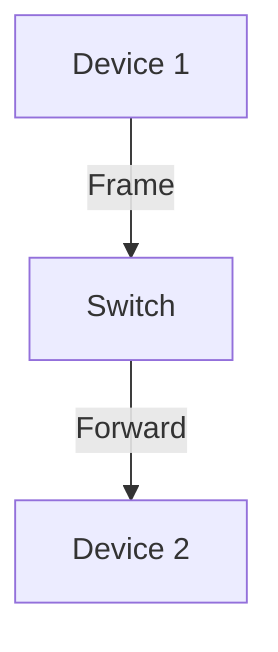

# 6.4 Switched LANs

- Switched LANs use switches to connect multiple devices in a local network.
- **Ethernet:** Most common LAN technology.
- **Switches:** Forward frames based on MAC addresses.
- **VLANs:** Virtual LANs segment networks logically.

---

## Ethernet
- **Frame format:** Preamble, dest MAC, src MAC, type, data, CRC.
- **MAC address:** Unique 48-bit identifier.

---

## Switch Operation
- **Learning:** Builds MAC address table.
- **Forwarding:** Sends frames to correct port.

---

## VLANs
- **Segment network:** Isolate traffic, improve security.

---

## Diagram: Switch Operation

---

## Summary Table
| Feature   | Ethernet | Switch | VLAN   |
|-----------|----------|--------|--------|
| Address   | MAC      | MAC    | Tag    |
| Function  | Frame Tx | Fwding | Segmt. |

---

## Practice Questions
1. **What is the function of a switch in a LAN?**
2. **How do VLANs improve security?**
3. **Draw a diagram of switch operation.**

---

**Exam Tips:**
- Know Ethernet frame format and switch operation.
- Be able to draw and explain VLAN diagrams. 