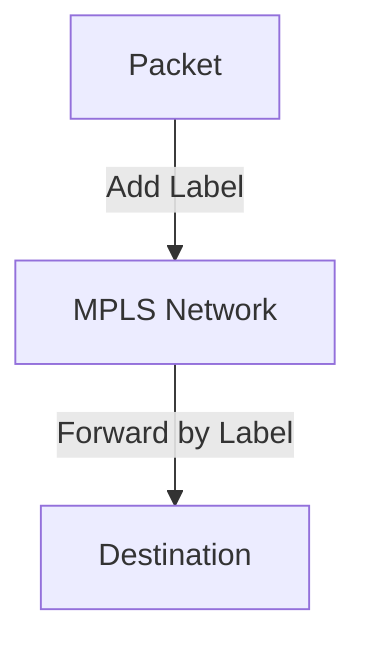

# 6.5 Link Virtualization

- Link virtualization allows multiple logical links over a single physical link.
- **Techniques:** Tunneling, MPLS (Multiprotocol Label Switching).

---

## Tunneling
- **Encapsulate packets:** Send through intermediate networks.
- **Use case:** VPNs.

---

## MPLS
- **Labels:** Forward packets based on labels, not IP.
- **Fast, flexible routing.**

---

## Diagram: MPLS Operation

---

## Summary Table
| Technique | Use Case | Key Feature     |
|-----------|----------|----------------|
| Tunneling | VPN      | Encapsulation  |
| MPLS      | WAN      | Label switching|

---

## Practice Questions
1. **What is link virtualization?**
2. **How does MPLS differ from IP routing?**
3. **Draw a diagram of MPLS operation.**

---

**Exam Tips:**
- Know tunneling and MPLS concepts.
- Be able to draw and explain MPLS diagrams. 