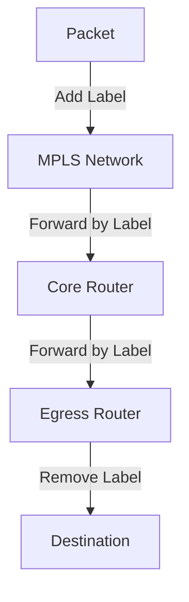

# 6.5 Link Virtualization

- Link virtualization allows multiple logical links over a single physical link.
- **Techniques:** Tunneling, MPLS (Multiprotocol Label Switching).

---

## Multiprotocol Label Switching (MPLS)

### Initial Goal
- **High-speed IP forwarding using fixed length label (instead of IP address)**
- **Fast lookup using fixed length identifier (rather than shortest prefix matching)**
- **Borrowing ideas from Virtual Circuit (VC) approach**
- **But IP datagram still keeps IP address!**

### Frame Structure
- **PPP or Ethernet header**
- **IP header**
- **Remainder of link-layer frame**
- **MPLS header**
  - **Label: 20 bits**
  - **Exp: 3 bits**
  - **S: 1 bit**
  - **TTL: 5 bits**

---

## MPLS Capable Routers

### Label-Switched Router
- **A.k.a. label-switched router**
- **Forward packets to outgoing interface based only on label value (don't inspect IP address)**
- **MPLS forwarding table distinct from IP forwarding tables**

### Flexibility
- **MPLS forwarding decisions can differ from those of IP**
- **Use destination and source addresses to route flows to same destination differently (traffic engineering)**
- **Re-route flows quickly if link fails: pre-computed backup paths (useful for VoIP)**

---

## MPLS Versus IP Paths

### IP Router
- **IP routing: path to destination determined by destination address alone**

### IP-Only Router
- **IP routing: path to destination determined by destination address alone**

### MPLS and IP Router
- **MPLS routing: path to destination can be based on source and destination address**
- **Fast reroute: precompute backup routes in case of link failure**
- **Entry router (R4) can use different MPLS routes to A based, e.g., on source address**

---

## MPLS Signaling

### Modified Link State Protocols
- **Modify OSPF, IS-IS link-state flooding protocols to carry info used by MPLS routing**
- **E.g., link bandwidth, amount of "reserved" link bandwidth**

### RSVP-TE Signaling
- **Entry MPLS router uses RSVP-TE signaling protocol to set up MPLS forwarding at downstream routers**
- **Modified link state flooding**
- **RSVP-TE for path setup**

---

## MPLS Forwarding Tables

### Example Network
- **Routers R1, R2, R3, R4, R5, R6**
- **Destinations A, D**

### Forwarding Table Entries
- **R1: in out out label label dest interface**
  - **6 - A 0**
- **R2: in out out label label dest interface**
  - **10 6 A 1**
  - **12 9 D 0**
- **R3: in out out label label dest interface**
  - **10 A 0**
  - **12 D 0**
- **R4: in out out label label dest interface**
  - **8 6 A 0**
  - **0 8 A 1**

---

## MPLS Operation Process

### Step-by-Step Process
1. **Packet arrives at ingress router**
2. **Router adds MPLS label based on destination and routing policy**
3. **Core routers forward based on label only (no IP lookup)**
4. **Egress router removes label and forwards based on IP address**

### Label Stacking
- **Multiple labels can be stacked**
- **Each label represents a different service or path**
- **Labels are processed in LIFO order (Last In, First Out)**

---

## MPLS Applications

### Traffic Engineering
- **Route traffic around congested links**
- **Load balancing across multiple paths**
- **Quality of Service (QoS) enforcement**

### Virtual Private Networks (VPNs)
- **Layer 2 VPNs (L2VPN)**
- **Layer 3 VPNs (L3VPN)**
- **Secure, isolated network segments**

### Fast Reroute
- **Pre-computed backup paths**
- **Sub-50ms failover times**
- **Critical for voice and video applications**

---

## MPLS vs Traditional IP Routing

### Performance
- **MPLS: Label lookup (hardware accelerated)**
- **IP: Longest prefix match (slower)**

### Flexibility
- **MPLS: Source and destination based routing**
- **IP: Destination only routing**

### Traffic Engineering
- **MPLS: Explicit path control**
- **IP: Best effort routing**

### QoS Support
- **MPLS: Built-in QoS mechanisms**
- **IP: Requires additional protocols (DiffServ, IntServ)**

---

## Diagram: MPLS Operation

---

## Summary Table
| Technique | Use Case | Key Feature     | Performance | Complexity |
|-----------|----------|----------------|-------------|------------|
| Tunneling | VPN      | Encapsulation  | Medium      | Low        |
| MPLS      | WAN      | Label switching| High        | High       |

---

## Practice Questions
1. **What is link virtualization?**
2. **How does MPLS differ from IP routing?**
3. **Draw a diagram of MPLS operation.**
4. **What are the benefits of MPLS?**
5. **Explain MPLS label structure.**

---

**Exam Tips:**
- Know tunneling and MPLS concepts.
- Be able to draw and explain MPLS diagrams.
- Understand MPLS forwarding tables.
- Know MPLS applications and benefits.

---

## PPP and HDLC
- **PPP (Point-to-Point Protocol):** Used for direct connections between two nodes (e.g., dial-up, WAN links). Provides framing, error detection, and optional authentication.
- **HDLC (High-Level Data Link Control):** Bit-oriented protocol for point-to-point and multipoint links. Provides framing, error detection, and flow control. 