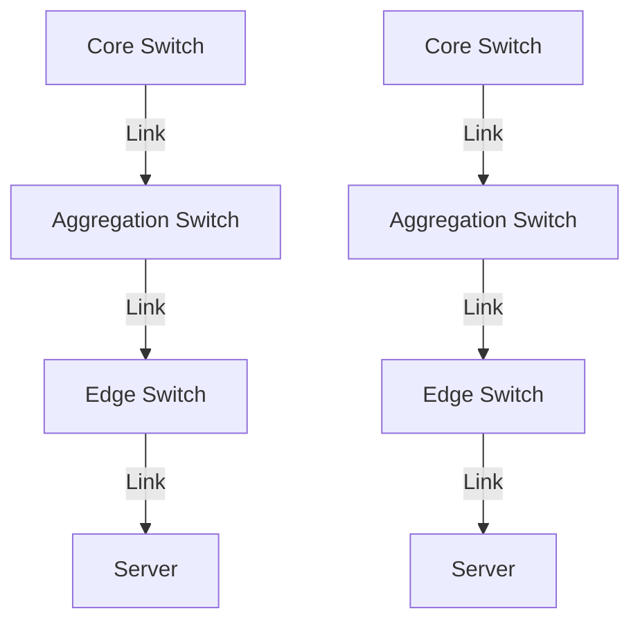
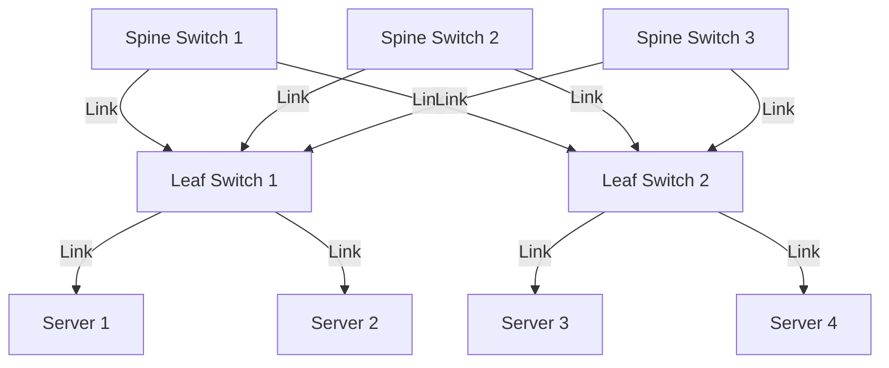

# 6.6 Data Center Networking

- Data centers host large numbers of servers and storage, requiring high-speed, reliable networking.
- **Topologies:** Fat-tree, spine-leaf, multi-rooted.
- **Switching:** High-capacity, low-latency.

---

## Data Center Networks

### Scale and Challenges
- **10's to 100's of thousands of hosts, often closely coupled, in close proximity:**
  - **E-business (e.g. Amazon)**
  - **Content-servers (e.g., YouTube, Akamai, Apple, Microsoft)**
  - **Search engines, data mining (e.g., Google)**

### Challenges
- **Multiple applications, each serving massive numbers of clients**
- **Managing/balancing load, avoiding processing, networking, data bottlenecks**

### Example
- **Inside a 40-ft Microsoft container, Chicago data center**

---

## Data Center Network Architecture

### Server Racks
- **Multiple servers organized in racks**
- **Each rack contains multiple servers**
- **Racks connected to top-of-rack (TOR) switches**

### Network Hierarchy
- **TOR switches (Top of Rack)**
- **Tier-1 switches**
- **Tier-2 switches**
- **Load balancer**
- **Border router**
- **Access router**

### Load Balancer
- **Application-layer routing**
- **Receives external client requests**
- **Directs workload within data center**
- **Returns results to external client (hiding data center internals from client)**

---

## Data Center Network Topology

### Rich Interconnection
- **Rich interconnection among switches, racks:**
  - **Increased throughput between racks (multiple routing paths possible)**
  - **Increased reliability via redundancy**

### Network Layout
- **Internet connection**
- **Server racks**
- **TOR switches**
- **Tier-1 switches**
- **Tier-2 switches**

---

## Fat-Tree Topology

### Multiple Layers
- **Core layer: High-speed backbone**
- **Aggregation layer: Traffic aggregation**
- **Edge layer: Server connections**

### Redundant Paths
- **Multiple paths between any two points**
- **Improve reliability and performance**
- **Load balancing across paths**

### Characteristics
- **Scalable to large data centers**
- **High bisection bandwidth**
- **Fault tolerant**
- **Complex cabling requirements**

---

## Spine-Leaf Topology

### Architecture
- **Spine switches: Connect to all leaf switches**
- **Leaf switches: Connect to servers**
- **Full mesh connectivity between spine and leaf**

### Benefits
- **Non-blocking network**
- **Predictable latency**
- **Easy to scale**
- **Simple routing**

### Scalability
- **Add spine switches for more bandwidth**
- **Add leaf switches for more servers**
- **Linear scaling**

---

## Data Center Network Technologies

### High-Speed Ethernet
- **10G, 40G, 100G Ethernet**
- **Low latency requirements**
- **Jumbo frames for efficiency**

### Network Virtualization
- **VXLAN (Virtual Extensible LAN)**
- **NVGRE (Network Virtualization using Generic Routing Encapsulation)**
- **Overlay networks**

### Software-Defined Networking (SDN)
- **Centralized control plane**
- **Programmable data plane**
- **Rapid network reconfiguration**

---

## Data Center Network Management

### Traffic Engineering
- **Load balancing across multiple paths**
- **Congestion control**
- **Quality of Service (QoS)**

### Monitoring and Analytics
- **Network performance monitoring**
- **Traffic analysis**
- **Predictive maintenance**

### Automation
- **Automated provisioning**
- **Self-healing networks**
- **Policy-based management**

---

## Data Center Network Security

### Segmentation
- **VLANs for traffic isolation**
- **Micro-segmentation**
- **Zero-trust architecture**

### Access Control
- **Port security**
- **MAC filtering**
- **Network access control (NAC)**

### Monitoring
- **Intrusion detection**
- **Traffic analysis**
- **Anomaly detection**

---

## Real-World Data Center Examples

### Google Data Centers
- **Custom network hardware**
- **Software-defined networking**
- **High-speed interconnects**
- **Efficient cooling and power**

### Amazon Web Services (AWS)
- **Multi-tenant architecture**
- **Elastic networking**
- **Global infrastructure**
- **Advanced security**

### Microsoft Azure
- **Hybrid cloud networking**
- **ExpressRoute for private connections**
- **Global network backbone**
- **Edge computing capabilities**

---

## Diagram: Fat-Tree Topology

---

## Diagram: Spine-Leaf Topology

---

## Summary Table
| Topology   | Feature         | Use Case      | Scalability | Complexity |
|------------|----------------|--------------|-------------|------------|
| Fat-tree   | Redundant paths| Large DCs     | High        | High       |
| Spine-leaf | Scalable, fast | Modern DCs    | Very High   | Medium     |
| Multi-rooted| Multiple paths | Enterprise    | Medium      | Medium     |

---

## Practice Questions
1. **What is a fat-tree topology?**
2. **How does spine-leaf improve scalability?**
3. **Draw a diagram of a data center network.**
4. **What are the challenges of data center networking?**
5. **Explain the role of load balancers in data centers.**

---

**Exam Tips:**
- Know data center topologies and switching.
- Be able to draw and explain fat-tree and spine-leaf diagrams.
- Understand data center challenges and solutions.
- Know modern data center technologies and trends. 