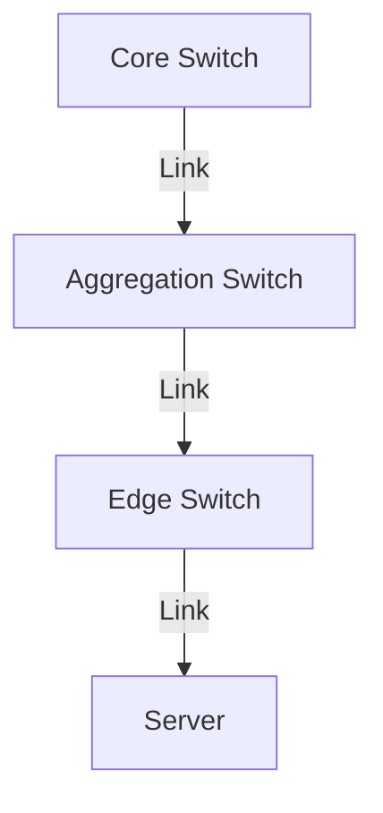

# 6.6 Data Center Networking

- Data centers host large numbers of servers and storage, requiring high-speed, reliable networking.
- **Topologies:** Fat-tree, spine-leaf, multi-rooted.
- **Switching:** High-capacity, low-latency.

---

## Fat-Tree Topology
- **Multiple layers:** Core, aggregation, edge.
- **Redundant paths:** Improve reliability.

---

## Spine-Leaf Topology
- **Spine switches:** Connect to all leaf switches.
- **Leaf switches:** Connect to servers.

---

## Diagram: Fat-Tree Topology

---

## Summary Table
| Topology   | Feature         | Use Case      |
|------------|----------------|--------------|
| Fat-tree   | Redundant paths| Large DCs     |
| Spine-leaf | Scalable, fast | Modern DCs    |

---

## Practice Questions
1. **What is a fat-tree topology?**
2. **How does spine-leaf improve scalability?**
3. **Draw a diagram of a data center network.**

---

**Exam Tips:**
- Know data center topologies and switching.
- Be able to draw and explain fat-tree diagrams. 