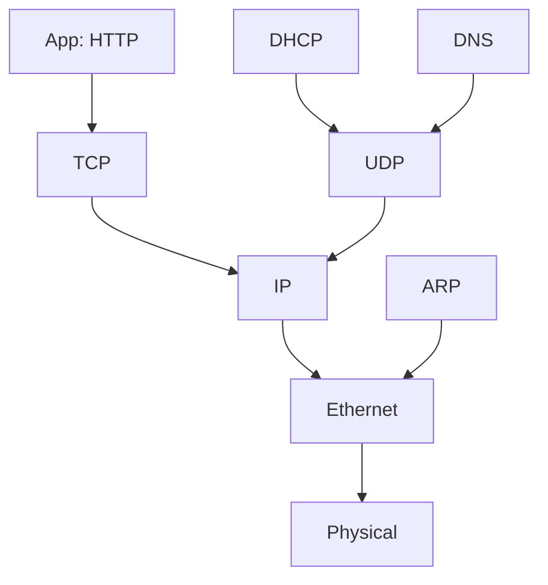

# 6.7 A Day in the Life of a Web Page Request

- Illustrates the journey of a web page request through all network layers.
- **Steps:** DNS lookup, TCP connection, HTTP request, data transfer, response.
- **Encapsulation:** Data wrapped with headers at each layer.

---

## Synthesis: A Day in the Life of a Web Request

### Journey Down Protocol Stack Complete!
- **Application, transport, network, link**
- **Putting-it-all-together: synthesis!**

### Goal
- **Identify, review, understand protocols (at all layers) involved in seemingly simple scenario: requesting www page**

### Scenario
- **Student attaches laptop to campus network, requests/receives www.google.com**

---

## A Day in the Life: Scenario

### Network Topology
- **Comcast network: 68.80.0.0/13**
- **Google's network: 64.233.160.0/19**
- **Web server: 64.233.169.105**
- **DNS server**
- **School network: 68.80.2.0/24**
- **Web page browser**

---

## A Day in the Life… Connecting to the Internet

### Connecting Laptop Needs to Get Its Own IP Address
- **Addr of first-hop router, addr of DNS server: use DHCP**

### DHCP Process
- **DHCP request encapsulated in UDP, encapsulated in IP, encapsulated in 802.3 Ethernet**
- **Ethernet frame broadcast (dest: FFFFFFFFFFFF) on LAN, received at router running DHCP server**
- **Ethernet demuxed to IP demuxed, UDP demuxed to DHCP**

### Protocol Stack
- **DHCP**
- **UDP**
- **IP**
- **Eth**
- **Phy**

---

## DHCP Server Response

### DHCP Server Formulates DHCP ACK
- **Contains client's IP address**
- **IP address of first-hop router for client**
- **Name & IP address of DNS server**

### Encapsulation and Forwarding
- **Encapsulation at DHCP server, frame forwarded (switch learning) through LAN, demultiplexing at client**

### Result
- **Client now has IP address, knows name & addr of DNS server, IP address of its first-hop router**
- **DHCP client receives DHCP ACK reply**

---

## A Day in the Life… ARP (Before DNS, Before HTTP)

### Before Sending HTTP Request, Need IP Address of www.google.com: DNS

### ARP Process
- **DNS query created, encapsulated in UDP, encapsulated in IP, encapsulated in Eth**
- **To send frame to router, need MAC address of router interface: ARP**
- **ARP query broadcast, received by router, which replies with ARP reply giving MAC address of router interface**
- **Client now knows MAC address of first hop router, so can now send frame containing DNS query**

### Protocol Stack
- **DNS**
- **UDP**
- **IP**
- **Eth**
- **Phy**
- **ARP query**
- **ARP reply**

---

## A Day in the Life… Using DNS

### DNS Query Forwarding
- **IP datagram containing DNS query forwarded via LAN switch from client to 1st hop router**
- **IP datagram forwarded from campus network into Comcast network, routed (tables created by RIP, OSPF, IS-IS and/or BGP routing protocols) to DNS server**
- **Demuxed to DNS server**

### DNS Response
- **DNS server replies to client with IP address of www.google.com**

### Network Path
- **Comcast network: 68.80.0.0/13**
- **DNS server**

---

## A Day in the Life… TCP Connection Carrying HTTP

### TCP Connection Establishment
- **To send HTTP request, client first opens TCP socket to web server**
- **TCP SYN segment (step 1 in 3-way handshake) inter-domain routed to web server**
- **TCP connection established!**

### Web Server Response
- **Web server responds with TCP SYNACK (step 2 in 3-way handshake)**

### Protocol Stack
- **HTTP**
- **TCP**
- **IP**
- **Eth**
- **Phy**

### Web Server
- **64.233.169.105**

---

## A Day in the Life… HTTP Request/Reply

### HTTP Request
- **HTTP request sent into TCP socket**
- **IP datagram containing HTTP request routed to www.google.com**

### HTTP Response
- **IP datagram containing HTTP reply routed back to client**
- **Web server responds with HTTP reply (containing web page)**

### Final Result
- **Web page finally (!!!) displayed**

### Protocol Stack
- **HTTP**
- **TCP**
- **IP**
- **Eth**
- **Phy**

---

## Complete Protocol Stack Journey

### Layer-by-Layer Encapsulation
1. **Application Layer: HTTP request**
2. **Transport Layer: TCP segments**
3. **Network Layer: IP datagrams**
4. **Link Layer: Ethernet frames**
5. **Physical Layer: Bits on wire**

### Each Layer Adds Headers
- **HTTP adds application headers**
- **TCP adds transport headers**
- **IP adds network headers**
- **Ethernet adds link headers**

---

## Protocol Interactions

### DNS Resolution
- **Application layer protocol**
- **Uses UDP for queries**
- **Uses TCP for zone transfers**

### TCP Connection
- **Three-way handshake**
- **Reliable data transfer**
- **Flow control**

### HTTP Transaction
- **Request-response model**
- **Stateless protocol**
- **Can use persistent connections**

---

## Network Address Translation (NAT)

### NAT Process
- **Private IP addresses translated to public IP addresses**
- **Port numbers used to distinguish connections**
- **NAT table maintains mappings**

### NAT Benefits
- **Conserves public IP addresses**
- **Provides security through obscurity**
- **Enables multiple devices to share single public IP**

---

## Diagram: Protocol Stack for Web Request

---

## Complete Web Request Timeline

### Step 1: Network Configuration
- **DHCP: Obtain IP address, router, DNS server**
- **ARP: Resolve router MAC address**

### Step 2: Name Resolution
- **DNS: Resolve www.google.com to IP address**
- **Multiple network hops to reach DNS server**

### Step 3: Connection Establishment
- **TCP: Three-way handshake with web server**
- **Route through multiple networks**

### Step 4: Data Transfer
- **HTTP: Request web page**
- **TCP: Reliable data transfer**
- **IP: Routing through Internet**

### Step 5: Response Processing
- **HTTP: Receive web page**
- **Browser: Render content**

---

## Summary Table
| Step      | Protocol | Layer      | Purpose                    |
|-----------|----------|------------|----------------------------|
| Network   | DHCP     | App        | Get IP address, config     |
| Address   | ARP      | Link       | Resolve MAC address        |
| Name Res. | DNS      | App        | Resolve domain to IP       |
| Conn.     | TCP      | Transp.    | Establish connection       |
| Request   | HTTP     | App        | Request web page           |
| Delivery  | IP/Eth   | Net/Link   | Route and transmit data    |
| Response  | HTTP     | App        | Receive web page           |

---

## Practice Questions
1. **List the steps in a web page request.**
2. **What is encapsulation?**
3. **Draw a protocol stack diagram for a web request.**
4. **Explain the role of DHCP in network configuration.**
5. **How does ARP work in the web request process?**

---

**Exam Tips:**
- Know protocol steps and encapsulation.
- Be able to draw and explain protocol stack diagrams.
- Understand the complete journey from DHCP to HTTP response.
- Know the role of each protocol in the process. 