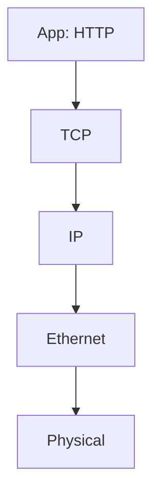

# 6.7 A Day in the Life of a Web Page Request

- Illustrates the journey of a web page request through all network layers.
- **Steps:** DNS lookup, TCP connection, HTTP request, data transfer, response.
- **Encapsulation:** Data wrapped with headers at each layer.

---

## Protocol Steps
1. **DNS:** Resolve domain to IP.
2. **TCP:** Establish connection.
3. **HTTP:** Request web page.
4. **Link/Physical:** Transmit frames/bits.

---

## Diagram: Protocol Stack for Web Request

---

## Summary Table
| Step      | Protocol | Layer      |
|-----------|----------|------------|
| Name Res. | DNS      | App        |
| Conn.     | TCP      | Transp.    |
| Request   | HTTP     | App        |
| Delivery  | IP/Eth   | Net/Link   |

---

## Practice Questions
1. **List the steps in a web page request.**
2. **What is encapsulation?**
3. **Draw a protocol stack diagram for a web request.**

---

**Exam Tips:**
- Know protocol steps and encapsulation.
- Be able to draw and explain protocol stack diagrams. 