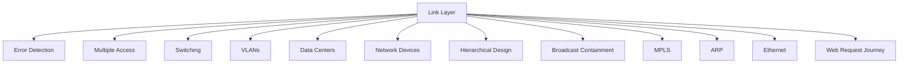

# 6.8 Summary

- The link layer handles local data transfer, framing, error detection, and medium access.
- Key protocols: Ethernet, WiFi, PPP, ARP.
- Concepts: error detection/correction, multiple access, switching, data center topologies.
- **Network devices:** Hubs, switches, NICs with detailed operation and characteristics.
- **Switching types:** Layer 2, Layer 3, and multilayer switching with comparisons.
- **Hierarchical design:** Three-layer model (Access, Distribution, Core) for scalable networks.
- **Broadcast containment:** VLANs, subnetting, storm control to manage broadcast traffic.

---

## Chapter 6: Summary

### Principles Behind Data Link Layer Services
- **Error detection, correction**
- **Sharing a broadcast channel: multiple access**
- **Link layer addressing**
- **Instantiation and implementation of various link layer technologies**

### Key Technologies Covered
- **Ethernet**
- **Switched LANS, VLANs**
- **Virtualized networks as a link layer: MPLS**
- **Synthesis: a day in the life of a web request**

---

## Chapter 6: Let's Take a Breath

### Journey Down Protocol Stack Complete (Except PHY)
- **Solid understanding of networking principles, practice**
- **Could stop here …. but lots of interesting topics!**

### Future Topics
- **Wireless**
- **Multimedia**
- **Security**

---

## Quick Revision Table
| Concept      | Key Point / Example         |
|--------------|----------------------------|
| Framing      | Encapsulate data in frames |
| CRC          | Error detection, Ethernet  |
| CSMA/CD      | Ethernet, collision detect |
| VLAN         | Logical segmentation       |
| MPLS         | Label switching, WANs      |
| Fat-tree     | Data center topology       |
| **Hub**      | **Signal repetition**      |
| **Switch**   | **MAC-based forwarding**   |
| **NIC**      | **Hardware interface**     |
| **Hierarchical** | **Three-layer design** |
| **Broadcast** | **VLAN containment** |
| **ARP**      | **IP to MAC resolution** |
| **Ethernet** | **Dominant LAN technology** |
| **Data Center** | **High-speed networking** |

---

## Mind Map: Chapter 6 Overview

---

## Network Devices Summary
| Device | OSI Layer | Function | Intelligence | Use Case |
|--------|-----------|----------|--------------|----------|
| Hub | Physical | Signal repetition | None | Legacy networks |
| Switch | Data Link | MAC-based forwarding | High | Modern LANs |
| NIC | Data Link | Hardware interface | Medium | End devices |
| Router | Network | IP-based routing | High | Inter-network |

---

## Switching Types Summary
| Type | OSI Layer | Forwarding Basis | Features |
|------|-----------|------------------|----------|
| Layer 2 | Data Link | MAC addresses | VLANs, port security |
| Layer 3 | Network | IP addresses | Routing, ACLs |
| Multilayer | Both | MAC and IP | Best of both worlds |

---

## Hierarchical Network Design Summary
| Layer | Purpose | Devices | Functions |
|-------|---------|---------|-----------|
| Access | End device connectivity | Switches, WiFi APs | Port security, VLANs |
| Distribution | Traffic aggregation | Layer 3 switches | Routing, security policies |
| Core | High-speed backbone | High-performance switches | Fast switching, redundancy |

---

## Broadcast Containment Summary
| Method | Purpose | Implementation | Benefits |
|--------|---------|----------------|----------|
| VLANs | Logical separation | Switch configuration | Security, performance |
| Subnetting | Network division | Router configuration | Reduced broadcast domains |
| Storm Control | Rate limiting | Switch configuration | Prevent broadcast storms |
| ACLs | Traffic filtering | Router configuration | Granular control |

---

## Error Detection Methods Summary
| Method | Detection Capability | Correction | Used In |
|--------|---------------------|------------|---------|
| Parity | Single bit errors | No | Simple hardware |
| Checksum | Many errors | No | IP, TCP, UDP |
| CRC | Burst errors | No | Ethernet, WiFi |
| Hamming | Single bit errors | Yes | Memory systems |

---

## Multiple Access Protocols Summary
| Protocol | Type | Collision Handling | Efficiency | Use Case |
|----------|------|-------------------|------------|----------|
| TDMA | Channel partitioning | None | Low at low load | Cellular |
| FDMA | Channel partitioning | None | Low at low load | Radio |
| ALOHA | Random access | Detect/retry | 18% | Legacy |
| CSMA/CD | Random access | Detect/correct | High | Ethernet |
| Token Ring | Taking turns | None | High | Legacy LANs |

---

## Ethernet Standards Summary
| Standard | Speed | Media | Use Case |
|----------|-------|-------|----------|
| 10Base-T | 10 Mbps | Twisted pair | Legacy |
| 100Base-TX | 100 Mbps | Twisted pair | Fast Ethernet |
| 1000Base-T | 1 Gbps | Twisted pair | Gigabit Ethernet |
| 10GBase-T | 10 Gbps | Twisted pair | High-speed |
| 40GBase-SR4 | 40 Gbps | Fiber | Data centers |

---

## MPLS Applications Summary
| Application | Purpose | Benefits |
|-------------|---------|----------|
| Traffic Engineering | Route optimization | Better performance |
| VPNs | Secure connectivity | Isolation, security |
| Fast Reroute | Quick failover | High availability |
| QoS | Service differentiation | Better user experience |

---

## Data Center Topologies Summary
| Topology | Characteristics | Use Case | Scalability |
|----------|----------------|----------|-------------|
| Fat-tree | Redundant paths | Large DCs | High |
| Spine-leaf | Non-blocking | Modern DCs | Very high |
| Multi-rooted | Multiple paths | Enterprise | Medium |

---

## Web Request Journey Summary
| Step | Protocol | Purpose | Layer |
|------|----------|---------|-------|
| Network config | DHCP | Get IP address | Application |
| Address resolution | ARP | Get MAC address | Link |
| Name resolution | DNS | Get IP address | Application |
| Connection | TCP | Establish connection | Transport |
| Data transfer | HTTP | Request/response | Application |
| Delivery | IP/Ethernet | Route/transmit | Network/Link |

---

## Common Exam Mistakes
- Confusing hubs and switches.
- Not understanding VLAN benefits.
- Forgetting error detection methods.
- Overlooking multiple access protocols.
- Not practicing switching scenarios.
- **New:** Not understanding hierarchical design benefits.
- **New:** Confusing broadcast containment methods.
- **New:** Overlooking network device characteristics.
- **New:** Not understanding ARP process.
- **New:** Confusing MPLS with traditional routing.
- **New:** Not knowing data center topologies.

---

**Exam Tips:**
- Know link layer protocols and error detection.
- Be able to draw and explain switching diagrams.
- Practice VLAN and switching scenarios.
- Avoid common mistakes listed above.
- **New:** Understand hierarchical network design principles.
- **New:** Know broadcast containment methods and benefits.
- **New:** Be familiar with network device types and functions.
- **New:** Understand the complete web request journey.
- **New:** Know MPLS applications and benefits.
- **New:** Understand data center networking challenges. 