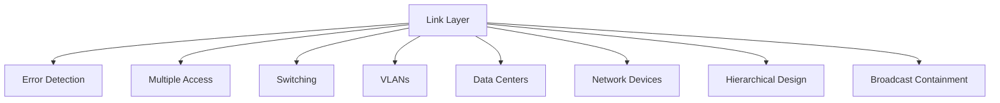

# 6.8 Summary

- The link layer handles local data transfer, framing, error detection, and medium access.
- Key protocols: Ethernet, WiFi, PPP, ARP.
- Concepts: error detection/correction, multiple access, switching, data center topologies.
- **Network devices:** Hubs, switches, NICs with detailed operation and characteristics.
- **Switching types:** Layer 2, Layer 3, and multilayer switching with comparisons.
- **Hierarchical design:** Three-layer model (Access, Distribution, Core) for scalable networks.
- **Broadcast containment:** VLANs, subnetting, storm control to manage broadcast traffic.

---

## Quick Revision Table
| Concept      | Key Point / Example         |
|--------------|----------------------------|
| Framing      | Encapsulate data in frames |
| CRC          | Error detection, Ethernet  |
| CSMA/CD      | Ethernet, collision detect |
| VLAN         | Logical segmentation       |
| MPLS         | Label switching, WANs      |
| Fat-tree     | Data center topology       |
| **Hub**      | **Signal repetition**      |
| **Switch**   | **MAC-based forwarding**   |
| **NIC**      | **Hardware interface**     |
| **Hierarchical** | **Three-layer design** |
| **Broadcast** | **VLAN containment** |

---

## Mind Map: Chapter 6 Overview

---

## Network Devices Summary
| Device | OSI Layer | Function | Intelligence | Use Case |
|--------|-----------|----------|--------------|----------|
| Hub | Physical | Signal repetition | None | Legacy networks |
| Switch | Data Link | MAC-based forwarding | High | Modern LANs |
| NIC | Data Link | Hardware interface | Medium | End devices |
| Router | Network | IP-based routing | High | Inter-network |

---

## Switching Types Summary
| Type | OSI Layer | Forwarding Basis | Features |
|------|-----------|------------------|----------|
| Layer 2 | Data Link | MAC addresses | VLANs, port security |
| Layer 3 | Network | IP addresses | Routing, ACLs |
| Multilayer | Both | MAC and IP | Best of both worlds |

---

## Hierarchical Network Design Summary
| Layer | Purpose | Devices | Functions |
|-------|---------|---------|-----------|
| Access | End device connectivity | Switches, WiFi APs | Port security, VLANs |
| Distribution | Traffic aggregation | Layer 3 switches | Routing, security policies |
| Core | High-speed backbone | High-performance switches | Fast switching, redundancy |

---

## Broadcast Containment Summary
| Method | Purpose | Implementation | Benefits |
|--------|---------|----------------|----------|
| VLANs | Logical separation | Switch configuration | Security, performance |
| Subnetting | Network division | Router configuration | Reduced broadcast domains |
| Storm Control | Rate limiting | Switch configuration | Prevent broadcast storms |
| ACLs | Traffic filtering | Router configuration | Granular control |

---

## Common Exam Mistakes
- Confusing hubs and switches.
- Not understanding VLAN benefits.
- Forgetting error detection methods.
- Overlooking multiple access protocols.
- Not practicing switching scenarios.
- **New:** Not understanding hierarchical design benefits.
- **New:** Confusing broadcast containment methods.
- **New:** Overlooking network device characteristics.

---

**Exam Tips:**
- Know link layer protocols and error detection.
- Be able to draw and explain switching diagrams.
- Practice VLAN and switching scenarios.
- Avoid common mistakes listed above.
- **New:** Understand hierarchical network design principles.
- **New:** Know broadcast containment methods and benefits.
- **New:** Be familiar with network device types and functions. 