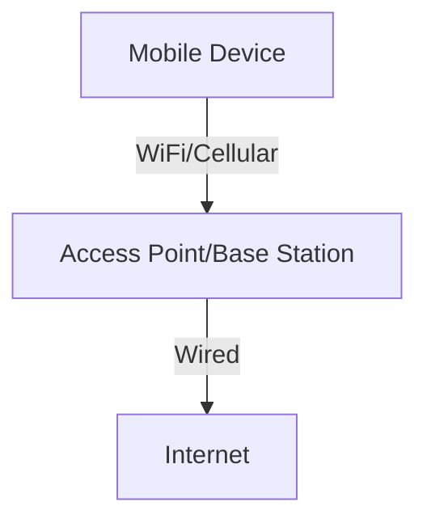

# 7.1 Introduction

- Wireless and mobile networks enable communication without fixed infrastructure.
- **Key concepts:** Wireless links, mobility, handoff, cellular architecture.
- **Examples:** WiFi, cellular networks (4G/5G), Bluetooth.

---

## Real-World Analogy
- Wireless networks are like walkie-talkies: devices communicate over the air, moving freely within coverage areas.

---

## Diagram: Wireless Network Overview

---

## Summary Table
| Concept   | Description                |
|-----------|----------------------------|
| Wireless  | No fixed medium            |
| Mobility  | Devices move, stay connected|
| Handoff   | Switch between base stations|

---

## Practice Questions
1. **What is a wireless network?**
2. **Give a real-world analogy for wireless communication.**
3. **List two examples of wireless technologies.**

---

**Exam Tips:**
- Know key wireless concepts and examples.
- Be able to draw and explain wireless network diagrams. 