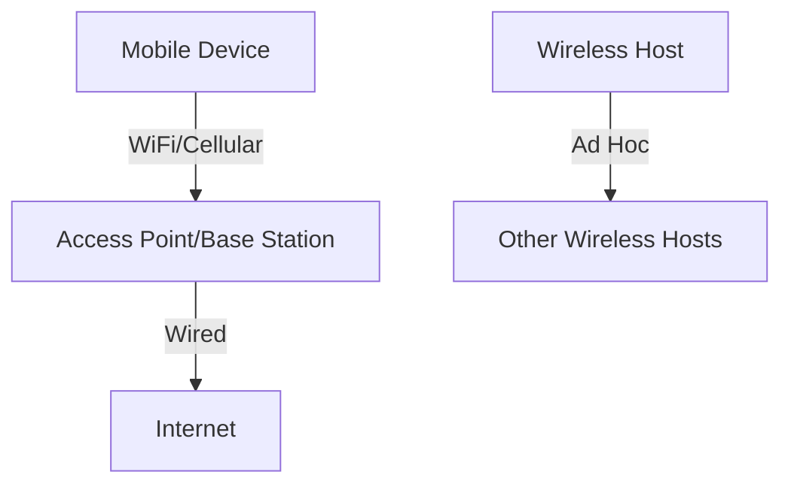

# 7.1 Introduction

- Wireless and mobile networks enable communication without fixed infrastructure.
- **Key concepts:** Wireless links, mobility, handoff, cellular architecture.
- **Examples:** WiFi, cellular networks (4G/5G), Bluetooth.

---

## Wireless and Mobile Networks: Context

### Current State of Wireless Networks
- **More wireless (mobile) phone subscribers than fixed (wired) phone subscribers (10-to-1 in 2019)!**
- **More mobile-broadband-connected devices than fixed-broadband-connected devices (5-1 in 2019)!**
- **4G/5G cellular networks now embracing Internet protocol stack, including SDN**

### Two Important (But Different) Challenges
1. **Wireless: communication over wireless link**
2. **Mobility: handling the mobile user who changes point of attachment to network**

---

## Chapter 7 Outline

### Complete Chapter Structure
1. **Introduction**
2. **Wireless**
   - **Wireless links and network characteristics**
   - **WiFi: 802.11 wireless LANs**
   - **Cellular networks: 4G and 5G**
3. **Mobility**
   - **Mobility management: principles**
   - **Mobility management: practice**
   - **4G/5G networks**
   - **Mobile IP**
   - **Mobility: impact on higher-layer protocols**

---

## Elements of a Wireless Network

### Wired Network Infrastructure
- **Backbone network providing connectivity**
- **Internet access and core services**

### Wireless Hosts
- **Laptop, smartphone, IoT devices**
- **Run applications**
- **May be stationary (non-mobile) or mobile**
- **Wireless does not always mean mobility!**

### Base Station
- **Typically connected to wired network**
- **Relay - responsible for sending packets between wired network and wireless host(s) in its "area"**
- **Examples: cell towers, 802.11 access points**

### Wireless Link
- **Typically used to connect mobile(s) to base station, also used as backbone link**
- **Multiple access protocol coordinates link access**
- **Various transmission rates and distances, frequency bands**

---

## Characteristics of Selected Wireless Links

### Indoor (10-30m)
- **802.11ac: 3.5 Gbps**
- **802.11n: 600 Mbps**
- **802.11g: 54 Mbps**
- **802.11b: 11 Mbps**
- **Bluetooth: 2 Mbps**

### Outdoor Midrange (50-200m)
- **802.11af, ah: Various speeds**
- **4G LTE: Various speeds**

### Long Range Outdoor (200m-4Km)
- **4G LTE: Various speeds**

### Very Long Range (4Km-15Km)
- **4G LTE: Various speeds**
- **5G: 10 Gbps**

---

## Infrastructure Mode vs Ad Hoc Mode

### Infrastructure Mode
- **Base station connects mobiles into wired network**
- **Handoff: mobile changes base station providing connection into wired network**

### Ad Hoc Mode
- **No base stations**
- **Nodes can only transmit to other nodes within link coverage**
- **Nodes organize themselves into a network: route among themselves**

---

## Wireless Network Taxonomy

### Single Hop
- **Infrastructure (e.g., APs):**
  - **Host connects to base station (WiFi, cellular) which connects to larger Internet**
- **No infrastructure:**
  - **No base station, no connection to larger Internet (Bluetooth, ad hoc nets)**

### Multiple Hops
- **Infrastructure:**
  - **Host may have to relay through several wireless nodes to connect to larger Internet: mesh net**
- **No infrastructure:**
  - **No base station, no connection to larger Internet. May have to relay to reach other a given wireless node MANET, VANET**

---

## Real-World Analogy
- Wireless networks are like walkie-talkies: devices communicate over the air, moving freely within coverage areas.

---

## Diagram: Wireless Network Overview

---

## Summary Table
| Concept   | Description                |
|-----------|----------------------------|
| Wireless  | No fixed medium            |
| Mobility  | Devices move, stay connected|
| Handoff   | Switch between base stations|
| Infrastructure | Base station coordination |
| Ad Hoc    | Peer-to-peer communication |

---

## Practice Questions
1. **What is a wireless network?**
2. **Give a real-world analogy for wireless communication.**
3. **List two examples of wireless technologies.**
4. **What is the difference between infrastructure and ad hoc modes?**
5. **Explain the two main challenges in wireless and mobile networks.**

---

**Exam Tips:**
- Know key wireless concepts and examples.
- Be able to draw and explain wireless network diagrams.
- Understand the difference between wireless and mobility.
- Know the taxonomy of wireless networks.

---

## Other Wireless Technologies
- **Bluetooth:** Short-range, low-power, used for PANs (headsets, wearables).
- **Zigbee:** Low-rate, low-power, used for IoT devices (sensors, smart home).
- **NFC (Near Field Communication):** Very short range, used for contactless payments and access cards.

| Technology | Range   | Speed      | Use Case         |
|------------|---------|------------|-----------------|
| WiFi       | 100m    | 100 Mbps+  | LAN, Internet   |
| Bluetooth  | 10m     | 1-3 Mbps   | PAN, wearables  |
| Zigbee     | 10-100m | 250 Kbps   | IoT, sensors    |
| NFC        | <10cm   | <500 Kbps  | Payments, access| 

---

## Case Studies & Real-World Strategies

### 1. WiFi Deployment and Optimization
- **Google, Amazon, Apple:** Use WiFi 6/6E in offices, warehouses, and retail for high device density, seamless roaming, and IoT support.
- **Universities, Airports, Stadiums:** Deploy dense WiFi networks with multiple access points, load balancing, and fast handoff for thousands of users. Use WPA2/WPA3 Enterprise for secure authentication.
- **Facebook:** Provides free public WiFi in developing regions to expand Internet access.

### 2. Cellular Network Evolution and 5G
- **Verizon, AT&T, T-Mobile:** Roll out 5G using a mix of macro towers, small cells, and mmWave for high speed and low latency. Use carrier aggregation and MIMO for capacity.
- **Reliance Jio (India):** Rapidly deployed 4G LTE nationwide, using VoLTE for voice and data convergence.
- **Apple:** Designs iPhones to support seamless handoff between WiFi and cellular (WiFi Assist, VoWiFi).

### 3. Mobility Management and Handoff
- **Google Fi:** Uses multi-carrier SIMs and automatic handoff between T-Mobile, Sprint, and US Cellular for best coverage.
- **Apple iOS:** Uses Multipath TCP (MPTCP) for seamless transition between WiFi and cellular in FaceTime and Siri.

### 4. Security and Authentication
- **Mobile Carriers:** Use SIM-based authentication and EAP-SIM/EAP-AKA for secure network access.
- **Enterprises:** Use WPA2/WPA3 Enterprise, 802.1X, and RADIUS for secure WiFi authentication.

### 5. Wireless in IoT and Smart Cities
- **Amazon Sidewalk:** Uses Bluetooth, Zigbee, and LoRa for wide-area IoT connectivity in smart home devices.
- **Smart Cities:** Deploy public WiFi, cellular IoT (NB-IoT, LTE-M), and sensor networks for traffic, utilities, and public safety. 