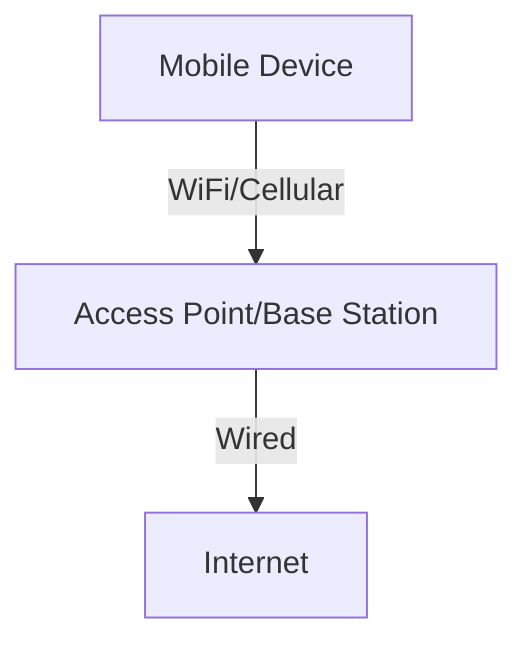

# 7.1 Introduction

- Wireless and mobile networks enable communication without fixed infrastructure.
- **Key concepts:** Wireless links, mobility, handoff, cellular architecture.
- **Examples:** WiFi, cellular networks (4G/5G), Bluetooth.

---

## Real-World Analogy
- Wireless networks are like walkie-talkies: devices communicate over the air, moving freely within coverage areas.

---

## Diagram: Wireless Network Overview

---

## Summary Table
| Concept   | Description                |
|-----------|----------------------------|
| Wireless  | No fixed medium            |
| Mobility  | Devices move, stay connected|
| Handoff   | Switch between base stations|

---

## Practice Questions
1. **What is a wireless network?**
2. **Give a real-world analogy for wireless communication.**
3. **List two examples of wireless technologies.**

---

**Exam Tips:**
- Know key wireless concepts and examples.
- Be able to draw and explain wireless network diagrams.

---

## Other Wireless Technologies
- **Bluetooth:** Short-range, low-power, used for PANs (headsets, wearables).
- **Zigbee:** Low-rate, low-power, used for IoT devices (sensors, smart home).
- **NFC (Near Field Communication):** Very short range, used for contactless payments and access cards.

| Technology | Range   | Speed      | Use Case         |
|------------|---------|------------|-----------------|
| WiFi       | 100m    | 100 Mbps+  | LAN, Internet   |
| Bluetooth  | 10m     | 1-3 Mbps   | PAN, wearables  |
| Zigbee     | 10-100m | 250 Kbps   | IoT, sensors    |
| NFC        | <10cm   | <500 Kbps  | Payments, access| 

---

## Case Studies & Real-World Strategies

### 1. WiFi Deployment and Optimization
- **Google, Amazon, Apple:** Use WiFi 6/6E in offices, warehouses, and retail for high device density, seamless roaming, and IoT support.
- **Universities, Airports, Stadiums:** Deploy dense WiFi networks with multiple access points, load balancing, and fast handoff for thousands of users. Use WPA2/WPA3 Enterprise for secure authentication.
- **Facebook:** Provides free public WiFi in developing regions to expand Internet access.

### 2. Cellular Network Evolution and 5G
- **Verizon, AT&T, T-Mobile:** Roll out 5G using a mix of macro towers, small cells, and mmWave for high speed and low latency. Use carrier aggregation and MIMO for capacity.
- **Reliance Jio (India):** Rapidly deployed 4G LTE nationwide, using VoLTE for voice and data convergence.
- **Apple:** Designs iPhones to support seamless handoff between WiFi and cellular (WiFi Assist, VoWiFi).

### 3. Mobility Management and Handoff
- **Google Fi:** Uses multi-carrier SIMs and automatic handoff between T-Mobile, Sprint, and US Cellular for best coverage.
- **Apple iOS:** Uses Multipath TCP (MPTCP) for seamless transition between WiFi and cellular in FaceTime and Siri.

### 4. Security and Authentication
- **Mobile Carriers:** Use SIM-based authentication and EAP-SIM/EAP-AKA for secure network access.
- **Enterprises:** Use WPA2/WPA3 Enterprise, 802.1X, and RADIUS for secure WiFi authentication.

### 5. Wireless in IoT and Smart Cities
- **Amazon Sidewalk:** Uses Bluetooth, Zigbee, and LoRa for wide-area IoT connectivity in smart home devices.
- **Smart Cities:** Deploy public WiFi, cellular IoT (NB-IoT, LTE-M), and sensor networks for traffic, utilities, and public safety. 